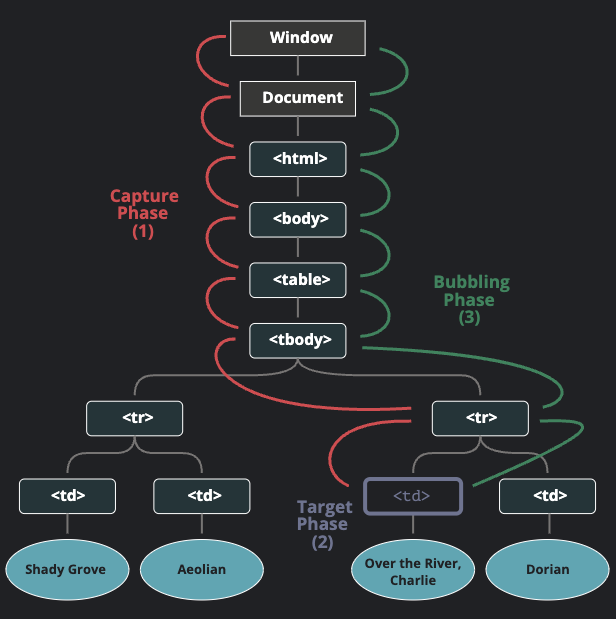

---
# 게시글 제목
title: "버블링과 캡처링"

# 작성 날짜
date: 2025-01-24

# 업데이트 날짜
update: 2025-01-24

# 태그
tags:
  - "버블링과 캡처링"
  - "JavaScript"

# 게시글 시리즈
series: "JavaScript"
---

## 버블링

- 한 요소에 이벤트가 발생하면, 이 요소에 할당된 핸들러가 동작하고, 이어서 부모 요소의 핸들러가 동작한다.
- 가장 최상단의 조상 요소를 만날 때까지 이 과정이 반복되면서 요소 각각에 할당된 핸들러가 동작한다.

```html
<style>
  body * {
    margin: 10px;
    border: 1px solid blue;
  }
</style>

<form onclick="alert('form')">
  FORM
  <div onclick="alert('div')">
    DIV
    <p onclick="alert('p')">P</p>
  </div>
</form>
```

- 위 코드에서 p태그를 누르게 된다면, `p` > `div` > `form` 순서대로 이벤트 버블링이 일어나 alert가 출력된다.
- 이러한 흐름을 "이벤트 버블링"이라고 부른다.

> `"거의"` 모든 이벤트가 버블링이 된다.
> 여기서 `"거의"`가 붙은 이유는 focus와 같은 예외도 있기 때문이다.

## event.target

- 부모 요소의 핸들러는 이벤트가 정확히 어디서 발생했는지 등에 대한 자세한 정보를 얻을 수 있다.
- 이벤트가 발생한 **가장 안쪽의 요소는 타겟(target)요소**라고 불리고, **event.target을 사용해 접근**할 수 있다.
- `event.target`과 this(=`event.currentTarget`)는 다음과 같은 차이점이 있다.
  - `event.target`은 실제 이벤트가 시작된 타깃 요소이다. 버블링이 진행되어도 변하지 않는다.
  - `this`는 현재 요소로, 현재 실행 중인 핸들러가 할당된 요소를 참조한다.

## 버블링 중단하기

- 이벤트 버블링은 타깃 이벤트에서 시작해서 `<html>`요소를 거쳐 `document` 객체를 만날 때까지 각 노드에서 모두 발생한다. 몇몇 이벤트는 `window` 객체까지 거슬러 올라간다.
- 핸들러에게 이벤트를 완전히 처리하고 난 후 버블링을 중단하도록 명령할 수 있다.
- `event.stopPropagation()`를 사용하면 해당 메서드를 사용한 위치부터 버블링이 일어나지 않는다.

## 캡처링

- 이벤트엔 버블링 이외에도 "캡처링" 이라는 흐름이 존재한다.
- 표준 Dom 이벤트에서 정의한 흐름엔 3가지 단계가 있다.
  1.  캡처링 단계: 이벤트가 하위 요소로 전파되는 단계
  2.  타깃 단계: 이벤트가 실제 타깃 요소에 전달되는 단계
  3.  버블링 단계: 이벤트가 상위 요소로 전파되는 단계



1. `<td>` 를 클릭하면 이벤트가 최상위 조상에서 시작해 아래로 전파되고(캡처링 단계)
2. 이벤트가 타깃 요소에 도착해 실행된 후(타깃 단계)
3. 다시 위로 전파된다. (버블링 단계)

- 이런 과정을 통해 요소레 할단된 이벤트 핸들러가 호출된다.

- `on<event>` 프로퍼티나 HTML 속성, `addEventListener(event, handler)`를 이용해 할당된 핸들러는 캡처링에 대해 전혀 알 수 없다.
- 캡처링 단계에서 이벤트를 잡아내려면 `addEventListener`의 `capture` 옵션을 `true`로 설정해야 한다.

```js
elem.addEventListener(..., {capture: true});
// capture은 안써도 된다.
elem.addEventListener(..., true);
```
