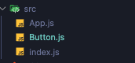

---
# 게시글 제목
title: "CRA"

# 작성 날짜
date: 2025-01-24

# 업데이트 날짜
update: 2025-01-24

# 태그
tags:
  - "CRA"
  - "React"
  - "프로젝트 세팅"

# 게시글 시리즈
series: "React"
---

- [Create-React-App](https://create-react-app.dev/)의 줄임말 이다.
- 리엑트를 사용하는 프로젝트를 만들 때 도움을 주는 도구이다.

## 리엑트 앱 생성하기

```
npx create-react-app {원하는 프로젝트 명}
```

- 위 명령어로 생성 가능하다.

- 생성한 후 vsCode로 열면 여러 파일들이 있을텐데, src 파일로 들어가 `App.js`와 `index.js`를 제외한 나마지 파일들은 모두 제거하였다.

### 1. 컴포넌트 파일로 분리하고 사용하기

- 컴포넌트를 파일 단위로 분리하여 사용하는 기능을 제공한다.

##### 1-1. 컴포넌트 생성

- 먼저 컴포넌트를 만들 파일을 생성해 준다.



- 그후 아래와 같이 컴포넌트를 만들어 준다.

```js
const Button = ({ text }) => {
  return <button>{text}</button>
}
```

- 후에 `export default`를 사용하여 다른 파일에서 컴포넌트를 사용할 수 있도록 해준다.

##### 1-2. 다른 파일에서 사용하기

- 해당 컴포넌트를 사용하는 쪽에서는 `import`를 사용하여 컴포넌트를 받아온 후 사용 가능하다.

```js
import Button from "./Button"

function App() {
  return (
    <div>
      <h1>Hello!</h1>
      <Button text={"hello!"} />
    </div>
  )
}

export default App
```

### 2. 컴포넌트 마다 스타일 적용시키기

- 모듈을 파일로 분리 가능하진다면 css 파일로 각 스타일들을 관리할 때, 모든 class 이름을 다르게 만드는 일이 일어날 수 있다.
- 이를 해결하기 위해 css파일도 모듈마다 적용 시킬 수 있는 기능을 지원한다.

##### 2-1. css 모듈 파일 생성

- 모듈마다의 스타일 적용을 위해 css파일도 각자 만들어 준다.
- 나같은 경우 `Button.module.css`라는 이름의 파일을 생성해 주었다.

##### 2-2. css 작성하기

- css 파일에 원하는 클래스 명과 스타일 코드를 작성해 준다.

```css
.btn {
  background-color: tomato;
  color: white;
}
```

##### 2-3. 스타일 적용하기

- 원하는 모듈 파일로 들어가 아래와 같이 `import` 구문을 작성해준다.

```js
import styles from "./Button.module.css"
```

- 그 후, 스타일을 적용할 블럭의 class를 다음과 같이 작성한다.

```jsx
<button class={styles.btn}></button>
```

- 이렇게 하면 css에 작성한 스타일이 이 묘듈에만 적용된다.
