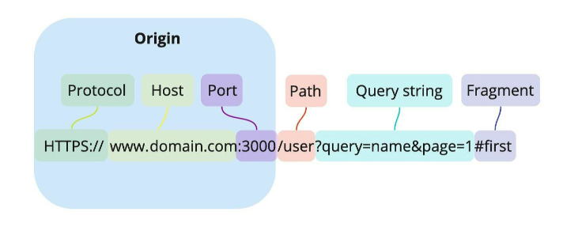
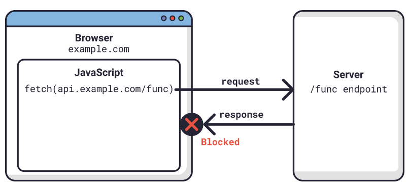
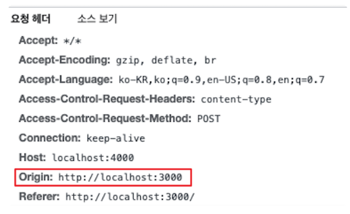
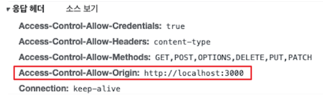
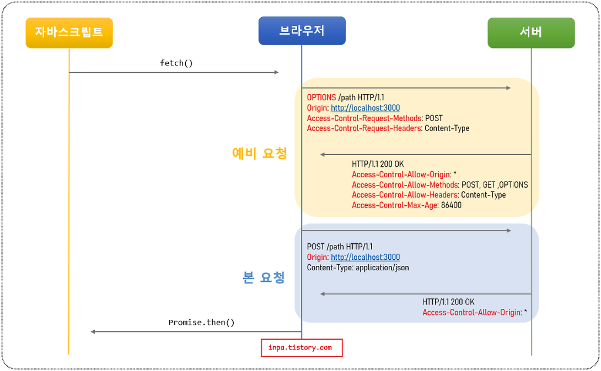

---

# 게시글 제목
title: "CORS 알아보기"

# 작성 날짜
date: 2025-02-03

# 업데이트 날짜
update: 2025-02-03

# 태그
tags:
  - "CORS"

# 게시글 시리즈
series: ""

---

- CORS는 프론트엔드 개발을 할때, 누구나 한번쯤 본적 있는 오류라고 할 만큼 자주 발생하는 오류이다.
- 그렇다면, CORS란 무엇이고 왜 발생하며, 어떻게 해결해야 할까?

## 1. CORS란?
- CORS란 **Cross-Origin Resource Sharing**의 약자로 직역하면 "교차 출처 리소스 공유 정책" 이라 해석할 수 있다.
- 여기서 교차란, 엇갈린 다른 출처를 의미한다.
- 그렇다면 **교차 출처 리소스**의 출처란 무엇일까?
### 1-1. 출처(Origin)
- 우리가 웹 사이트에 접근할때, URL이라는 문자열을 사용하여 접근하게 된다.
- 이런 URL의 구성 요소는 아래와 같다.

- Protocol(Scheme): http, https
- Host: 사이트 도메인
- Port: 포트 번호
- Path: 가이트 내부 경로
- Query string: 요청의 key와 value값
- Fragment: 해시 태그

- 여기서 Origin은 **Protocol + Host + Port** 라고 할 수 있다.
### 1-2. 동일 출처 정책 (Same-Origin Prolicy)
- 이제 출처(Origin)이 뭔지 알게 되었으니, Same Origin 정책과 Cross Origin 정책에 대해 알아보자.

- SOP는 **동일한 출처에 대한 정책**을 의미한다. 이 SOP 정책은 "동일한 출처에서만 리소스를 공유할 수 있다" 라는 법률을 가지고 있다.
- 즉 동일 출처(Same-Origin)서버에 있는 리소스는 자유롭게 가져올 수 있지만, 다른 출처(Cross-Origin)서버에 있는 이미지나 기타 리소스들은 상호작용이 불가능 하다는 말이다.
#### 1-2-1. 동일 출처 정책이 필요한 이유
- 만일, 동일한 출처가 아닌 다른 출처의 리소스를 자유롭게 사용 가능하다면, CSRF나 XSS 등의 방법으로 우리가 만들 어플리케이션에 해커가 심어놓은 코드가 실행하여 정보를 가로챌 수 있다.
- 그렇기 때문에 SOP 정책으로 동일하지 않는 다른 출처의 스크립트가 실행되지 않도록 브라우저에서 사전에 미리 방지하는 것이다.
### 1-3. 같은 출처와 다른 출처의 구분 기준
- SOP 정책에서 같은 출처(Origin)의 판단 기준은 무엇일까?
- 동일한 출처의 기준은 URL의 구성 요소 중 **Protocol(Scheme), Host, Port** 3가지만 동일하다면, 동일한 출처로 판단한다.

- 다음은 https://www.hello.com:3000 출처에 대한 URL에 따른 동일 출처 비교표이다.

|                 **URL**                 | **동일 출처인가?** |           이유            |
| :-------------------------------------: | :----------: | :---------------------: |
|    https://www.hello.com:3000/about     |     true     |   프로토콜, 호스트, 포트 번호 동일   |
| https://www.hello.com:3000/about?page=1 |     true     |   프로토콜, 호스트, 포트 번호 동일   |
|        http://www.hello.com:3000        |    false     | 프로토콜 다름 (http != https) |
|        https://www.hello.kr:3000        |    false     |         호스트 다름          |
|       https://www.hello.com:8888        |    false     |        포트 번호 다름         |
|          https://www.hello.com          |    false     |  포트 번호 다름(443 != 3000)  |
### 1-4. 출처 비교와 차단
- 그렇다면, 저런 출처의 다름을 판단하고 차단을 진행하는 작업은 어디서 처리되는 것일까?
- 네트워크에 관련된 오류 이므로 서버에서 처리한다 생각할 수 있겠지만, 이는 **브라우저에서 구현된** 기능이다.

- 서버는 옳바른 응답을 진행 하지만, 동일한 출처를 판단할 헤더 정보가 없을 때 브라우저에서 에러를 발생시키는 것이다.
- 하지만, 만약 모든 출처가 다른 요청을 막는다면 다른 웹페이지의 리소스를 쓰지 않고 개발을 해야하는 웃지 못할 상황이 생겨날 것이다.
- 그래서 몇 가지 예외 조항을 두고 다른 출처의 리소스 요청이라도 이 조항에 해당할 경우에는 허용하기로 하는데, 이중 하나가 **CORS 정책**을 지킨 리소스 요청이다.
## 2. 교차 출처 리소스 공유 (Cross-Origin Resource Sharing)
- 이처럼 **교차 출처 리소스 공유(CORS)**는 **다른 출처의 리소스 공유에 대한 허용/비허용 정책**이다.
- 다른 출처의 리소스를 어쩔수 없이 참고해야 하는 상황에서는 이 CORS 정책을 허용하는 리소스에 한에 참고 가능하게 하는 것이다.
- 결국, CORS는 에러를 이르키는 주범이 라니라, SOP 정책에 따라 다른 출처의 리소스를 차단하면서 발생된 에러를 해결하기 위한 해결책 인것이다.
### 2-1. 브라우저의 CORS 기본 동작
##### 1. 클라이언트에서 HTTP 요청을 헤더에 Origin을 담아 전달
- 기본적으로 웹은 HTTP 프로토콜을 이용하여 서버에 요청을 보내게 된다.
- 이때 브라우저는 요청 헤더에 Origin이라는 필드에 출처를 함께 담아 보내게 된다.

##### 2. 서버는 응답헤더에 Access-Control-Allow-Origin을 담아 클라이언트로 전달한다.
- 이후 서버가 이 요청에 대한 응답을 할 때 응답 헤더에 `Access-Control-Allow-Origin`이라는 필도를 추가하고 값으로 **이 리소스를 접근하는 것이 허용된 출처 url**을 내려보낸다.

##### 3. 클라이언트에서 Origin과 서버가 보내준 Access-Control-Allow-Origin을 비교한다.
- 이후 응답을 받은 브라우저는 자신이 보냈던 요청의 Origin과 서버가 보내준 응답의 Access-Control-Allow-Origin을 비교해본 후 차단할지 말지를 결정한다.
- 만약 유효하지 않다면 그 응답을 사용하지 않고 버린다. (CORS 에러)
- 위의 경우에는 둘다 http://localhost:3000 인 유효한 출처의 리소스이기 때문에 에러가 발생하지 않는다.

## CORS 작동 방식 (예비 요청)
- CORS에는 3가지 작동 방식이 있는데, 그중 하나가 바로 **예비 요청** 방식이다.
- 예비요청 방식은 브라우저에서 요청을 보낼때, 한번에 요청을 보내는게 아닌 예비 요청을 먼저 보낸 후 통신을 확인 하고 본 요청을 보낸다.
- 예비 요청을 보냄으로써 안전한지 여부를 브라우저에서 확인하는 것이다.
- 여기서 예비 요청을 보내는 것을 Preflight라고 부르며, HTTP의 **OPTIONS**라는 메소드를 사용하여 요청한다.

## 참고
- https://inpa.tistory.com/entry/WEB-%F0%9F%93%9A-CORS-%F0%9F%92%AF-%EC%A0%95%EB%A6%AC-%ED%95%B4%EA%B2%B0-%EB%B0%A9%EB%B2%95-%F0%9F%91%8F
