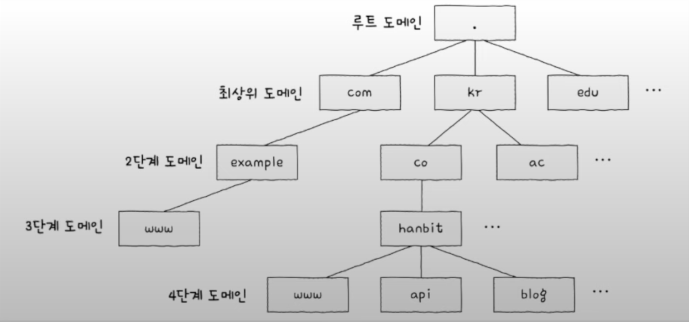

## 도메인 네임과 네임 서버
네트워크 상에서 어떤 호스트를 특정하기 위해 IP 주소를 사용하고 있다. 하지만 오로지 IP 주소만을 사용한다면 원하는 특정 호스트의 IP 주소를 모두 외워둬야 하는 문제가 발생한다. 이를 위해 IP 주소 대신 **도메인 네임**을 사용하며, 도메인 네임과 IP 주소는 **네임 서버**에서 관리한다. 이중 도메인 네임을 관리하는 네임 서버는 **DNS서버** 라고도 한다.

- `도메인 네임`: IP 주소 대신 사용하는 도메인의 이름
- `네임 서버`: IP 주소와 도메인 네임을 관리하는 서버
- `DNS 서버`: 도메인 네임을 관리하는 서버

## 도메인 네임의 구조
도메인 네임은 (.)을 기준으로 계층적으로 분류된다. 최상단에 **루트 도메인**이 있고, 그 다음에는 **최상위 도메인**, 계속 그 다음은 **n단계 도메인**이 있는 식이다.

일반적으로 알고있는 도메인 **네임의 마지막** 부분을 최상위 도메인이라 하며, 줄여서 **TLD** 라고 한다. 위 사진에서는 `com`, `kr`, `edu` 가 된다. 루트 도메인은 점(.)으로 표기 되는데, 일반적으로는 생략한다.

www.example.com. 과 같이 도메인 모두 포함하는 도메인 네임을 전체 주소 도메인 네임(FQDN)이라고 한다.

이러한 계층적인 형태의 도메인 네임을 효율적으로 관리하기 위해 형성된 관리 체계를 **도메인 네임 시스템** 줄여서 **DNS**라고 부른다. DNS는 호스트가 이러한 도메인 네임 시스템을 이용할 수 있도록 하는 애플리케이션 계층 프로토콜을 의미하기도 한다.

## 계층적 네임 서버
IP 주소를 모르는 상태에서 도메인 이름을 통해 IP 주소를 알아내는 과정을 **리졸빙(resolve+ing)** 이라고 한다. 리졸빙을 하는 과정에서 다양한 네임 서버들이 사용되는데, 역할 담당에 따라 크게 4가지로 분류할 수 있다.

- 로컬 네임 서버
- 루트 네임 서버
- TLD(최상위 도메인) 네임 서버
- 책임 네임 서버

### 로컬 네임 서버
클라이언트와 맞닿아 있는 네임 서버로 클라이언트가 도메인 네임을 통해 IP 주소를 알아내고자 할 때 가장 먼저 찾게되는 네임 서버이다. 로컬 네임 서버의 주소는 일반적으로 ISP에서 할당해 준다.

### 공개 DNS 서버
만약 로컬 네임 서버를 사용하지 않는다면 사용할 네임 서버이다. 이름 그대로 공개 되어있는 DNS 서버 이므로 공개된 주소를 통해 접근 가능하다.

대표적으로 `8.8.8.8`, `8.8.4.4`의 구글 DNS 서버와 `1.1.1.1`의 클라우트플레어의 공개 DNS 서버가 있다.

### 루트 네임 서버
**루트 네임 서버**는 루트 도메인을 관장하는 네임 서버로, 질의에 대해 TLD 네임 서버의 IP 주소를 반환할 수 있다.

클라이언트가 로컬 네임 서버에서 특정 도메인 네임에 대응되는 IP 주소가 무엇인지 질의하였을 때, 만약 로컬 네임 서버가 해당 도메인 네임에 대응하는 IP 주소를 모른다면 **루트 네임 서버**에게 질의를 하게 된다. 

## TLD 네임 서버
**TLD 네임 서버**는 TLD(최상위 도메인)를 관리하는 네임 서버이다. 루트 네임 서버와 비슷하게 TLD의 하위 도메인 네임을 관리하는 네임 서버 주소를 반환할 수 있다.

## 책임 네임 서버
**책임 네임 서버**는 특정 도메인 영역을 관리하는 네임 서버로, 자신이 관리하는 도메인 영역의 질의에 **곧바로 답할 수 있는 네임 서버**이다. 로컬 네임 서버가 마지막으로 질의하는 네임 서버이므로 일반적으로 책임 네임 서버에서 원하는 IP 주소를 얻을 수 있다.

이와 같이 네임 서버들은 계층적인 구조를 통해 도메인 네임을 리졸빙 할 수 있다.

## 리졸빙 방식
도메인 네임을 리졸빙 하는 과정에서, 로컬 네임 서버가 각 도메인 네임 서버들에게 질의하는 방식을 크게 2가지로 나눌 수 있다.

- 재귀적 질의
- 반복적 질의

### 재귀적 질의
**재귀적 질의**는 클라이언트가 로컬 네임 서버에게 도메인 네임을 질의하면 로컬 네임 서버가 루트 네임 서버에게 질의하고, 루트 네임 서버가 TLD 네임 서버에 질의하고, TLD 네임 서버가 책임 네임 서버에게 질의하여 최종 응답 결과를 역순으로 전달받는 방식이다.

### 반복적 질의
**반복적 질의**는 클라이언트가 로컬 네임 서버에게 질의하면, 로컬 네임 서버가 루트 네임 서버에게 질의한 후 다음 단계 서버의 주소를 받고 다시 로컬 네임 서버가 받은 주소의 서버에 질의하는 반복적인 방식으로 최종 응답을 받는 방식이다.

## DNS 캐시
도메인 네임의 리졸빙 과정을 보면 상당히 많은 통신 과정이 필요하다는 것을 알 수 있다. 만약 매번 저런식으로 리졸빙을 하게 된다면 빠르게 네임 서버에 과부화가 발생할 것이다. 이런 문제를 해결하기 위해 네임 서버들은 **DNS 캐시**를 통해 응답받은 결과를 임시로 저장해 둔다. 임시 저장해둔 값은 지정된 **TTL**에 따라 자동으로 삭제된다.

## 자원을 식별하는 URL
- `자원(resource)`: 네트워크상의 메시지를 통해 주고 받는 대상. HTML 파일, 이미지, 동영상 파일 등 다양한 요소들이 있다.
- `URI(Uniform Resource Identifier)`: 자원을 식별할 수 있는 정보라는 의미. HTTP 기반의 통신에서 여러 자원들중 특정 자원을 식별할 수 있는 통일된 방식

자원을 식별하기 위한 `URI`에는 위치를 이용하여 식별하는 방식과 이름을 이용하여 식별하는 방식이 있다. 각각 `URL`과 `URN`이라고 부른다.

### URL(Uniform Resource Locator)
**URL**은 위치 기반 식별자로 특정 자원을 찾을때 위치를 기반으로 찾는 방식이다.

URL의 형태는 인터넷 표준 문서에 소개되어 있으며 각 부분별로 표기되는 의미가 다르다.
#### scheme
URL의 첫 부분으로 **"자원에 접근하는 방법"** 을 의미한다. 일반적으로 프로토콜이 명시된다. 

- HTTP를 사용할 때 -> http://
- HTTPS를 사용할 때 -> https://

#### authority
**"호스트를 특정할 수 있는 정보"** 가 담기기는 부분이다. 주로 IP 주소 혹은 도메인 네임이 명시된다. 콜론(:)뒤에 포트 번호를 덧붙일 수도 있다.

#### path
**"자원이 위치한 경로"** 가 명시된다. 자원의 위치는 슬래시(/)를 기준으로 계층적으로 표현되고, 최상위 경로 또한 슬래시로 표현된다. 

위와 같은 계층 구조에서 a.png에 접근하기 위한 URL의 path는 `/home/images/a.png`라고 표현할 수 있다.

#### query
요청-응답 기반의 HTTP 프로토콜에서 **"특정 단어를 검색한 결과"** 이나 **"결과 내림차순 정렬"** 과 같은 세부적인 요청 정보를 전달하기 위한 부분이다. 물음표(?)로 시작되는 <키=값> 형태의 데이터로 표현하며 `&`를 사용하여 여러 쿼리 문자열을 연결할 수 있다.

쿼리 문자열은 개발자의 설계에 따라 달라질 수 있으며, 쿼리 문자열을 통해 보다 유연한 서버와의 상호 작용이 가능해 진다.

#### fragment
**"자원의 한 조각을 가리키기 위한 정보"** 이다. 흔히 HTML 파일과 같은 자원에서 특정 부분을 가리키기 위해 사용되며 (#)을 붙여 표현한다. 

- 현재 글의 `fragment` 부분을 표현한다면, https://bjcho0501.github.io/DNS/#fragment 와 같다.

### URN(Uniform Resource Name)
URN은 자원에 고유한 이름을 붙여 식별하는 방식이다. URL같은 경우 위치를 기반으로 식별하기 때문에 자원의 위치가 바뀐다면 식별할 수 없는 단점이 있다. 반면 URN은 **자원에 대한 고유한 이름**이 붙기 때문에 자원의 위치와 상관 없이 식별 가능하다는 장점이 있다.

하지만 URN의 경우 아직 URL만큼 널리 채택된 방식은 아니기에 오늘날에는 주로 URL이 더 많이 사용된다.