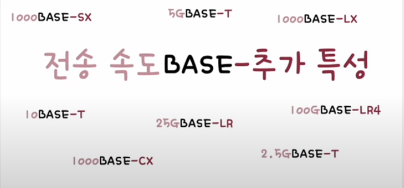
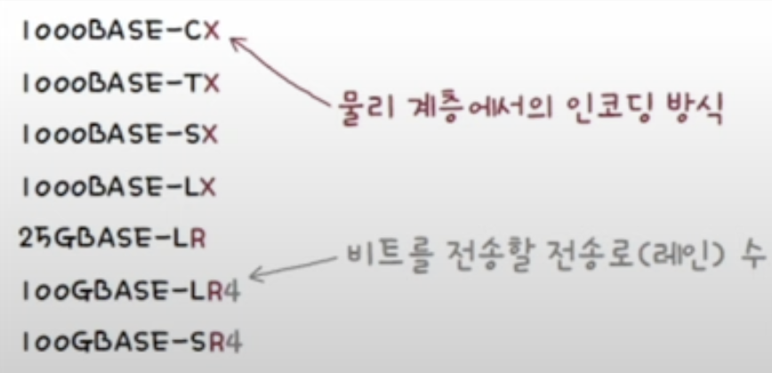
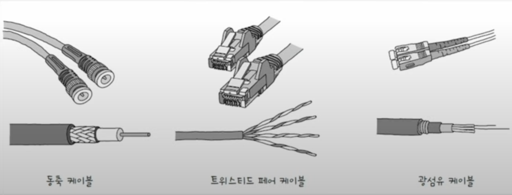
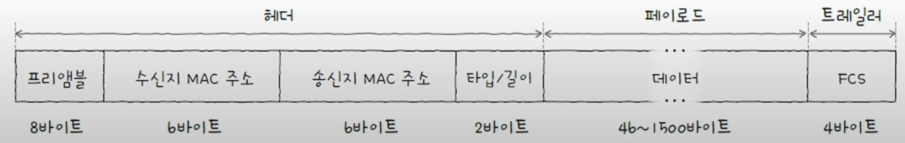
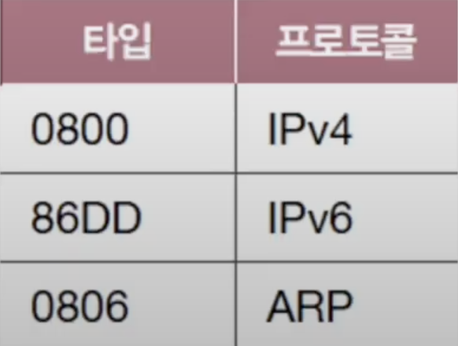
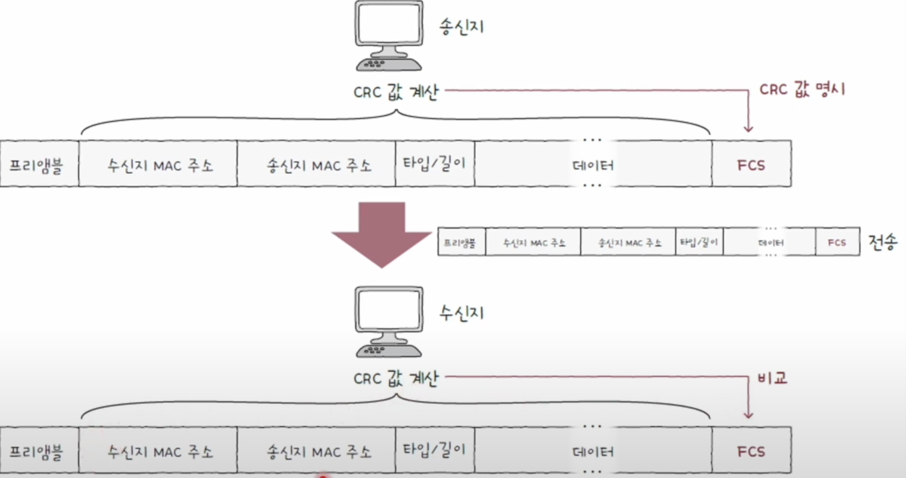

## 이더넷 알아보기
이더넷은 현대 유선 LAN 환경에서 대중적으로 사용되는 기술로, 다양한 통신 매체의 규격들과 송수신 되는 프레임의 형태, 프레임을 주고 받는 방법 등이 정의된 네트워크 기술이다.

[이전 글](https://bjcho0501.github.io/blog/StartNetwork/)의 내용 중 네트워크 참조 모델의 `물리 계층`과 `데이터링크 계층`에 공통적으로 사용되는 기술이기도 하다.

## 이더넷 표준 
앞선 내용과 같이 이더넷은 "유선 LAN 환경에서 대중적으로 사용되는 기술" 이기 때문에 국제적으로 표준화가 이루어져 있다. 

전기전자공학자협회(IEEE)라는 국제 조직이 처음 이더넷 관련 기술을 **IEEE 802.3** 이라 표준화 하였고, 이에 따라 각기 다른 제조사의 네트워크 장비를 사용하더라도 동일한 형식의 프레임을 주고 받고 통신할 수 있게 되었다.

> IEEE는 지금까지도 [새로운 표준](https://www.ieee802.org/3)을 개발하고 있다.

## 통신 매체 표기 형태
이더넷 표준 규격에 따라 구현된 통신 매체들을 지칭할 때에는 아래과 같은 형식으로 한눈에 알아볼 수 있게 표현한다.

### 1. 전송 속도
말 그대로 해당 통신 매체의 지원 속도를 표기하는 부분이다. 

숫자만 표기되어 있으면 Mbps 속도, 숫자 뒤에 G가 붙는 경우 Gbps 속도를 의미한다.

| 전송 속도 표기 |        의미        |
| :------: | :--------------: |
|    10    |      10Mbps      |
|   100    |     100Mbps      |
|   1000   | 1000Mbps (1Gbps) |
|   2.5G   |     2.5Gbps      |
|    5G    |      5Gbps       |
|   10G    |      10Gbps      |
|   40G    |      40Gbps      |
|   100G   |     100Gbps      |
### 2. BASE
BASE는 **베이스밴드**의 약자로 **변조 타입**을 의미한다. **변조 타입**이란 비트 신호로 변환된 데이터를 통신 메체로 전송하는 방법을 의미한다.

특별한 경우가 아니라면 보통 **BASE**를 사용한다고 기억하는 것이 좋다.

> BASE 외에 BROAD로 표기하는 브로드밴트, PASS로 표기하는 패스밴트도 있다.

### 3. 추가 특성
추가 특성은 통신 매체의 특성을 명시한다. 명시하는 특성은 아래와 같이 여러개가 있다.
- 전송 가능한 최대 사거리 (10BASE-**2**, 10BASE-**5**)
- 물리 계층 인코딩 방식 - 데이터가 비트 신호로 변환되는 방식
- 레인 수 - 비트 신호를 옮길 수 있는 전송로 수

## 통신 매체 종류
다음은 가장 대중적인 통신 매체의 종류 예시이다.

| 추가 특성 표기(통신 매체의 종류) | 케이블 종류       |
| ------------------- | ------------ |
| C                   | 동축 케이블       |
| T                   | 트위스티드 페어 케이블 |
| S                   | 단파장 광섬유 케이블  |
| L                   | 장파장 광섬유 케이블  |

지금까지 배운 내용들을 사용하면 아래와 같은 표기 형식들을 보고 해석이 가능해 진다.
- 10BASE-T 케이블: 10Mbps 속도를 지원하는 트위스티드 페어 케이블
- 100BASE-SX 케이블: 100Mbps 속도를 지원하는 단파장 광섬유 케이블
- 1000BASE-LX 케이블: 1000Mbps 속도를 지원하는 장파장 광섬유 케이블

> ‼️ 이더넷 표준과 통신 매체의 표기가 항상 일대일로 대응되는 것이 아니라는 것을 유의하자.

### 이더넷 프레임
지금까지는 물리 계층과 관련된 내용 이라면, 이번 이터넷 프레임은 데이터링크 계층에 관련된 내용이다.

현대의 유선 LAN 환경은 대부분 이더넷을 기반으로 구성되어 있기 때문에 호스트가 데이터 링크 계층에서 주고 받는 프레임 형식도 정해져 있다. 즉 이더넷 프레임이란, **호스트가 이더넷 네트워크에서 주고 받는 프레임**을 의미한다.

이더넷 프레임은 헤더와 트레일러를 추가하는 **캡슐화** 과정을 통해 만들어 지고, 수신지 입장에서는 프레임의 헤더와 트레일러를 제거하는 **역갭슐화** 과정을 거친다.

이더넷 프레임은 아래와 같은 구성으로 이루어져 있다.

**헤더**
- 프리앰블
- 수신지 MAC 주소
- 송신지 MAC 주소
- 타입/길이

**페이로드**
- 데이터

**트레일러**
- FCS

### 프리앰블
**프리앰블**은 이더넷 프레임의 시작을 알리며 송수신지 간의 동기화를 위해 사용되는 정보이다. 

8바이트(64비트) 크기를 가지고 있으며, 첫 7바이트는 `10101010`값을 마지막 바이트는 `10101011` 값을 가진다. 

### 수신지 MAC 주소와 송신지 MAC 주소
"물리적 주소" 라고도 불리는 `MAC 주소`는 데이터 링크 계층의 핵심이다. 

MAC주소는 네트워크 인터페이스마다 부여되는 6바이트(48비트) 길이의 주소로, LAN 내의 수신자와 송신자를 특정할 수 있다. MAC 주소는 일반적으로 고유하고, 일반적으로 변경되지 않는 주소로써 네트워크 인터페이스마다 부여된다. 보동 **NIC(Network Interface Controller)** 라는 장치가 네트워크 인터페이스 역할을 담당하며, 한 컴퓨터의 NIC가 여러 개 있다면 MAC 주소도 여러개 있을 수 있다.

> #### MAC 주소는 반드시 고유하지 않다!
> 위 내용에서 "일반적으로" 고유하고 변경되지 않는다고 하였는데, 이는 MAC 주소도 고유하지 않거나 변경 가능할 수 있기 때문이다.
> 
> MAC 주소가 우연히 같을 확률은 낮고, 의도적으로 같게 만드는 상황이 흔하지는 않기 때문에 **"일반적으로 고유하고, 변경되지 않는 주소"** 정도로 표현하는 것이다.

### 타입/길이
**타입/길이** 필드에는 **타입**이나 **길이**가 올 수 있다.

만약 필드에 명시된 크기가 1500(16진수 05DC) 이하일 경우 길이를 나타내는 데 사용되고, 1536(16진수 0600) 이상일 경우 타입을 나타내는 데 사용된다.

여기서 타입이란 **이더넷 프레임이 어떤 정보를 캡슐화 하였는지**를 나타내는 정보로 **이더타입** 이라고도 부른다.
대표적으로 상위 계층에서 사용된 프로토콜의 이름이 명시된다.

### 데이터
**데이터**는 상위 계층에서 전달받거나 상위 계층으로 전달해야 할 내용이다. 네트워크 계층의 데이터와 헤더를 합친 PDU가 이곳에 포함된다. 최대 크기는 1500바이트 이고, 반드시 일정 크기(46바이트 이상)여야 한다는 점이다.
만약 데이터가 그 이하의 크리라면, 보통 46바이트 이상이 될 때까지 0으로 채워진다. 여기서 채워진 정보를 **패딩**이라고 한다.

### FCS
**FCS(Frame Check Sequence)**는 수신한 이더넷 프레임에 오류가 있는지 확인하기 위한 필드이다.

FCS필드에는 **CRC(Cyclic Redundancy Check, 순환 중복 검사)** 라고 불리는 오류 검출용 값이 들어간다. 송신지는 프리앰블을 제외한 나머지 필드값을 바탕으로 CRC 값을 계산한 후, 이 값을 FCS 필드에 명시하면 수신지는 프리앰블과 FCS 필드를 제외한 나머지 필드 값들을 바탕으로 CRC 값을 계산한 뒤, FCS 필드 값과 비교한다. 만약 비교 값이 일치하지 않는다면 프레임에 오류가 있다고 판단하여 해당 프레임을 폐기한다.

> 이더넷 이외의 기술로 **토큰 링** 이라는게 있다.