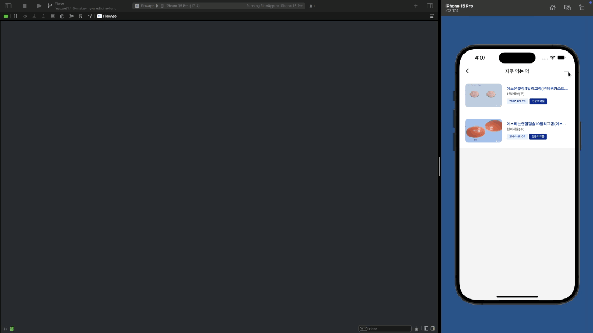
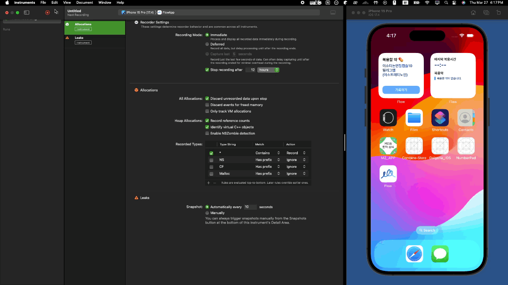
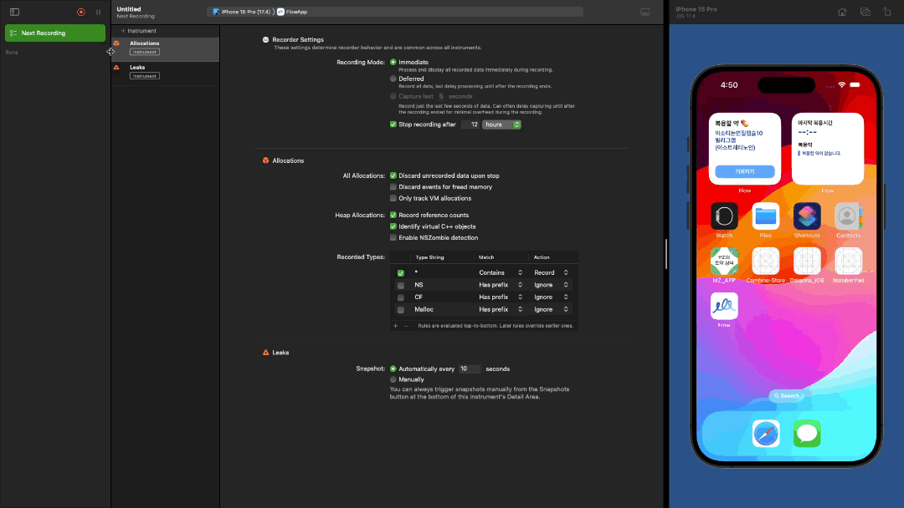

---

# 게시글 제목
title: "메모리 릭 잡고 성능 최적화하기"

# 작성 날짜
date: 2025-03-27

# 업데이트 날짜
update: 2025-03-27

# 태그
tags:
  - "메모리 릭"
  - "iOS"

# 게시글 시리즈
series: "iOS"

---

개인 프로젝트 개발중, 분명 메모리 해제가 되어야 하는 객체가 중첩돼서 메모리를 잡아먹는 현상이 발생하였다.
이런 현상을 **메모리 릭(Memory Leak)** 이라고 하는데, 어떻게 메모리 릭이 일어났는지 확인하고 해결하였는지에 대한 과정을 기록해 볼까 한다.

### 메모리 릭 찾기
처음 메모리 릭이 생겼다는걸 발견한건 Rxswift를 사용하여 구독한 Observable이 화면이 사라졌음에도 불구하고 dispose가 되지 않는 것을 확인했을 때이다.
``` swift
NotificationCenter.keyboardHightObservable
	.debug()
	.skip(while: { $0 == 0.0 })
	.subscribe(onNext: setNextButtonPosition)
	.disposed(by: disposeBag)

// setNextButtonPosition 함수
private func setNextButtonPosition(keyboardHeight: CGFloat) {
	print(keyboardHeight)

	// 다른 코드들...
}
```
해당 코드에서 `NotificationCenter.keyboardHightObservable`은 키보드가 보이고 사라질 때, 키보드의 높이를 이벤트로 방출하는 Observable이고, 그 Observable을 구독하여 `setNextButtonPosition(:_)`이라는 함수를 실행시키는 코드이다.

`setNextButtonPosition(:_)`는 `keyboardHeight`를 받아 print를 하는데, 해당 출력이 화면을 보여줄때마다 중첩해서 출력되는 현상이 발생하였다.




좀더 확실하게 확인하기 위해 Xcode의 성능 분석 도구를 사용해 보았다.
**Product > Profile** 또는 **Command + i** 를 사용하여 프로파일 도구를 실행시키고, **Leaks** 항목을 선택한다.

그 다음 화면의 **오른쪽 위 빨간색 재생 버튼**같이 생긴걸 누르면, 앱이 실행되면서 검사를 시작하게 된다.

검사중인 화면에서 **Leaks** 라는 부분을 보면 메모리 릭이 있는지 체크표시로 표시해 준다. 예상대로 특정 화면을 열고 닫는 과정 중 메모리 릭이 일어나 표시해 주는 것을 확인할 수 있다.

## 해결하기
메모리 릭이 일어나는 이유는 아래와 같이 여러 요인들이 있다.
- 순환 참조
- 강한 참조
- 뷰 컨트롤러의 라이프 사이클 관리 실수
- 클로저에서의 강한 참조

저 많은 요인들중 가장 의심가는 문제는 `.subscribe(onNext:_)`의 클로저에서 `setNextButtonPosition` 을 강한 참조로 실행시킨 부분이다. 사실 이 부분은 RxSwift를 사용하면서 가장 흔하게 생기는 문제인데, `.subscribe(onNext: setNextButtonPosition)`형식으로 바로 사용하면 문제가 생기지 않을거라고 생각한 내 실수였다.

해당 문제를 해결하는 방법은 간단하게 강한 참조를 weak self를 사용하여 약한 참조로 바꾸는 것이다.
```swift
NotificationCenter.keyboardHightObservable
	.skip(while: { $0 == 0.0 })
	.subscribe(onNext: { [weak self] in
		guard let self else { return }
		setNextButtonPosition(keyboardHeight: $0)
	})
	.disposed(by: disposeBag)
```

마지막으로 성능도구 확인까지 해보자
