## HTTP의 특성
Hypertext Transfer Protocol의 약자로 응용 계층에서 정보를 주고 받는데 사용되는 프로토콜이다. 

### 요청-응답 기반 프로토콜
HTTP는 클라이언트와 서버가 서로 HTTP 요청 메시지와 HTTP 응답 메시지를 주고 받는 구조로 동작한다. 그렇기 때문에 같은 HTTP를 따른다 하더라도 요청 HTTP 메시지와 응답 HTTP 메시지의 형태가 다르다.

### 미디어 독립적 프로토콜
HTTP는 **자원**을 주고 받는다 하였는데, 이 자원이란 정확히 어떤 것을 특정하는 것이 아니다. HTTP에서의 **자원**은 `HTML`, `JPEG`, `PNG`, `JSON`, `XML`, `PDF`등 다양한 종류를 의미할 수 있으며 HTTP는 주고 받을 자원의 특정과 무관하게 그저 **자원을 주고 받을 수단(인터페이스)** 의 역할만 수행한다.

여기서 HTTP의 자원 종류를 **미디어 타입(media type, MIME Type)** 이라고 부른다. 미디어 타입은 일종의 웹 확장자와 같은 개념이다. 기본적으로 "*타입/서브타입*" 형식으로 구성된다.

- `타입`: 데이터 유형
- `서브타입`: 주어진 타입에 대한 세부 유형

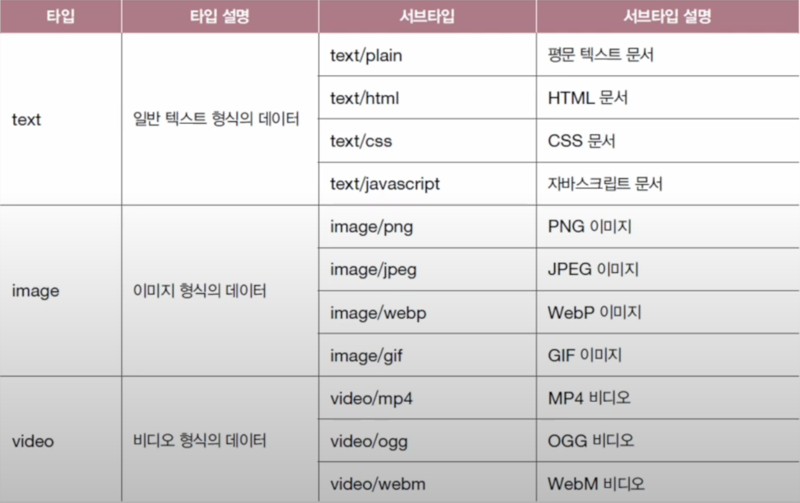
미디어 타입에는 (\*)을 사용하여 여러 미디어 타입을 통칭하기도 한다. `text/*` 는 text 타입의 모든 서브타입을 나타내며 `*/*`은 모든 미디어 타입을 나타낸다.

부과적인 설명을 위해 선택적으로 매개변수를 포함 시킬 수도 있다. 형식은 아래와 같다.
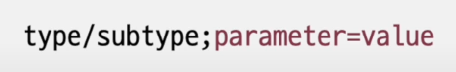

### 스테이트리스 프로토콜
HTTP는 상태를 츄지하지 않는 **스테이트리스** 프로토콜이다. 서버가 HTTP 요청을 보낸 클라이언트와 관련된 상태를 기억하지 않는다는 것을 의미하며, HTTP의 설계 목표인 **확장성**과 **견고성**을 지키기 위해 **스테이트리스**하게 설계 되었다.

만약 HTTP가 스테이트하게 설계 되었다면, 클라이언트가 서버에 종속되어 특정 서버를 의존하는 문제가 발생할 수 있고, 서버가 고장나거나 추가로 서버를 확장해야 할 때 유연한 대처가 불가능해 질 수 있다.
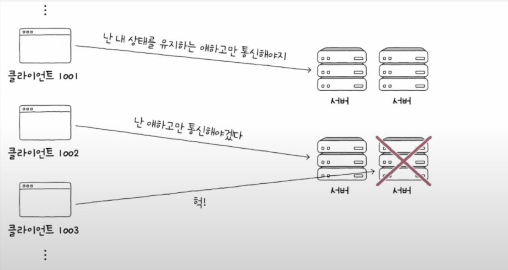

### 지속 연결 프로토콜
HTTP는 TCP상에서 동작하는 프로토콜 이지만, HTTP의 경우 TCP와 다르게 **비연결형** 프로토콜 이다. 비연결형 프로토콜이기 때문에 과거 `HTTP/1.0`이하에서는 매번 요청과 응답을 할 때마다 쓰리핸드셰이크를 통해 TCP 연결을 수립한 후 요청을 하고 응답을 받으면 TCP연결을 종료하는 과정을 거쳐야만 했다.

이런 비효율적인 문제를 해결하기 위해 **지속 연결(;keep-alive)** 이라는 기술을 제공하게 되었다. 지속 연결은 하나의 TCP 연결상에서 여러 개의 요청-응답을 주고 받을 수 있는 기술이다. 이로 인해 기존에 매번 새롭게 연결을 수립하는 비지속 연결에 비해 더 빠른 HTTP 요청-응답 처리가 가능해졌다.
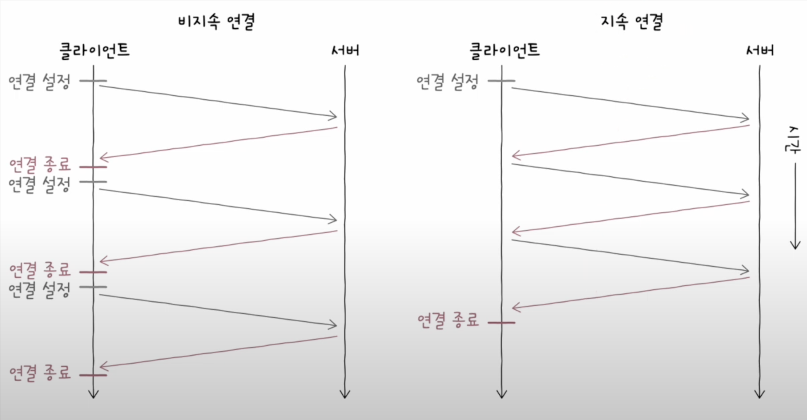
## HTTP 메시지 구조
`HTTP/1.1`의 기준으로 HTTP 메시지의 구성을 살펴보면 다음과 같다.
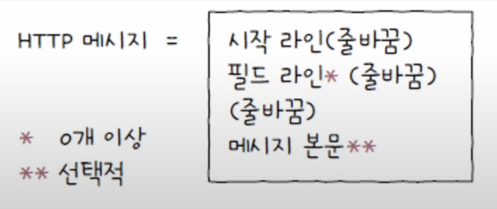
### 시작라인
시작라인은 요청 메시지인지 응답 메시지인지에 따라 **요청 라인**, **상태 라인**이 된다.

요청 라인의 경우 아래 사진과 같은 구성으로 이루어져 있다.

- `메서드`: 클라이언트가 서버의 자원에 대해 수행할 작업 (GET, POST, DELETE 등)
- `요청 대상`: HTTP 요청을 보낼 서버의 자원을 의미한다. 쿼리가 포함된 URL의 경로(path)가 명시된다. `http://www.example.com/hello?q=world`로 요청을 보내면 요청 대상은 `/hello?q=world`가 된다. 하위 경로가 없다면 `/`가 요청 대상이 된다.
- `HTTP 버전`: 이름 그대로 HTTP의 버전이 명시된다. `HTTP/버전` 표기 방식을 따른다.

상태 라인의 경우 아래 사진과 같은 구성으로 이루어져 있다.
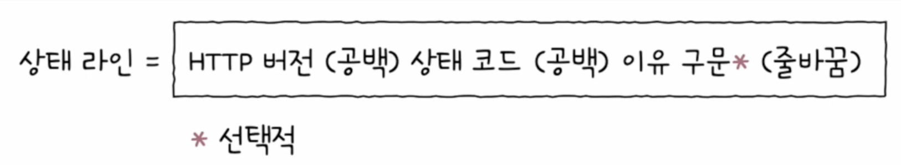
- `HTTP 버전`: HTTP의 버전이 명시된다. `HTTP/버전` 표기 방식을 따른다.
- `상태 코드`: 요청에 대한 결과를 나타내는 세 자리 정수이다. (200, 404 등)
- `이유 구문`: 상태 코드에 대한 문자열 형태의 설명을 의미한다. (OK, Not Found 등)

### 필드 라인
필드 라인에는 0개 이상의 HTTP 헤더가 명시된다. 그래서 **헤더 라인**이라 부르기도 한다. HTTP 헤더란 HTTP 통신에 필요한 부가 정보를 의미하며 콜론(:)을 기준으로 **헤더 이름**과 하나 이상의 **헤더 값**으로 구성된다. 
- `Content-Type: application/json` (헤더 이름: 헤더 값)
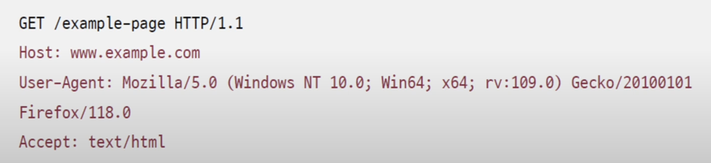
### 메시지 본문
HTTP 요청 혹은 응답 메시지에서 본문이 필요할 경우 **메시지 본문**에 명시된다. 메시지 본문은 없을 수도 있으며, 다음과 같이 다양한 콘텐츠 타입이 사용될 수 있다.
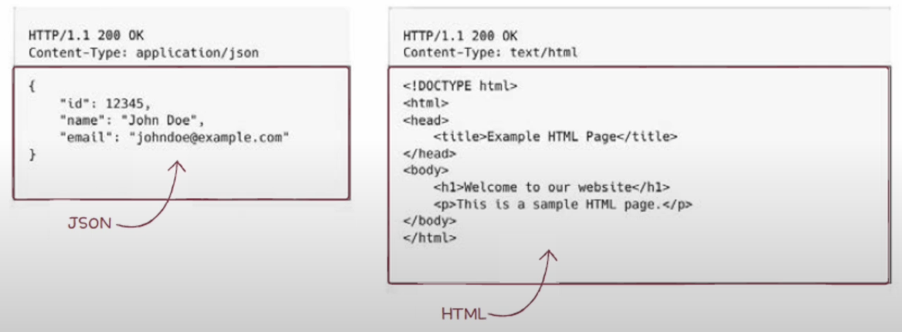
## HTTP 메서드
HTTP 요청 메시지에는 다양한 메서드들을 사용하여 자원에 대해 수행할 작업을 명시할 수 있다.
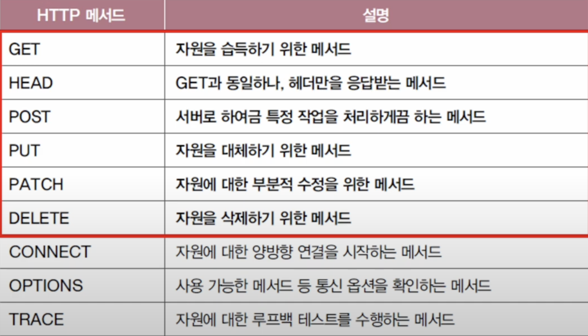
### GET
- 특정 자원을 조회할 때 사용되는 메서드
- 대부분의 웹브라우저를 통해 조회하는 자원의 메서드가 GET
- GET 메서드에서 요청 메시지 본문을 포함시키지 않는것이 바람직함
- 메시지 본문보다 쿼리 문자열이 사용되는 경우가 많음
### HEAD
- GET 메서드와 동일한 역할을 하나, 응답 메시지에 메시지 본문이 포함되지 않음
- "헤더만 가져다주세요" 같은 요청
### POST
- 서버로 하여금 특정 작업을 처리하도록 요청하는 메서드
- 처리할 대상은 흔히 메시지 본문으로 명시됨 (body)
- 보통 새로운 자원을 생성하고자 할 때 사용함
### PUT
- 덮어쓰기를 요청하는 메서드
- 요청 자원이 없다면 메시지 본문으로 자원을 새롭게 생성하거나, 이미 자원이 존재한다면 메시지 본문으로 자원을 완전히 대체함
### PATCH
- 부분적 수정을 요청하는 메서드
- PUT 메서드가 완전한 대체에 가깝다면, PATCH 메서드는 부분적 수정에 가까움
### DELETE
- 특정 자원을 삭제하고 싶을 때 사용하는 메서드

## HTTP 상태 코드
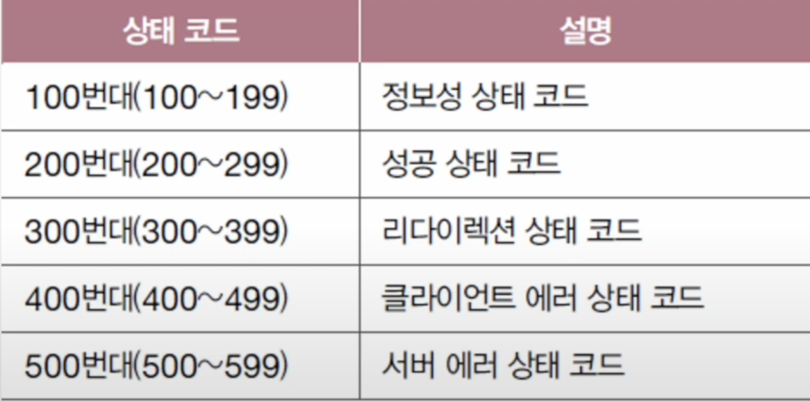
### 200번대: 성공 상태 코드
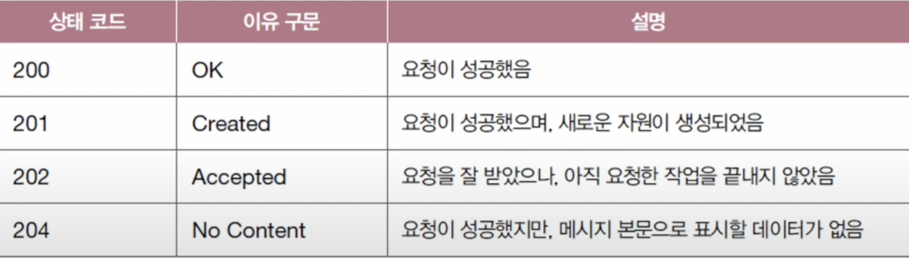
요청이 성공했음을 의미한다. 만약 POST 요청을 통해 서버에 새로운 자원을 생성한 경우, 상태 코드 201(Created)로 요청이 성공했으며 새로원 자원이 만들어졌음을 알릴 수 있다. 이 경우 Location 헤더를 통해 생성된 자원의 위치를 명시할 수 있다.

### 300번대: 리다이렉션 상태 코드
300번대 코드는 **리다이렉션**과 관련된 코드이다. **리다이렉션**이란 "요청을 완수하기 위해 추가적인 조치가 필요한 상태"로 정의 한다. 쉽게 생각해 클라이언트의 요청을 다른 곳으로 이동시키는 것이다.

클라이언트가 요청한 자원이 다른 URL에 있을 경우, 서버는 응답 메시지의 Location 헤더를 통해 요청한 자원이 위치한 URL을 안내해 줄 수 있다. 
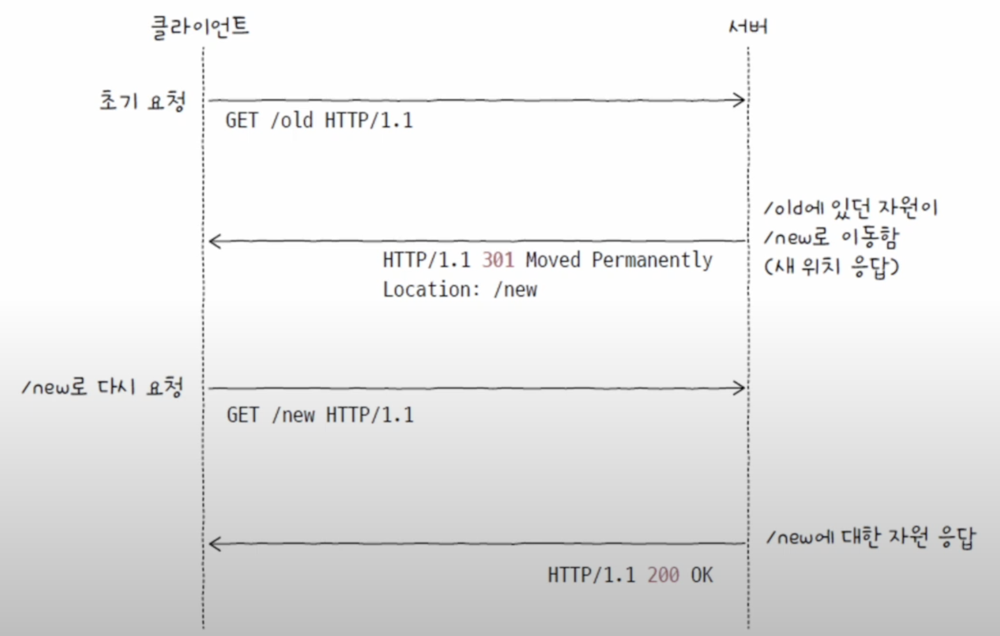

리다이렉션은 **영구적인 리다이렉션**과 **일시적인 리다이렉션**으로 구분할 수 있다. 

**영구적인 리다이렉션**은 자원이 완전히 새로운 곳으로 이동하여 경로가 **영구적**으로 재지정되는 것을 의미한다. 이 경우 기존의 URL에 요청 메시지를 보내면 **항상 새로운 URL**로 리다이렉트 된다. 관련된 상태 코드는 아래와 같다.
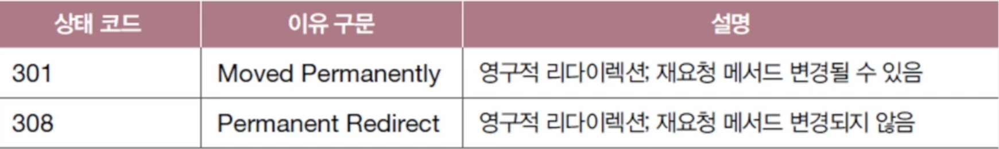
둘의 차이는 **재요청 메서드 변경 여부**에 있다. 301의 경우 `GET`요청으로 바뀔 '수도' 있다 라는 의미이고, 308은 바뀌지 않는다는 의미이다.

**일시적인 리다이렉션**은 자원의 위치가 임시로 변경되었거나 임시로 사용할 URL이 필요한 경우 사용된다. 임시적인 리다리렉션 URL이 응답으로 오기 때문에 따로 기억해둬야 한다. 관련 상태 코드는 아래와 같다.
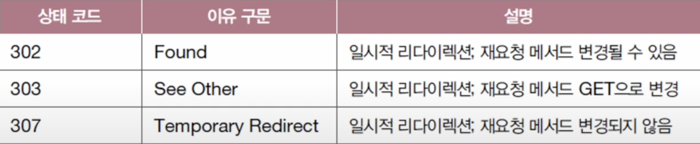
302 코드는 301과 비슷하게 재요청 메서드가 `GET`으로 바뀔 '수도' 있다는 의미이다. 307 코드는 308 코드와 같이 메서드가 변경되지 않는다는 의미이다. 303코드는 재요청 메서드가 `GET`으로 변경된다는 의미이다.

리다이렉션의 다른곳으로 이동시키는 "다른곳"은 URL이 될 수도 있고 캐시가 될 수도 있다.
### 400번대: 클라이언트 에러 상태 코드
400번대 코드는 클라이언트에 의한 에러가 있음을 알려주는 상태 코드이다. 서버가 처리할 수 없는 형태로 요청을 보내거나 존재하지 않는 자원에 대해 요청을 보내는 경우가 속한다.
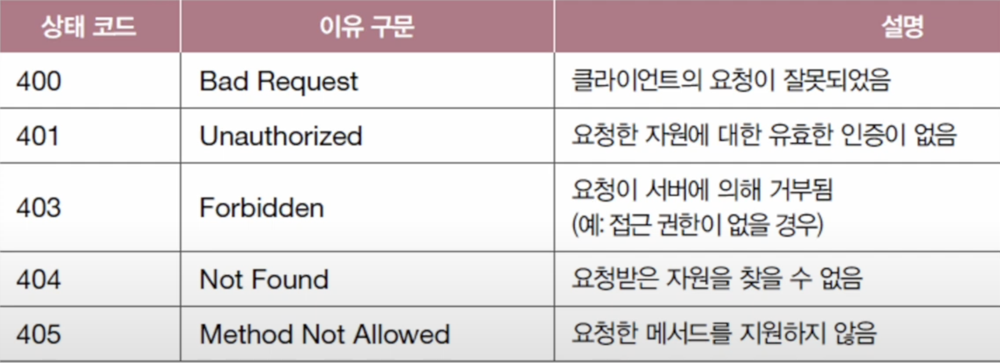

400번 코드는 클라이언트의 요청이 잘못되었음을 알려주는 상태 코드이다. 요청 메시지의 내용이나 형식 자체에 문제가 있어 서버가 요청 메시지를 올바르게 처리할 수 없는 경우가 속한다.

401코드는 **인증**이 필요한 경우 나타나는 코드이다. 특정 자원에 접근할 때 해당 자원에 접근하기 위한 인증 방법을 헤더에 명시해 주어야 하는데, 이게 없으면 발생한다.
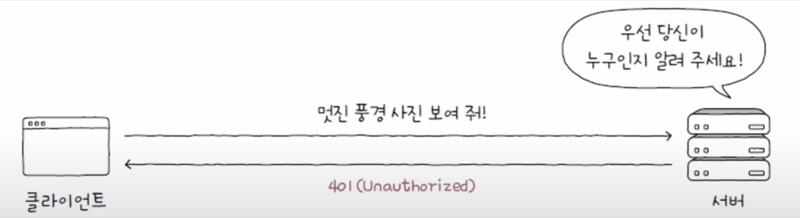

403은 **권한**이 충분하지 않다는 상태 코드이다. 401과의 차이점은 이미 인증은 하였으나, 인증된 주체의 권한이 없기 때문에 나타나는 코드라는 것이다. **인증**이란 **'자신이 누구인지 증명하는 것'** 을 의미하고, **권한 부여**는 **'인증된 주체에게 작업을 허용하는 것'** 을 의미한다.

404는 접근하고자 하는 자원이 존재하지 않을을 알리는 상태코드이다. 존재하더라도 공개하지 않는 자원에 대해서 404를 응답하는 경우도 있다.

405는 해당 자원이 지원하지 않는 메서드로 요청을 하면 발생하는 코드이다. POST와 GET만 지원하는 자원에게 PATCH를 요청하면 405코드가 발생한다.
### 500번대: 서버 에러 상태 코드
500번대는 서버가 원인인 에러 코드이다. 클라이언트가 올바르게 요청을 보냈을지라도 발생할 수 있는 서버 에러에 대한 상태 코드이다.
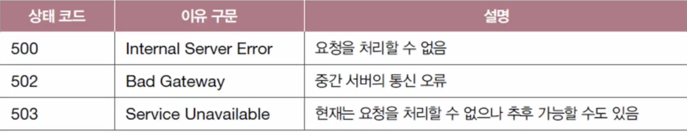
500번대 코드는 '서버의 예기치 못한 상황으로 인해 요청을 처리할 수 없음'을 의미한다. 포괄적인 의미에서 예측하지 못한 에러가 발생하였을때 일반적으로 500코드를 사용한다.

502번대 코드는 클라이언트와 서버 사이에 위치한 중간 서버의 통신 오류를 나타내는 상태코드이다. 게이트웨이를 비롯한 여러 중간 서버중 잘못된 응답을 하거나 정상적이지 않을 때 발생하는 코드이다.
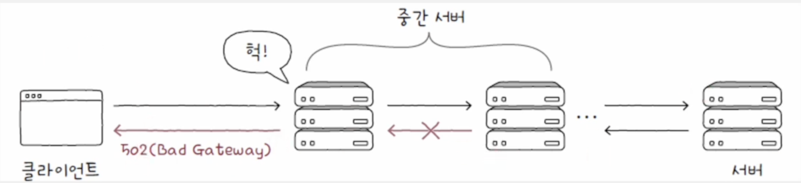

503번대 코드는 '현재 서비스를 일시적으로 사용할 수 없음'을 의미하는 상태코드이다. 서버가 과부하 상태에 있거나 일시적인 점검 상태일 때 볼 수 있는 상태 코드이다.