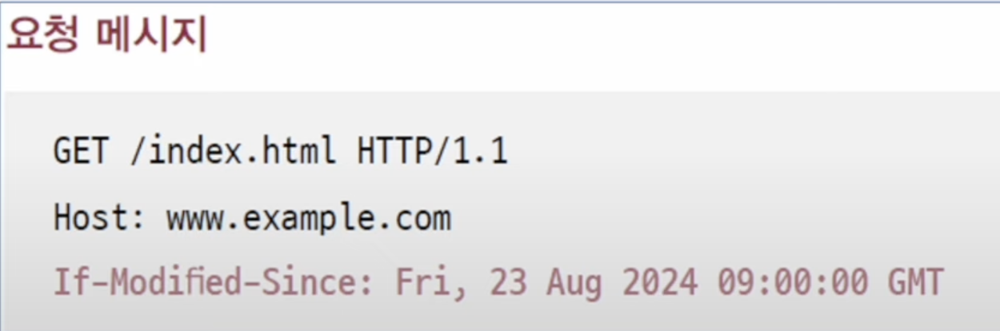

캐시란 불필요한 대역폭 낭비와 응답 지연을 방지하기 위해 정보의 사본을 임시로 저장하는 기술이다.  캐시는 웹 브라우저에 저장되는 **개인 전용 캐시(private cache)** 와 중간 서버에 저장되는 **공용 캐시(public cache)** 가 있다. 

캐시는 어디까지나 임시의 사본이기 때문에 원본 데이터가 바뀐다면 캐시도 갱신해야 한다는 절대적인 원칙이 있다. 이때 특정 캐시의 최신 원본 데이터와의 유사도를 **캐시 신선도**라고 표현하기도 한다. 캐시의 신선도를 유지하기 위한 방법은 **캐시된 데이터의 유효기간을 설정**하는 방법이 있다. 

## 캐시의 유효기간 설정
캐시의 유효기간을 부여하는 방법은 응답 메시지의 Expires 헤더와 Cache-Control 헤더의 Max-Age 값(초)을 이용할 수 있다. 

위의 응답 메시지는 각각 캐시의 유효 기간을 2024년 2월 6일 화요일 12:00:00로 설정하고, 1200초로 설정하는 응답 메시지이다.

## 캐시의 신선도 재검사

만약 캐시의 유효기간이 만료되어 서버에게 자원을 다시 요청해야 하는 상황일 때, 원본 데이터가 캐시와 차이점이 없다면 서버는 굳이 같은 자원을 다시 전송할 이유가 없다. 

이처럼 캐시가 만료되더라도 캐시된 자원이 여전히 신선한지를 검사하기 위해 주로 **날짜 기반으로 서버에게 물어보거나**, **엔티티 태그를 기반으로 서버에게 물어보는 방법**을 사용한다.

### 날짜 기반 재검사
날짜 기반으로 재검사 하는 방식은 `If-Modified-Since` 헤더를 통해 특정 날짜 이후에 원본 데이터의 변경이 있었는지 판단하는 방법을 사용한다. 

위와 같이 `If-Modified-Since` 헤더가 담긴 요청 메시지를 보낸다면 서버에서는 상황에 따라 다음과 같은 응답을 제공한다.
- **200(OK)**: 자원이 변경되어 새로운 자원을 반환한다.
- **304(Not Modified)**: 자원이 변경되지 않음.
- **404(Not Found)**: 요청 받은 자원이 삭제됨 (찾을 수 없음).

여기서 304응답의 경우 `Last-Modified`라는 헤더를 통해 마지막으로 수정된 시점을 알 수 있다.
#### 엔티티 태그 기반 재검사

**엔티티 태그**란 **자원의 버전**을 식별하기 위한 정보로 자원에 유의미한 변경 사항이 생길 시 매번 다른 엔티티 태그가 할당된다. 만약 현재 클라이언트의 엔티티 태그와 서버 원본 자원의 엔티티 태그가 같다면 이는 유의미한 변경이 일어나지 않았다는 것을 의미한다.

엔티티 태그를 이용하여 서버에 요청하기 위해서는 `If-None-Match`헤더를 사용해야 한다. 해당 헤더에 캐시의 엔티티 태그를 담아 요청하면 아래와 같은 응답을 제공한다.
- **200(OK)**: 자원의 엔티티 태그가 변경되어 새로운 자원을 반환한다.
- **304(Not Modified)**: 자원이 변경되지 않음 (엔티티 태그 값이 같음). 
- **404(Not Found)**: 요청 받은 자원이 삭제됨 (찾을 수 없음).