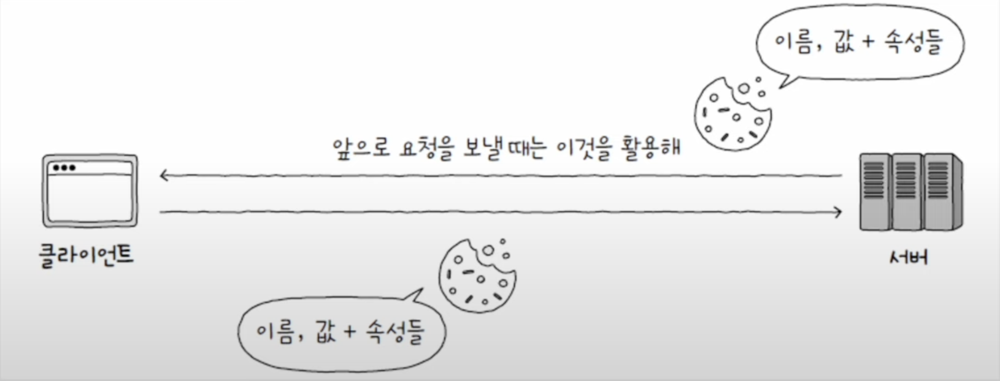
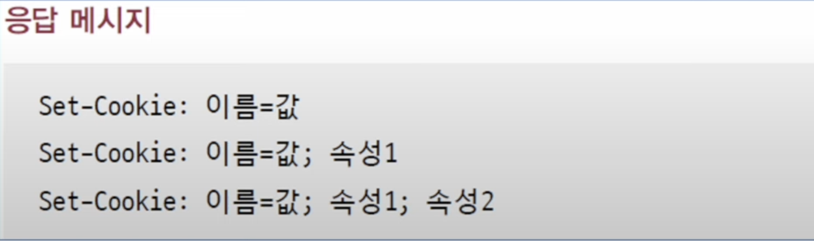
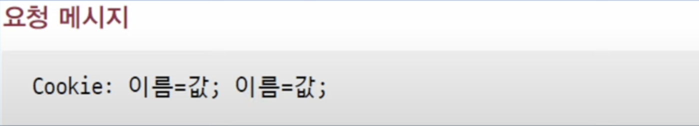
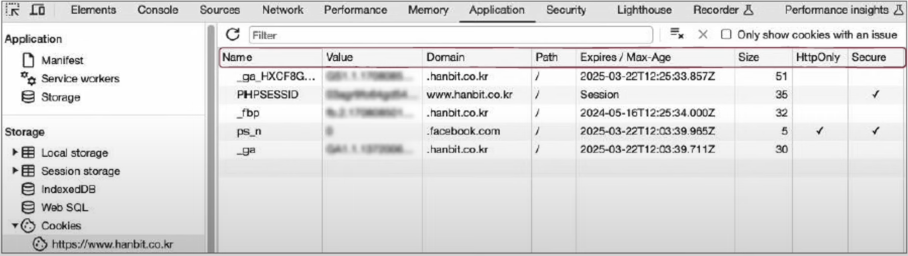
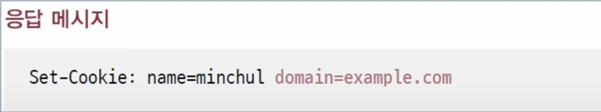
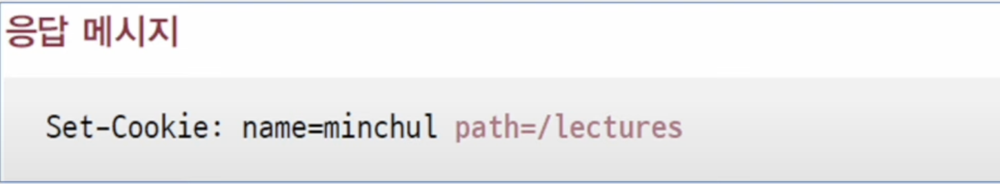
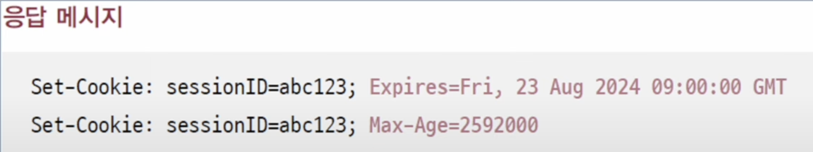

## 쿠키란?
서버에서 생성되어 클라이언트 측에 저장되는 데이터로, 상태를 유지하지 않는 HTTP의 특성을 보완하기 위한 수단이다. `<이름, 값>` 쌍의 형태를 띠고 있으며, 추가로 적용 범위와 만료 기간 등 다양한 속성을 가질 수 있다.

서버는 쿠키를 생성하여 클라이언트에게 전송하고, 클라이언트는 전달받은 쿠키를 저장해 두었다가 추후 동일한 서버에 보내는 요청 메시지에 쿠키를 포함하여 전송한다. 주로 로그인 상태를 유지하는 기능에 사용된다.

> **세션 인증**
> 
> 쿠키에서 보내는 정보를 바탕으로 서버에서 매번 인증 과정을 거치지 않기 위해 서버에서는 **세션 아이디**를 클라이언트에 전송하는 방식으로 인증 과정을 건너뛰는 방법을 사용한다. 이를 **세션 인증**이라고 한다.
>  
>  
> 세션 아이디는 `Set-Cookie`헤더를 통해 전달하며, 다음과 같은 세션 인증 과정을 통해 클라이언트를 식별한다.
> 1. 클라이언트는 서버에게 (아이디, 비밀번호와 같은) 인증 정보를 전송한다.
> 2. 인정 정보가 올바르다면, 서버는 세션 아이디를 생성해 클라이언트에게 전송한다.
> 3. 클라이언트는 추후 요청을 보낼 때 쿠키 내에 세션 아이디를 포함하여 전송한다.
> 4. 서버는 쿠키 속 세션 아이디와 저장된 세션 아이디를 비교하여 클라이언트를 식별한다.

## 쿠키와 관련된 헤더
쿠키를 전송하거나 서버에서 전송한 쿠키를 저장하는 과정은 `Set-Cookie` 헤더와 요청 메시지의 `Cookie` 헤더를 통해 이루어 진다.

응답 메시지의 `Set-Cookie` 헤더를 통해 쿠키의 이름, 값과 더불어 세미콜론(;)으로 구분되는 속성들을 전달할 수 있다.

요청 메시지의 Cookie 헤더 값은 서버에 전달할 쿠키의 이름과 값을 나타내는 헤더이다. 여러개의 쿠키 값을 서버에 전달해야 할 때는 다음과 같이 세미콜론(;)을 사용하여 여러 쿠키의 `이름-값`을 나타낼 수 있다.

## 브라우저에서 쿠키 살펴보기
쿠키는 브라우저에서 저장되고 관리된다. 크롬 브라우저에서 개발자 도구를 열고, `Application` -> `Storage`-> `Cookies`를 확인하면 다음과 같이 쿠키의 이름, 값 목록을 볼 수 있다.

쿠키 관련 정보로 이름과 값 외에 `도메인`과 `경로`등이 있는 것을 볼 수 있는데, 이는 쿠키를 올바른 도메인과 경로에 전송하기 위한 속성 값들이다. 도메인의 경우 `Set-Cookie` 헤더의 `'domain'`속성으로 정해지고, 같은 도메인에서도 하위 경로마다 쿠키를 다르게 설정하고 싶다면 `'path'`속성에 하위 경로를 입력하여 설정할 수 있다.

`Expires/Max-Age`라는 열은 쿠키의 유효 기간을 나타낸다. 쿠키는 보통 유효 기간이 정해져 있기 때문에 `Expires`는 `요일, DD-MM-YY HH:MM:SS GMT` 형식으로 표기되는 만료 시점을 의미하고, `Max-Age`는 초 단위 유효 기간을 의미한다. `Expires/Max-Age`로 명시된 유효기간이 지나면 해당 쿠키는 삭제 되거나 전달되지 않는다.

## 쿠키의 한계
쿠키는 사용하기 간편한 만큼 보안적인 측면에서 한계가 있다. 쿠키의 정보는 쉽게 노출 되거나 조작할 수 있기 때문에 보통 쿠키에는 민감한 정보를 담아 송수신 하는걸 권장하지 않는다.

하지만 이런 문제점을 보롼하기 위해 `Secure`속성과 `HttpOnly`라는 속성이 있다.

`Secure`속성은 HTTPS 프로토콜이 사용되는 경우에만 쿠키를 전송되도록 하는 속성이다. HTTPS 프로토콜은 송수신시 정보가 암호화되기 때문에 보다 안전한 쿠키 전송이 가능하다.

`HttpOnly`속성은 HTTP 송수신을 통해서만 쿠키를 이용하도록 제한하는 속성이다. 쿠키는 HTTP 송수신 외 자바스크립트를 통해 접근이 가능한데, 이로 인해 중간에 쿠키를 가로채거나 위조할 위험이 있기 때문에 HTTP 송수신으로만 쿠키에 접근 가능하도록 제안하는 것이다.

> **웹 스토리지: 로컬 스토리지와 세션 스토리지**
> 
> 쿠키 이외에도 `<키-값>`으로 정보를 저장하는 방법이 있다. 바로 웹 스토리지에 저장하는 것이다. 
>  
>  
> 웹 스토리지에는 웹 브라우저 내의 저장 공간으로, 일반적인 쿠키보다 더 큰 데이터를 저장할 수 있다. 또 쿠키는 서버로 자동 전송되지만, 웹 스토리지의 정보는 서버로 자동 전송되지 않는다.
>  
>  
> 웹 스토리지에는 크케 **로컬 스토리지**와 **세션 스토리지**가 있다. 로컬 스토리지는 별도로 삭제하지 않는 한 영구적으로 정보 저장이 가능하며, 세션 스토리지는 세션이 유지되는 동안(브라우저가 열려 있는 동안) 유지되는 정보이다.

