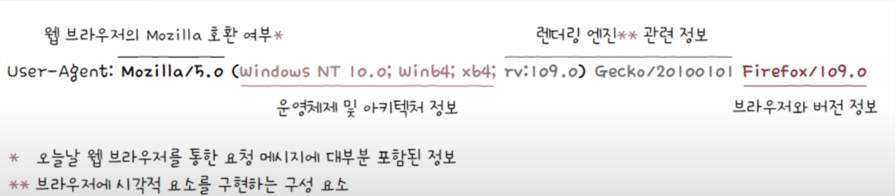
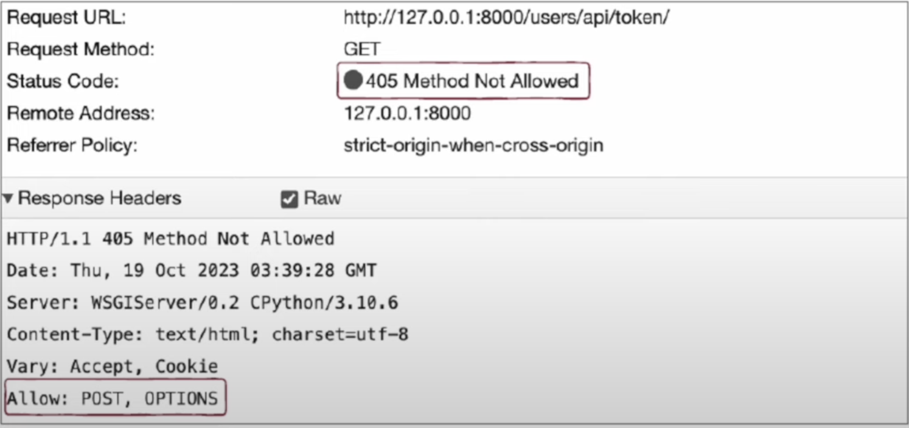

## HTTP 헤더
HTTP 헤더는 요청시 활용되는 헤더와 응답 시 활용되는 헤더, 그리고 요청과 응답 모두에서 자주 활용되는 헤더순으로 설명할 수 있다.

### 요청 시 활용되는 HTTP 헤더
#### 1. Host
요청을 보낼 호스트를 나타내는 헤더이다. 주로 도메인 네임으로 명시되며, 포트 번호가 포함되어 있을 수 있다. 아래 예시는 http://naver.com/user 에 접속할 때의 HTTP 요청 메시지의 일부이다.
```text
Get /user HTTP/1.1
Host: naver.com
...
```

#### 2. User-Agent
**유저 에이전트**란 웹 브라우저와 같이 HTTP 요청을 시작하는 클라이언트 측의 프로그램을 의미한다. 따라서 User-Agent 헤더에는 요청 메시지 생성에 관여한 클라이언트의 운영체제, 브라우저 종류 및 버전, 렌더링 엔진과 같은 정보가 포함되어 있다.


#### 3. Referer
클라이언트가 요청을 보낼 때 머무르고 있던 URL이 명시된다. 해당 헤더를 통해 클라이언트의 유입 경로를 파악해 볼 수 있다.

다음 헤더는 https://google.com 에서 요청을 보냈음을 의미한다.
```text
Referer: https://google.com
```
여담으로, 영문법 상 Referrer이 맞는 표기지만 개발 초기 오류로 인해 지금까지 Referer로 사용되고 있다.

#### 4. Authorization
클라이언트의 인증 정보를 담는 헤더이다. 표기 방식은 다음과 같이 **인증 타입**과 **인증을 위한 정보**가 차례로 명시된다. 
```text
Authorization: <type> <credentials>
```

### 응답 시 활용되는 HTTP 헤더
#### 1. Server
요청을 처리하는 서버 측의 소프트웨어와 관련된 정보를 명시한다. 예시로 다음과 같은 헤더는 'Unix 운영체제에서 동작하는 아파치 HTTP 서버'를 의미한다.
```text
Server: Apache/2.4.1 (Unix)
```

#### 2. Allow
클라이언트에게 허용된 HTTP 메서드 목록을 알려 주기 위해 사용된다. 주로 405(Method Not Allowed)를 응답하는 메시지에 Allow 헤더가 함께 사용된다.


#### 3. Retry-After
503(Service Unavailable)의 상태 코드 응답에서 사용될 수 있는 헤더이다. 자원을 사용할 수 있는 날자 혹은 시간을 나타낸다.

#### 4. Location
클라이언트에게 자원의 위치를 알려 주기 위해 사용되는 헤더이다. 주로 리다이렉션이 발생했을 때나 새로운 자원이 생성되었을 때 사용된다.

#### 5. WWW-Authenticate
401(Unauthorized)상태 코드일때, 인증 방식을 설명하는 헤더이다. 인증 타입을 알려 줄수 있으며, 조금더 많은 정보를 알려주기 위해 다음과 같이 **보안 영역(realm)** 을 함께 알려주거나 인증에 사용될 **문자 집합**도 알려 줄 수 있다.
```text
WWW-Authenticate: Basic realm="Access to engineering site", charset="UTF-8"
```
> **realm이란?**
> 
> realm이란 보안이 적용될 영역을 의미한다. 영역이 달라지면 요구되는 권한도 달라질 수 있다.

### 요청과 응답 모두에서 활용되는 HTTP 헤더
#### 1. Date
메시지가 생성된 날짜와 시각에 관련된 정보를 담은 헤더이다.

#### 2. Connection
클라이언트의 요청과 응답 간의 연결 방식을 설정하는 헤더이다. HTTP가 지속 연결 프로토콜을 유지하기 위해 명시적으로 `keep-alive`를 희망함을 표기하는 헤더이기도 하다. 
```text
Connection: keep-alive
Connection: close
```

#### 3. Content-Length
본문의 바이트 단위 크기(길이)를 나타낸다.
``` text
Content-Length: 100
```

#### 4. Content-Type, Content-Language, Content-Encoding
해당 헤더들은 전송하려는 메시지 본문의 표현 방식을 설명하는 헤더이다. 이런 점에서 **표현 헤더**의 일종이라고도 부른다. 

**Content-Type** 헤더는 메시지 본문에서 사용된 미디어 타입을 담고 있다. 다음 헤더는 메시지 본문이 HTML문서 형식이며, 문자 인코딩으로 UTF-8을 사용한다는 정보를 알려준다.
```text
Content-Type: text/html; charset=UTF-8
```

**Content-Language** 헤더는 메시지 본문에 사용된 자연어를 명시한다. 어떤 언어로 작성되었는지 해당 헤더를 통해 알 수 있으며, 하이픈으로 구분된 언어 태그로 작성되어 있다. `en`, `ko`일 경우 첫 번째 태그만 사용된 것이고, `en-US`, `ko-KR`일 경우 두 번째 서브 태그까지 사용된 것이다.

| 국가  | 국가 코드 |     |  언어  | 언어 코드 |
| :-: | :---: | --- | :--: | :---: |
| 한국  |  KR   |     | 한국어  |  ko   |
| 미국  |  US   |     |  영어  |  en   |
| 영국  |  GB   |     | 중국어  |  zh   |
| 중국  |  CN   |     | 일본어  |  ja   |
| 타이완 |  TW   |     | 독일어  |  de   |
| 일본  |  JP   |     | 프랑스어 |  fr   |
| 독일  |  DE   |     |      |       |
| 프랑스 |  FR   |     |      |       |

**Content-Encoding** 헤더는 메시지 본문을 압축하거나 변환한 방식이 명시된다. HTTP를 통해 송수신 되는 데이터는 전송 속도 개선을 위해 종종 압축이나 변환이 되는데, 이때 사용된 방식을 인식하고, 압축을 헤제하거나 원문으로 재변환하여 본문 내용을 확인할 수 있다.
```text
Content-Encoding: gzip
Content-Encoding: compress
Content-Encoding: deflate
Content-Encoding: br

// 여러 인코딩이 사용되었을 경우 적용된 순서대로 명시
Content-Encoding: deflate, gzip
```