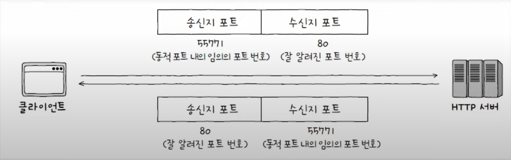

네트워크 계층의 IP는 **신뢰할 수 없는 통신**과 **비 연결형 통신**을 수행한다는 한계가 있다. 전송 계층은 신뢰할 수 있는 통신과 연결형 통신을 가능하게 하여 IP의 한계를 극복하고, **포트 번호**를 통헤 응용 계층의 애플리케이션 프로세스들을 식별하는 역할을 수행한다.

## 신뢰할 수 없는 통신과 비연결형 통신
**신뢰할 수 없는 통신**은 IP 프로토콜이 패킷이 수신지까지 제대로 전송되었는지 보장하지 않는 특징이다. 패킷의 손상이나 손실에 대한 확인을 하지 않으며 도착할 것이라는 보장도 없다는 것이다. 이러한 특성을 **최선형 전달**이라 부른다.

**신뢰할 수 없는 통신**: IP 프로토콜이 전송한 패킷이 수신지까지 전송되었다는 보장을 하지 않는 특징

**최선형 전달**: 전송 결과에 대해서는 어떠한 보장도 하지 않는 특성 (전송은 최선을 다할게~ 근데 결과는 몰라)

**비 연결형 통신**은 이름 그대로 송수신 호스트 간에 사전 연결 수립 작업을 가치지 않는 특징을 의미한다.

## 전송 계층이 IP의 한계를 보완하는 방법
### 1. 전송 계층은 연결형 통신을 가능하게 한다.
연결형 통신을 지원하는 프로토콜인 **TCP**를 사용하여 두 호스트가 정보를 주고 받기 전에 마치 가상의 회선을 설정하듯 연결을 수립한다.

### 2. 전송 계층은 신뢰성 있는 통신을 가능하게 한다.
이 또한 **TCP**를 사용하여 패킷의 확실한 전달을 보장하기 위해 재전송을 통신 오류 제어, 흐름 제어, 혼잡 제어 등을 진행한다.

> #### 빠른 전송을 위한 프로토콜, UDP
> 패킷 전송에 있어, 신뢰성 있는 통신을 중요하게 여기는 통신에서는 TCP를 사용하지만, 패킷의 일부 손실 보단 속도가 중요한 상황(실시간 스트리밍 서비스 등)에서는 비연결성 통신과 신뢰할 수 없는 통신을 해야 할 때가 있다. 이럴때 사용하는 프토로콜이 **UDP** 이다.

## 응용 계층과의 연결 다리, 포트
### 포트의 정의 
패킷이 실행 중인 특정 애플리케이션 프로세스까지 전달되어야 할때, 특정 애플리케이션을 식별할 수 있는 정보를 **포트**라고 한다.

### 포트의 분류
전송 계층에서는 수신자 포트와 송신자 포트를 통해 송수신지 호스트의 애플리케이션을 식별한다. 포트 번호는 2^16(65536개, 0 ~ 65535)개가 존재히며, 포트의 범위별 대표적인 종류는 3가지가 있다.

> 잘 알려진 포트와 등록된 포트의 할당은 **인터넷 할당 번호 관리 기관(IANA)** 에서 한다. 물론 해당 포트 번호는 권고일뿐 강제는 아니다.
#### 잘 알려진 포트(well kown port)
- 0 ~ 1023 포트 번호
- 시스템 포트라고도 불리며 범용적으로 사용되는 포트 번호를 의미한다. 
#### 등록된 포트(registered port)
- 1024 ~ 49151 포트 번호
- 잘 알려진 포트에 비해서느 덜 범용적이지만, 흔히 사용되는 애플리케이션 프로토콜을 할당하기 위해 사용된다.
#### 동적 포트(dynamic port)
- 49152 ~ 65535 포트 번호
- 사설 포트, 임시 포트라고도 불리며 특별히 관리되지 않아 자유롭게 사용 가능한 포트이다.

서버로서 동작하는 프로그램은 일반적으로 잘 알려진 포트, 등록된 포트(사전에 암묵적으로 정해진 포트)로 동작하는 경우가 많다. 하지만 클라이언트로서 동작하는 프로그램은 동적 포트 번호중에서 **임의의 포트가 할당되는 경우가 많다**. 대표적인 예시로 **웹 브라우저**가 있다.

IP와 포트 번호에 대한 정보가 함께 주어지면, **특정 호스트에서 실행 중인 특정 애플리케이션 프로세스**를 식별 할 수 있기 때문에, 일반적으로 **IP 주소:포트번호** 형식으로 IP 주소와 함께 표기되는 경우가 많다.

## 정리
- 전송 계층은 신뢰할 수 있는 연결형 통신이 가능한 프로토콜인 **TCP**를 제공하여 네트워크 계층의 **한계를 보완**한다.
- 포트를 통해 응용 계층의 애플리케이션을 식별함으로써 응용 계층과의 연결다리 역할을 수행한다.