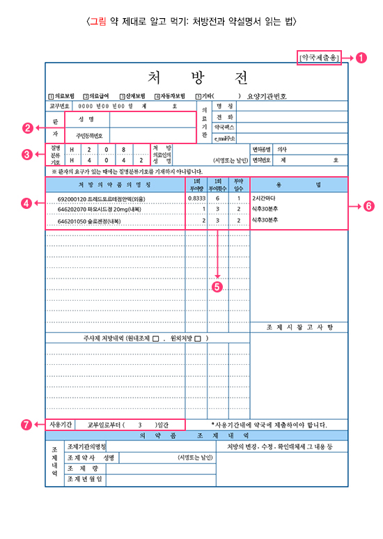
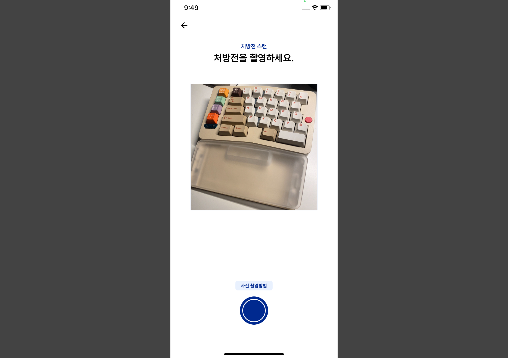
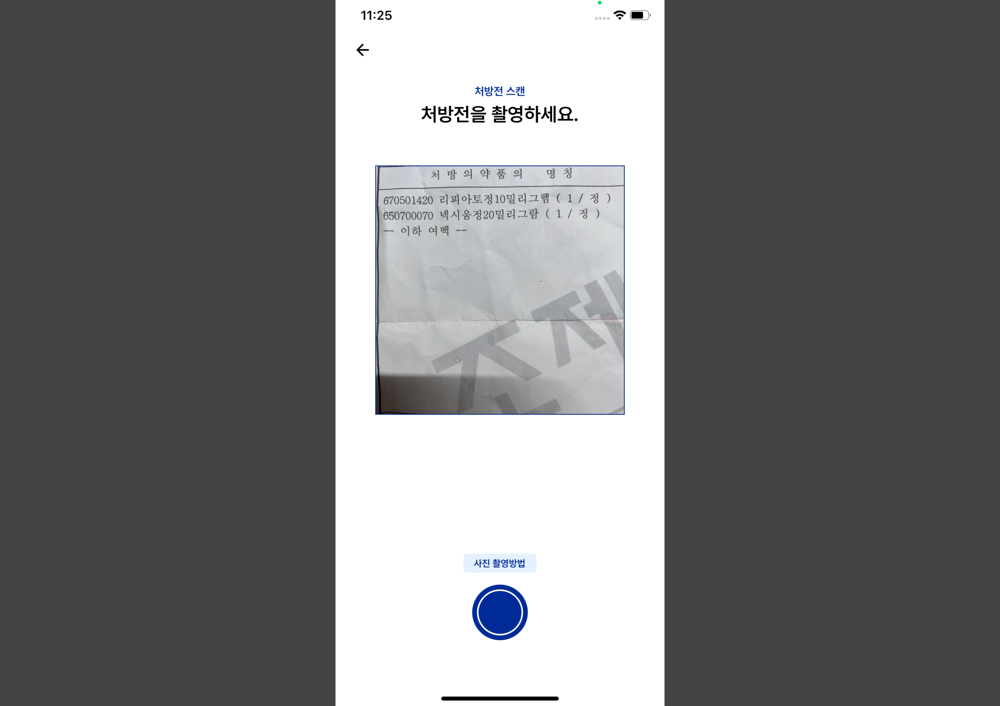
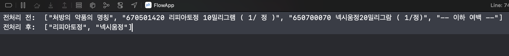
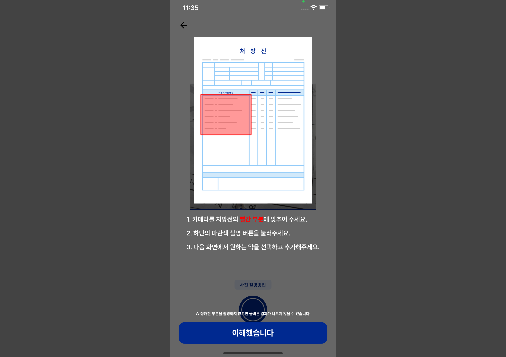
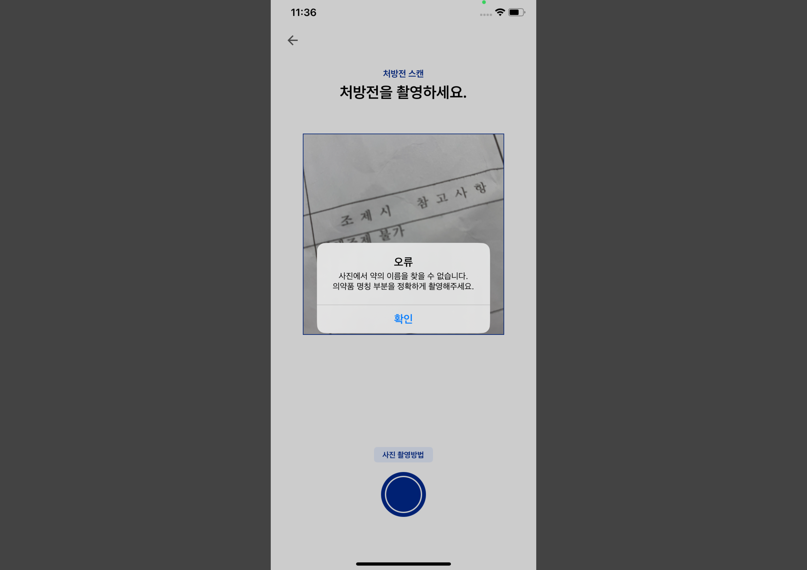
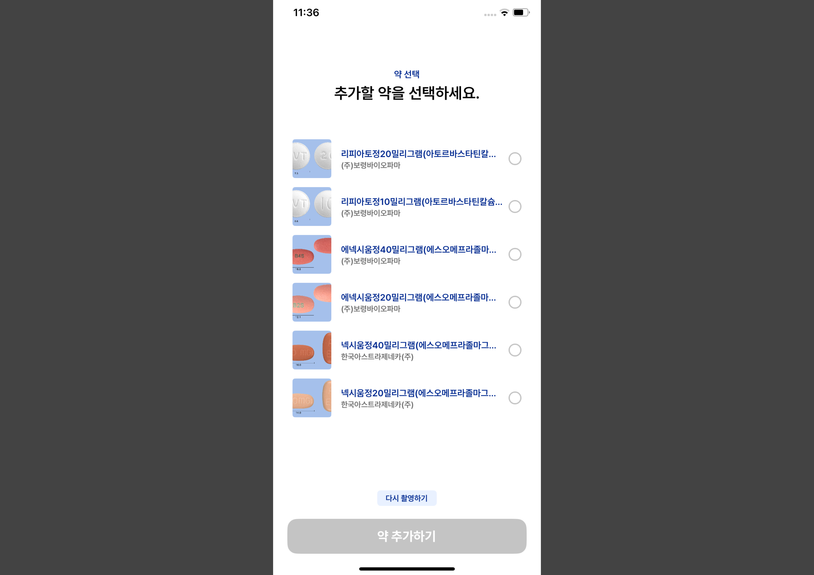

복약기록 서비스인 Flow를 개발하던 중, 처방전의 내용을 바탕으로 복약할 약을 자동으로 추가할 수 있는 기능 개발을 진행하려고 하였다.

## 1. 처방전의 글자를 인식하는 방법
### 1-1. 처방전의 형태 분석
먼저 처방전의 형태가 어떤식으로 생겼는지 조사를 시작하였다.

질병관리청 국가건강정보포털의 [처방전과 약 설명서 읽는 방법! 알려드리겠습니다!](https://health.kdca.go.kr/healthinfo/biz/health/gnrlzHealthInfo/gnrlzHealthInfo/gnrlzHealthInfoView.do?cntnts_sn=3607)에 따르면, 처방전에는 크게 **약국제출용**과 **환자보관용**이 있으며, 위 사진과 같은 구성으로 이루어져 있다고 한다.

1. 약국제출용, 환자보관용 식별 글자
2. 대상 환자의 정보 (성명, 주민등록번호)
3. 환자가 가진 질병에 따른 질병분류기호
4. 환자가 처방받은 의약품 이름
5. 약의 적정 투여량, 투여횟수, 투약알수
6. 약을 먹는 방법(용법)
7. 처방전의 사용 기간

여기서 내가 필요한 정보는 **4번째의 처방받은 의약품 이름**이다.

### 1-2 처방전에서 약 이름 추출
사진에 글자를 추출하는 방식은 크기 2가지를 찾을 수 있었다.
1. 광학 문자 인식(OCR)
2. AI 기반 텍스트 추출

두 방법의 장단점은 아래와 같다.

| 항목       | OCR 방식                  | AI 기반 방식                         |
| -------- | ----------------------- | -------------------------------- |
| 인식 정확도   | 사진 품질에 따라 다르나, 일반적으로 낮음 | 높음 (저해상도나 복잡한 레이아웃도 인식 가능)       |
| 전처리 의존도  | 매우 높음                   | 비교적 낮음                           |
| 속도       | 빠름 (가벼워서 로컬에서도 처리 가능)   | 비교적 느림 (모델에 따라 다르나 일반적으로 연산량이 큼) |
| 온디바이스 실행 | 가능                      | 어려움 (외부 모델서버에 의존)                |
| 비용       | 무료                      | 유료 (외부 API 사용해야함)                |

이 둘을 비교했을 때, 비교적 인식 정확도는 낮지만 비용과 속도 그리고 온디바이스 실행이 가능한 OCR 기능을 사용하는 것이 합리적이라 생각하여 iOS에서 OCR은 어떤식으로 구현해야 하는지 찾아보았다.

iOS에서는 [VisionKit](https://developer.apple.com/documentation/visionkit)이라는 apple의 자체 API로 OCR을 지원한다는 문서를 찾을 수 있었다. 심지어 iOS 16.4 이상부터는 한국어까지 지원하기 때문에 안쓸 이유가 없었다.

## 2. VisionKit으로 처방전 약품명 추출하기
### 2-1. AVFoundation으로 카메라 기능 구현하기
먼저 VisionKit에서 인식할 사진을 찍는 기능을 구현하기 위해 AVFoundation으로 카메라 기능을 구현하였다. 

[AVFoundation](https://developer.apple.com/documentation/avfoundation)은 Apple 플렛폼 시청각 매체의 검사, 재생, 캡처 및 처리 과정에 필요한 작업들을 모아둔 라이브러리이다. 해당 라이브러리의 [AVCaptureDevice](https://developer.apple.com/documentation/avfoundation/avcapturedevice/), [AVCaptureSession](https://developer.apple.com/documentation/avfoundation/avcapturesession/), [AVCaptureVideoPreviewLayer](https://developer.apple.com/documentation/avfoundation/avcapturevideopreviewlayer/) 등의 클래스를 활용하면 커스텀 카메라 화면을 구현할 수 있다.

자세한 구현은 [해당 블로그](https://velog.io/@heyksw/iOS-AVFoundation-%EC%9C%BC%EB%A1%9C-custom-camera-%EA%B5%AC%ED%98%84)를 참고하였다.

아래와 같은 UI로 사용자가 처방전의 의약품 명칭 부분을 촬영할 수 있도록 구현하였다.


### 2-2. 촬영한 사진 VisionKit으로 글자 추출하기
촬영한 사진의 글자를 VisionKit으로 분석하기 위해서는 `VNImageRequestHandler`이라는 클래스와 `VNRecognizeTextRequest`이라는 클래스를 사용해야 한다. 

`VNImageRequestHandler`은 단일 이미지에 대해 하나 이상의 분석 요청을 하기위한 객체로, 생성자로 `cgImage`를 받는다.

``` swift
let handler = VNImageRequestHandler(cgImage: cgImage)
```

`VNRecognizeTextRequest`은 이미지에서 텍스트를 찾는 요청을 하기위한 객체로, 해당 객체를 사용해서 아까 설정한 `VNRecognizeTextRequest` 이미지의 택스트 분석 요청을 진행할 수 있다. 클로저를 사용하여 분석 결과를 반환하는데, 분석된 택스트의 위치(CGRect)와 분석 택스트를 받을 수 있다.

`VNRecognizeTextRequest`의 초기 설정으로 어떤 버전의 비전을 사용할건지, 어떤 언어를 분석할 것 인지 등을 설정할 수 있다. 자세한 내용은 [공식문서](https://developer.apple.com/documentation/vision/vnrecognizetextrequest)를 참고하였다.
``` swift
let request = VNRecognizeTextRequest { [weak self] request, error in

	guard let observations = request.results as? [VNRecognizedTextObservation],
		error == nil else { return }

	let texts = observations.compactMap { $0.topCandidates(1).first?.string }

	// OCR 결과물
	print(texts)
}

// 버전 설정
request.revision = VNRecognizeTextRequestRevision3
// 인식 레벨 설정
request.recognitionLevel = .accurate
// 언어 설정
request.recognitionLanguages = ["ko-KR", "en-US"]
// 언어 교정 사용여부
request.usesLanguageCorrection = true
```

이제 `VNImageRequestHandler` 객체의 `preform(_:)`을 사용해서 이미지 분석 요청을 진행해 준다.
``` swift
try? handler.perform([request])
```

### 2-3. 전처리 진행
OCR진행 후 결과물을 살펴보면, `646201050 (급) 파모시드정 20mg`이나 `처방 의약품 명칭`과 같이 약품명과 관련 없는 문장들이 포함되어 있는 것을 볼 수 있다. 그래서 아래와 같은 4단계의 작업을 통해 가능한 순수한 약품명을 얻을 수 있도록 구현하였다.
#### 1. 필요없는 문장 제거
`주사제 처방내역`, `~습니다`, `~합니다`, `~마세요` 와 같은 약품명과 관계없는 단어들을 선정하여 배열에 저장한 후, 해당 단어가 포함되어 있는 값 제외
``` swift
let unAbleString = ["•", "합니다", "습니다", "마세요", "계산서", "영수증", "공제신청", "세부내역", "부담항목", "복용", "봉투", "처방", "처방의약품", "명칭", "환자", "질병" ,"투여", "투약", "구분코드", "봉투", "약품", "값", "횟수", "일수", "총투", "여백"]

// 필요없는 문장 필터링 진행
let longStringFilterTexts = texts
	.filter { text in
		unAbleString.contains { word in text.contains(word) } == false
	}
```
#### 2. 공백 기준으로 문장 분리
`646201050 (급) 파모시드정 20mg`과 같은 문장에서 약품명을 분리하기 위해 공백 기준으로 문장 분리
``` swift
// 공백 기준으로 문장 분리
let spliteTexts = longStringFilterTexts
	.flatMap { 
		$0.components(separatedBy: .whitespaces)
			.filter { $0.isEmpty == false }
	}
```
#### 3. 약품명의 기본 조건을 만족하지 않는 단어 제외
단어 개수가 1개 이하, 단어가 숫자로만 구성, 단어 첫 문자가 숫자인 단어 제외
``` swift
let filterTexts = spliteTexts
	// 문장 개수가 1개 이하 제거
	.filter { $0.count > 1 }
	// 숫자로만 이루어저 있는 문장 제거
	.filter { $0.allSatisfy { $0.isNumber } == false }
	// 첫 단어가 숫자인 문장 제거
	.filter { $0.first!.isNumber == false }
```
#### 4. 특수문자가 들어간 단어 제외 및 단위 제거
괄호나 덧셈기호 같은 특수문자가 들어간 단어 제외, `파모시드정20mg`에서 `20mg` 같은 단위 제거
``` swift
let unAbleCharacters = ["(", ")", "[", "]", ",", "-", "+", "\\", "|"]

// 특수문자 필터링 진행 및 단위 삭제
let validTexts = filterTexts
	.filter { text in
		unAbleCharacters.contains { word in text.contains(word) } == false
	}
	.map { text in
		if let index = text.firstIndex(where: { $0.isNumber }) {
			return String(text[..<index])
		} else {
			return text
		}
	}
	.filter { $0.count > 1 }
```
### 전처리 결과물


### 2-4. 촬영 가이드라인 구현
좋은 품질의 결과물을 얻으려면 전처리도 중요하지만, 무엇보다 효과적인 방법은 사용자에게 정확한 촬영 방법을 가이드라인으로 안내하는 것이다. 이를 위해 촬영 전 가이드라인 페이지를 노출시켜 사용자가 올바른 촬영을 진행하도록 유도하였다.

(여담으로 처방전 사진은 저작권 등의 문제를 피하기 위해 한땀한땀 피그마로 제작하였다...)
## 3. 추출한 약품명을 사용해 약 검색하기
추출한 약품명을 식약처 API를 사용해 실제 존재하는 약인지 검증하는 과정을 거쳤다. 만일, 여기서 결과값이 나오지 않는다면 사용자에게 재촬영을 요청하도록 구현하였다.

만일 약 검색에 성공했다면, 해당 결과중 원하는 약을 사용자가 선택하여 추가할 수 있도록 구현하였다.

좀더 자세한 작동 과정을 보고 싶다면? 아래 링크 참고 (홍보 맞다 ㅎㅎ)
https://apps.apple.com/us/app/flow-%EB%A7%A4%EC%9D%BC-%EB%B3%B5%EC%9A%A9%ED%95%9C-%EC%95%BD-%EA%B8%B0%EB%A1%9D%ED%95%98%EA%B8%B0/id6502969163

## 참고
- https://ohwhatisthis.tistory.com/17
- https://developer.apple.com/documentation/visionkit
- https://zeddios.tistory.com/526
- https://velog.io/@heyksw/iOS-AVFoundation-%EC%9C%BC%EB%A1%9C-custom-camera-%EA%B5%AC%ED%98%84
- https://developer.apple.com/documentation/avkit
- https://developer.apple.com/documentation/avfoundation