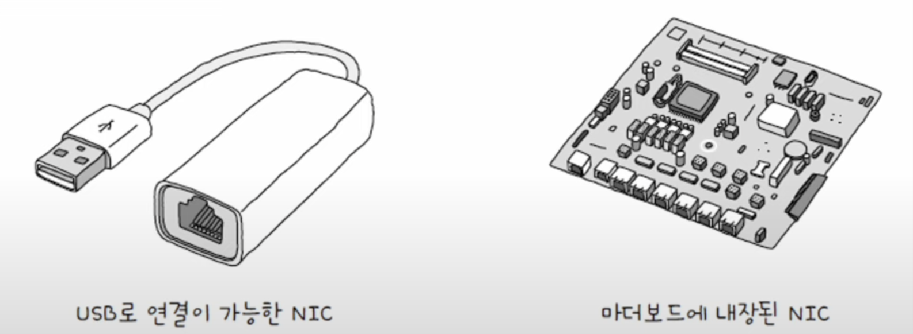
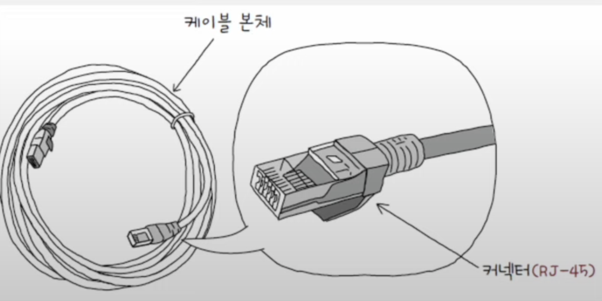
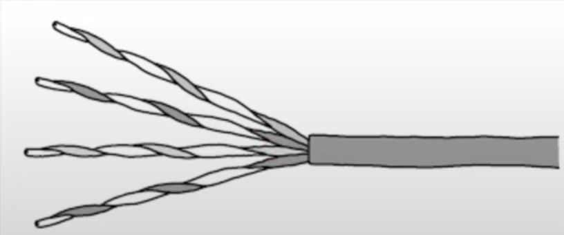
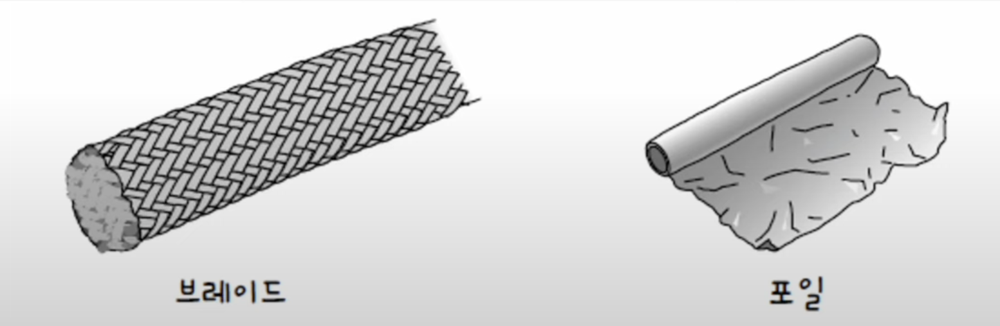
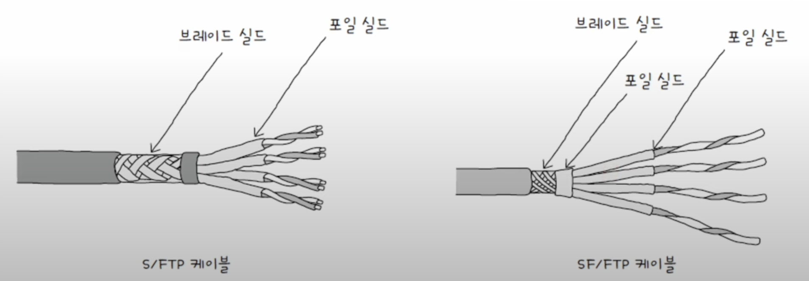
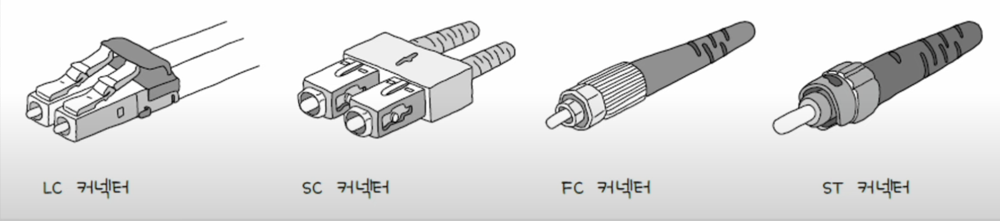
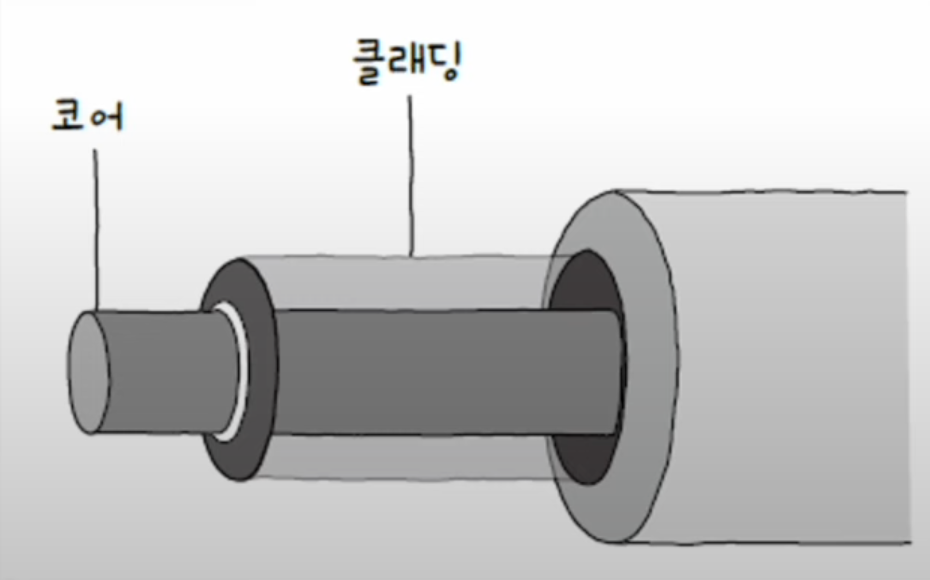
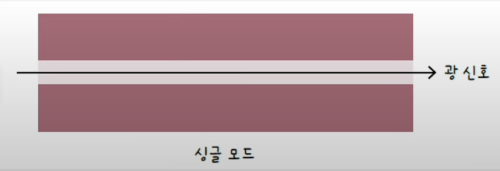
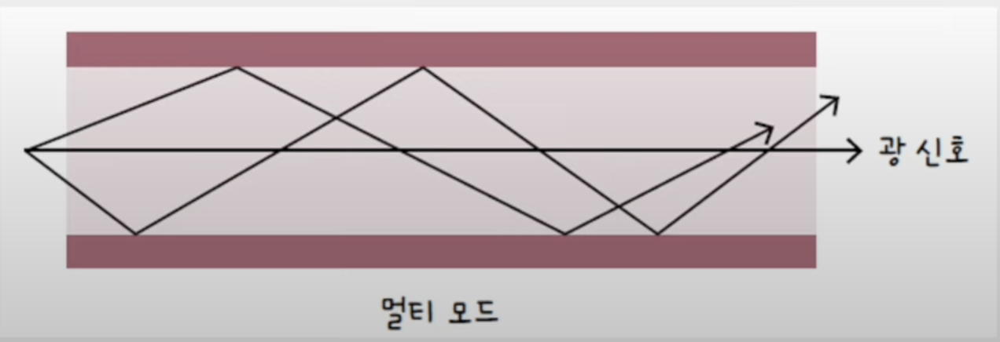

## NIC란?
**NIC(Network Interface Controller)**는 호스트와 통신 메체를 연결하고, MAC 주소가 부여되는 네트워크 장비이다. 

통신 매체에는 다양한 신호(전기, 빛)가 흐를 수 있어 해당 신호를 호스트가 이해할 수 있도록 **변환하는 과정이 필요**하다. 이때, 호스트와 유무선 통신 매체를 연결하고 이러한 변환을 담당하는 네트워크 장비가 NIC이다.
NIC가 있어야 네트워크 신호를 받을 수 있고, 네트워크에 참여하여 다른 호스트에게 신호를 줄 수 있다.

### NIC의 생김새
NIC는 네트워크 인터페이스 카드, 네트워크 어댑터, LAN 카드, 네트워크 카드, 이더넷 카드 등 다양한 명칭으로 불리고 있다. 

우리에게 익숙한 LAN 카드도 NIC에 속하는 것인데, 이 외에 USB로 연결하거나 메인보드에 내장되어 있는 NIC도 있다.

### NIC의 역할
NIC는 통신 매체에 흐르는 신호를 호스트가 이해하는 프레임으로 변환하거나 반대로 호스트가 이해하는 프레임을 통신 매체에 흐르는 신호로 변환한다.

**통신 매체 -> NIC -> 호스트**

**통신 매체 <- NIC <- 호스트**

NIC는 네트워크의 연결점을 담당한다는 점에서 **네트워크 인터페이스** 역할을 수행한다고도 한다.

NIC에는 자신의 MAC 주소가 아닌 다른 주소의 프레임도 수신되는데, 만약 자신의 MAC주소의 프레임이 아닌 경우 해당 프레임을 폐기할 수 도 있고, FCS 필드를 토대로 오류를 검출해 잘못된 프레임을 폐기하기도 한다.

## 케이블
케이블은 NIC에 연결되는 물리 계층의 유선 통신 매체이다. 대표적인 종류로는 트위스티드 페어 케이블, 광섬유 케이블이 있다.

### 트위스티드 페어 케이블
구리 선으로 전기 신호를 주고받는 통신매체 이다. 우리가 흔히 말하는 LAN 케이블이라 했을때 떠오르는 가장 익숙한 케이블이다.

트위스티드 페어 케이블은 케이블 본체와 케이블의 연결부인 커넥터로 이루어져 있다. 
커넥터의 경우 주로 **RJ-45**라는 명칭을 자주 사용하며, 케이블 본체에는 구리선이 두가닥씩 꼬아져 있는 모습이다.

구리선이 꼬아져 있는 구조상 트위스티드 페어 케이블에는 노이즈가 발생할 수 있는데, 이를 막기 위해 그물 모양의 철사인 **브레이드 실드**와 **포일 실드**를 사용한다.

사용한 실드에 따라 정해진 명칭이 있는데,  `XX` / `Y`TP의 형대를 띈다.
`X`와 `Y`에는 U, S, F의 문자가 들어간다.

**U**: 아무것도 감싸지 않음 
**S**: 브레이드 실드로 감쌈 
**F**: 포일 실드로 감쌈

앞의 `XX`의 경우 케이블 외부를 감싸는 실드 종류가 명시되며, 2개의 실드를 사용할 수 있어 X가 2개 있는 것이다. `Y`의 경우 꼬인 구리 선 쌍을 감싸는 실드의 종류가 명시된다.

### 광섬유 케이블
광섬유 케이블은 이름 그대로 **빛(광신호)**를 이용해 정보를 주고 받는 케이블이다. 빛을 이용하여 전송하기 때문에 전기 신호에 비해 속도가 빠르고, 먼 거리까지 전송이 가능하며, 노이즈로부터 간섭받는 영향도 적다. 이런 장점 덕분에 광섬유 케이블은 대륙간 네트워크 연결에도 사용된다.

광섬유 케이블은 다양한 커넥터의 종류가 있으며, 케이블 본체 내부에는 머리카락과 같은 형태의 광섬유로 구성되어 있다.

광섬유 한가닥의 중심에는 실질적으로 빛이 흐르는 부분인 **코어**가 있으며, 코어의 주위에서 코어 안의 빛을 가두는 **클래딩**이 있다. 코어와 클래딩 간에 빛의 굴절률 차이를 만들어 빛을 코어 내부에 가두는 원리이다.

광섬유 케이블은 코어의 지름에 따라 **싱글 모드 광섬유 케이블**과 **멀티 모드 광섬유 케이블**로 나뉜다.
### 싱글 모드 광섬유 케이블
코어의 지름이 8~10µm 정도이다. 코어의 지름이 작기 때문에 빛이 이동할 수 있는 경로가 하나 이상을 갖기 어렵고, 이를 두고 **"모드가 하나다"** 라고 표현한다.

싱글 모드 케이블은 파장이 긴 장파장 빛을 사용하며, 신호 손실이 적기에 장거리 전송에 적합하다. 하지만 멀티 모드에 비해 일반적으로 비용이 높다는 단점도 있다.

### 멀티 모드 광섬유 케이블
코어의 지름이 50~62.5µm 정도이다. 코어의 지름이 싱글 모드에 비해 크기 때문에 빛이 여러 경로로 이동할 수 있다. 이를 두고 **"모드가 여러 개"** 라고 표현한다.

멀티 모드는 싱글 모드보다 전송 시 신호 손실이 클 수 있기에 주로 근거리 연결에 사용한다. 또한 멀티 모드 케이블은 싱글 모드에 비해 단파장의 빛을 사용한다.