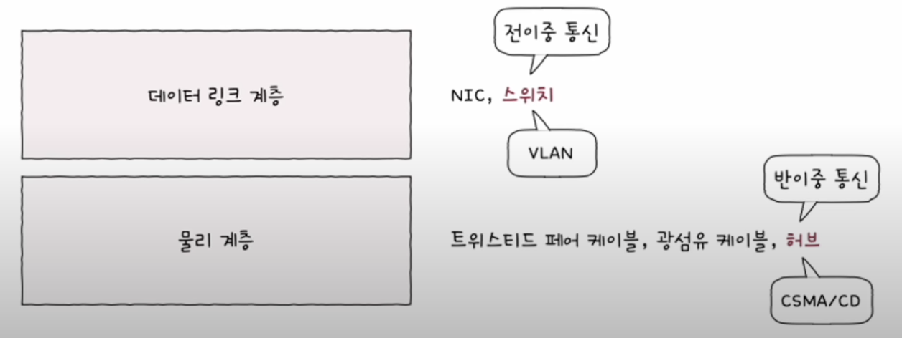

## 네트워크 장비
네트워크 장비에는 허브와 스위치 등이 있다. 허브는 물리 계층을 대표하는 장비이고, 스위치는 데이터 링크 계층을 대표하는 장비이다.

## 주소 개념이 없는 물리 계층
물리 계층과 데이터 링크 계층의 차이점중 하나는 물리 계층에는 주소 개념이 없고, 데이터 링크 계층에는 있다는 것이다. 물리 계층에서는 단지 호스트와 통신 매체 간의 연결과 통신 매체상의 송수신이 이루어 질 뿐, 송수신 되는 정보의 어떠한 조작이나 판단을 하지 않는다.

반면, 데이터 링크 계층의 경우 MAC주소라는 주소 개념이 존재한다. 따라서 데이터 링크 계층의 장비나 그 이상의 계층 장비들은 송수신지를 특정할 수 있고, 주소를 바탕으로 송수신 되는 정보에 대한 조작과 판단이 가능하다.

## 허브
물리 계층의 허브는 **여러 대의 호스트를 연결**하는 장치이다. 리피터 허브라고 부르기도 하며, 이더넷 네트워크의 허브는 이더넷 허브라고 부른다.

허브는 커넥터를 연결할 수 있는 포트라는 지점이 있으며, 포트에 호스트의 연결 매체를 연결할 수 있다.

### 허브의 특징
#### 1. 전달 받은 신호를 다른 모든 포트로 그대로 다시 내보낸다.
허브는 물리 계층에 속하여 주소 개념이 없기 때문에 수신지를 특정할 수 없다. 그래서 허브는 신호를 전달 받으면 어떠한 조작이나 판단을 하지 않고 송신지를 제외한 모든 포트에 신호를 내보내기만 한다. 이러한 신호는 데이터 링크 계층에서 패킷의 MAC 주소를 확인하고 자신과 관련 없는 주소는 폐기한다.

#### 2. 반이중 모드로 통신한다.
반이중 모드란, 마치 1차선 도로처럼 송수신을 번갈아 가면서 하는 방식이다. 동시에 송수신이 불가능 하며 다른 쪽의 송신이 끝나야 자신의 송신이 가능한 것이다.

> #### 반이중 모드의 반대, 전이중 모드
> 반이중 모드의 반대로 전이중 모드가 있다. 전이중 모드는 송수신을 동시에 양방향으로 할 수 있는 모드이다.
> 

### 콜리전 도메인
허브는 반이중 모드로 통신하기 때문에 동시에 송수신이 불가능 하다고 하였다. 하지만 만일 동시에 허브에 신호를 송신하면 **충돌(Collision, 콜리전)**이 발생한다.

허브에 호스트가 많이 연결되어 있을수록 충돌 발생 가능성이 높아진다. 그리고 이렇게 충돌이 발생할 수 있는 영역을 **콜리전 도메인(Collision Domain)** 이라고 한다.

허브의 넓은 콜리전 도메인으로 인한 충돌 문제를 해결하려면 **CSMA/CD 프로토콜**을 사용하거나 스위치 장비를 사용해야 한다.

## CSMA/CD
CSMA/CD는 허브와 같이 반이중 모드에서의 동시 신호 송신으로 인한 충돌을 해결하기 위한 대표적인 프로토콜이다. 

**CSMA/CD**는 **Carrier Sense Multiple Access with Collision Detection**의 약자이다. 단어 하나하나를 살펴보며 **CSMA/CD**에 대해 이해해보자.

### 1. CS는 Carrier, 캐리어 감지를 의미한다.
CSMA/CD프로토콜을 사용중인 반이중 이더넷 네트워크에서는 메시지를 보내기 전에 현재 네트워크상에서 전송 중인 것이 있는지 먼저 확인한다. 이러한 확인 화정을 **캐리어 감지(Carrier Sense)**라고 한다.

> 엄밀히 말하면 반송파 감지를 의미한다고 한다.

### 2. MA는 Multiple Access, 다중 접근을 의미한다.
위의 캐리어 감지를 진행 하여도, 부득이 하게 동시에 네트워크를 사용하려 할 때가 있다. 복수의 호스트가 네트워크에 접근하려는 상황을 **다중 접근(Multiple Access)**라고 한다.

### 3. CD는 Collision Detection, 충돌 검출을 의미한다.
충돌이 발생하면 이를 검출 하는것을 **충돌 검출(Collision Detection)** 이라고 한다. 충돌을 감지하면 전송이 중단되고, 충돌을 검출한 호스트는 다른 호스트에게 충돌이 발생했음을 알리는 **잼 신호(jam signal)** 라는 특별한 신호를 보낸다. 그리고 임의의 시간 동안 기다린 뒤 다시 전송한다.

정리하면, 반이중 이더넷 네트워크에서 CSMA/CD 프로토콜을 사용하면 다음과 같은 순서의 작업을 진행한다.

**호스트들은 메시지를 전송하기 전..**
1. 먼저 현재 전송이 가능한 상태인지 확인하고,
2. 다른 호스트가 전송 중이지 않을 때 메시지를 전송한다.
3. 만일 부득이하게 다수의 호스트가 접근하여 충돌이 발생하면 임의의 시간만큼 대기한 후에 다시 전송한다.