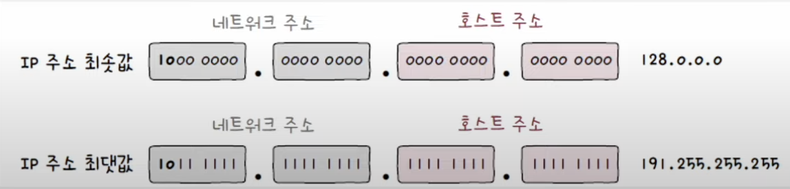

IP 주소는 네트워크 통신에서 기본적으로 사용되는 주소이다. 하나의 IP 주소는 크게 **네크워크 주소**와 **호스트 주소**로 이루어져 있다.

## 네트워크 주소와 호스트 주소
**네트워크 주소**는 네트워크 ID, 네트워크 식별자 등으로 부르기도 하며, **호스트 주소**는 호스트 ID, 호스트 식별자등으로 부른다.

네트워크 주소와 호스트 주소의 범위는 유동적일 수 있다. 이런 유동적인 네트워크 주소와 호스트 주소를 분류하는 기준이 IP 주소의 **클래스**이다.

## 클래스풀 주소 체계
**클래스**는 네트워크 크기에 따라 IP 주소를 분류하는 기준이다. 클래스를 이용하면 필요한 호스트 IP 개수에 따라 네트워크 크기를 가변적으로 조정해 네트워크 주소와 호스트 주소를 구획할 수 있다.

이처럼, 클래스를 기반으로 IP 주소를 관리하는 주소 체계를 **클래스풀 주소 체계**라고 한다. **클래스풀 주소 체계**에는 각각 A, B, C, D, E 클래스가 있다. 이중 D, E 클래스는 각각 멀티캐스트를 위한 클래스와 특수한 목적을 위해 예약된 클래스이기 때문에 A, B, C 클래스만 살펴볼 것이다.
### A 클래스
- 할당 가능한 호스트 주소가 3옥텟으로 가장 많다. (2^24, 16,777,216개)
- 네트워크 주소는 1옥텟으로 비트 '0'으로 시작한다. (2^7, 128개)
- 최솟값: 0.0.0.0, 최댓값: 127.255.255.255

### B 클래스
- 할당 가능한 호스트 주소가 2옥텟 (2^16, 65,534개)
- 네트워크 주소는 2옥텟으로 비트 '10'으로 시작한다. (2^14, 16,384개)
- 최솟값: 128.0.0.0, 최댓값: 191.255.255.255

### C 클래스
- 할당 가능한 호스트 주소가 1옥텟 (2^8, 256개)
- 네트워크 주소는 3옥텟으로 비트 '110'으로 시작한다. (2^21, 2,097,152개)
- 최솟값: 192.0.0.0, 최댓값: 223.255.255.255

> **할당 가능한 호스트의 개수에 따른 순서**
> 
> A클래스 > B클래스 > C클래스

### 이미 예약된 호스트 주소 공간
호스트 주소가 전부 0인 IP주소와 호스트 주소가 전부 1인 IP 주소는 특정 호스트를 지칭하는 IP 주소로 활용할 수 없다. 호스트 주소가 전부 0인 IP 주소는 **해당 네트워크 자체를 의미하는 네트워크 주소**로, 전부 1인 IP 주소는 **브로드캐스트를 위한 주소**로 사용되기 때문이다.

때문에 실제로 할당할 수 있는 IP 주소의 개수는 이론상 할당 가능한 개수에서 2를 뺀 개수이다. A 클래스를 예로 들면 아래와 같다고 할 수 있다.
$$2^{24}-2(16,777,216 - 2개)$$

## 클래스리스 주소 체계
클래스리스 주소 체계는 클래스풀 주소 체계의 유동적이지 못해 생기는 한계를 해결하기 위한 체계이다. 이름처럼 클래스 개념 없이 클래스에 구애받지 않고 네트워크 영역을 나누어서 호스트에게 IP 주소 공간을 할당하는 방식이다.
#### 서브넷 마스크
클래스리스 주소 체계는 클래스를 이용하지 않아 IP 주소상에서 네트워크 주소와 호스트 주소를 구분 짓는 지점은 임의의 지점이 될 수 있다. 이러한 임의의 지점을 표시하는 방법이 서브넷 마스크이다.

**서브넷 마스크**는 IP 주소상의 네트워크 주소는 1, 호스트 주소는 0으로 표기한 비트열을 의미한다. 그리고 이 서버넷 마스크를 사용해 클래스는 원하는 크기로 쪼개어 사용하는 것을 **서브네팅**이라고 한다.

### 서브네팅: 비트 AND 연산
서브넷 마스크를 사용하여 네트워크 주소와 호스트 주소는 구분 짓는 방법은 **비트 AND 연산**을 사용하여 구할 수 있다.

해당 연산을 IP주소와 서브넷 마스크에 해주면 해당 IP 주소의 네트워크 주소를 연산 결과로 얻을 수 있다.

해당 결과의 호스트 주소 부분이 모두 0인 `192.168.219.0`은 네트워크 주소, 모두 1인 `192.168.219.255`는 브로드캐스트 주소임으로 이를 제외한 `192.168.219.1` ~ `192.168.219.254` 즉 254개의 주소가 실제 사용가능한 주소가 된다.

### 서브넷 마스크 표기: CIDR 표기법
서브넷 마스크를 표기하는 방법중 CIDR 방법은 **'IP 주소/서브넷 마스크상의 1의 개수'** 형식으로 표기하는 방법이다. 가장 간단하고 직관적이기 때문에 주로 사용되는 방법이다.

## 공인 IP 주소와 사설 IP 주소
IP 주소가 MAC 주소와 같이 고유한 특성이 있다고 생각할 수 있는데, 이는 반만 맞는 말이다. 공인 IP의 경우 전 계에서 고유한 IP이지만, 사설 IP는 중복될 수 있는 IP이다.

### 공인 IP 주소
공인 IP 주소는 전 세계에서 고유한 IP 주소이다. 네트워크 간의 통신, 혹은 인터넷을 사용할 때 사용하는 주소가 공인 IP 주소이다. 공인 IP 주소는 ISP나 공인 IP 주소 할당 기관을 통해 할당 받을 수 있다.

### 사설 IP 주소와 NAT
사설 IP 주소란 사설 네트워크에서 사용하기 위한 IP 주소이다. 사설 네트워크란 인터넷, 외부 네트워크에 공개되지 않는 네트워크를 의미한다. LAN의 많은 호스트들이 이 사설 IP 주소를 사용한다.

사설 IP 주소는 특별히 예약된 IP 주소 공간이 있다. 다음 IP 주소 범위의 IP들은 사설 IP 주소로 간주하기로 약속되어 있다.
- `10.0.0.0/8` (10.0.0.0 ~ 10.255.255.255)
- `172.16.0.0/12` (172.16.0.0 ~ 172.31.255.255)
- `192.168.0.0/16` (192.168.0.0 ~ 192.168.255.255)

사설 IP 주소는 주로 **라우터**에서 할당하며 사설 IP 주소는 해당 호스트가 속한 네트워크 상에서만 유효함으로 얼마든지 다른 네트워크상의 사설 IP와 중복될 수 있다. 

하지만 사설 IP 만으로는 다른 네트워크와의 통신이 어렵기 때문에 호스트가 외부의 네트워크와 통신하기 위해서는 **NAT(Network Address Translation)** 이라는 IP주소 변환 기술을 사용해야 한다. NAT은 주로 사설 IP 주소를 공인 IP 주소로 변환하는데 사용하며 NAT을 통해 사설 IP 주소를 사용하는 여러 호스트는 적은 수의 공인 IP 주소를 공유할 수 있다.

대부분의 라우터와 가정용 공유기는 NAT기능을 내장하고 송수신시 아래와 같은 작업을 진행해준다.

**송신시** - 사설 IP 주소로 통신시에 공유기를 거쳐 공인 IP 주소로 변환되고, 외부 네트워크로 전송된다.

**수신시** - 외부 네트워크로부터 받은 패킷 속 공인 IP 주소는 공유기를 거쳐 사설 IP 주소로 변경되어 사설 네트워크 속 호스트에 도달한다.

## 정적 IP 주소와 동적 IP 주소
호스트에 IP 주소를 할당하는 방법은 정적으로 할당하는 방법과 동적으로 할당하는 방법이 있다. 
### 정적 할당 
정적 할당은 호스트에 직접 수작업으로 IP를 부여하는 방식이다. 정적 할당으로 할당된 IP 주소를 **정적 IP 주소**라고 부른다. 

각 OS마다 설정 방법은 조금씩 다를 수 있으나, 네트워크 설정에서 부여하고자 하는 IP 주소, 서브넷 마스크, 게이트웨이(라우터) 주소, DNS 주소를 입력하면 고정된 정적 IP 주소를 할당할 수 있다.

### 동적 할당과 DHCP
만약 수천가지의 호스트를 정적 할당으로 IP를 할당한다면, 중복되는 IP가 생기는 등의 문제가 발생할 것이다. 이런 문제를 해결하기 위해 호스트의 IP가 자동으로 할당되는 **동적 할당**이 있다. 동적 할당으로 할당된 IP는 **동적 IP 주소**라고 부르며 지금의 호스트 IP 할당은 대부분 동적 할당으로 진행한다.

#### DHCP
IP를 동적으로 할당하기 위한 대표적인 프로토콜이 **DHCP(Dynamic Host Configuration Protocol)** 이다. DHCP를 통한 IP 주소 할당은 할당 받고자 하는 호스트와 해당 호스트에게 IP 주소를 제공하는 **DHCP서버** 간에 메시지를 주고 받음으로써 이루어 진다. DHCP 서버의 역할은 일반적으로 라우터(공유기)가 수행하지만, 특정 호스트에 DHCP 서버 기능을 추가할 수도 있다.

DHCP로 할당 받은 IP 주소는 **사용할 기간(임대 기간)이 정해져 있어** 임대 기간이 끝난 IP 주소는 일반적으로 DHCP 서버에 IP 주소가 반납된다. 그래서 DHCP를 통해 IP 주소를 할당받는 것을 **"IP 주소를 임대한다"** 라고 표현하기도 한다.

IP 주소를 할당받는 과정에서 클라이언트와 DHCP서버 간에 주고받는 메시지의 종류는 아래와 같다.
1. DHCP Discover
2. DHCP Offer
3. DHCP Request
4. DHCP ACK(Acknowledgment)

##### 1. DHCP Discover(클라이언트 -> DHCP 서버)
클라이언트가 DHCP 서버를 찾기위해 전송하는 메시지 이다. 프로트캐스트로 DHCP Discover 메시지를 전송하며 전송 시점에서 클라이언트는 아직 IP 주소를 할당받지 못했으므로 송신지 IP 주소는 0.0.0.0으로 설정된다.

##### 2. DHCP Offer(DHCP 서버 -> 클라이언트)
DHCP 서버가 DHCP Discover 메시지를 받은 뒤 클라이언트에게 DHCP Offer 메시지를 보낸다. DHCP Offer 메시지는 클라이언트에게 할당해 줄 IP 주소를 제안하는 메시지 이다. 클라이언트에게 제안할 IP 주소 뿐만 아니라 서브넷 마스크, 임대 기간등의 정보도 포함되어 있다.

##### 3. DHCP Request(클라이언트 -> DHCP 서버)
DHCP Request는 DHCP Offer에 대한 응답이다. 이 메시지 또한 브로드캐스트로 전송된다. DHCP Offer 메시지를 잘 전송 받고, 이 IP 주소를 사용해도 되는지 묻는 것과 같다.

##### 4. DHCP ACK(DHCP 서버 -> 클라이언트)
마지막으로 DHCP 서버는 클라이언트에게 DHCP ACK 메시지를 보낸다. 이 메시지는 최종 승인과도 같은 메시지이다. DHCP ACK 메시지까지 받은 클라이언트는 이제 할당받은 IP 주소를 자신의 IP 주소로 설정한 뒤 임대 기간동안 IP 주소를 사용한다.

##### DHCP의 임대 갱신
IP 주소의 사용 기간이 모두 끝난경우 DHCP 서버에 반납되며 원칙적으로는 할당 과정을 다시 거쳐야 한다. 하지만 IP 주소 임대 기간이 끝나기 전에 임대 기간을 연장할 수 도 있다. 이를 **임대 갱신**이라고 한다. 임대 갱신은 IP 주소의 임대 기간이 끝나기 전에 기본적으로 **두 차례 자동으로 수행**하며 임대 갱신 시도가 **두 차례 모두 실패하면 그때 IP 주소는 DHCP 서버로 반납**된다.