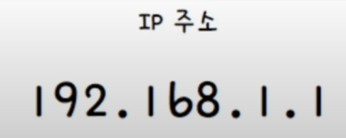

## 데이터 링크 계층의 한계
물리 계층과 데이터 링크 계층 만으로는 LAN을 넘어선 통신을 하기에 어려움이 있다. 
#### 1. 물리 계층과 데이터 링크 계층 만으로는 다른 네트워크까지의 도달 경로를 파악하기 어렵다.
호스트가 패킷을 송신할 때, LAN에 속한 호스트에게만 송신하지 않기 때문에 패킷은 서로에게 도달하기 위해서 수많은 네트워크 장비들을 거치고 다양한 경로를 통해 이동한다. 이때, 통신을 빠르게 주고 받기 위해 패킷이 이동할 최적의 경로를 결정하는 것을 **라우팅**이라고 한다. 

물리 계층과 데이터링크 계층의 장비로는 라우팅을 수행할 수 없지만, 네트워크 계층의 **라우터**를 사용하면 라우팅을 수행할 수 있다.

#### 2. MAC 주소만으로는 모든 네트워크에 속한 호스트의 위치를 특정하기 어렵다.
현실 적으로 모든 호스트가 모든 네트워크에 속한 모든 호스트의 MAC 주소를 서로 알고 있기란 불가능에 가깝다. 그래서 특정 NIC의 MAC 주소 이외에 수신지를 알 수 있는 어떠한 주소가 필요하다. 이 수신지 역할을 하는것이 바로 **IP 주소**이다.

네트워크에서는 MAC 주소와 IP 주소를 함께 사용하고, 기본적으로 IP 주소를 우선으로 활용한다.

MAC 주소를 물리 주소라 부르는 것처럼 IP 주소는 **논리 주소**라고도 불린다. 또, MAC 주소는 일반적으로 NIC 마다 할당되는 고정된 주소이지만, IP 주소는 호스트에 직접 할당이 가능하다. **DHCP(Dynamic Host Configuration Protocol)** 라는 특정 프로토콜을 동해 자동 할당도 가능하며 직접 할당하거나 한 호스트가 복수의 IP 주소를 가질 수도 있다.

## 인터넷 프로토콜 (IP)
네트워크 계층의 핵심적인 프로토콜은 **인터넷 프로토콜(Internet Protocol, IP)** 이다. IP는 IPv4와 IPv6의 2가지 버전이 있다.
### IP주소의 형태 (IPv4)
4바이트(32 비트)로 주소를 표현할 수 있고, 숫자당 8비트로 표현되기에 0~225 범위 안에있는 네개의 10진수로 표기된다. 각 10진수는 점으로 구분되며, 점으로 구분된 8비트를 **옥텟**이라고 한다. 

### IP의 기능
IP는 크게 2가지의 기능이 있다. **IP주소 지정**과 **IP 단편화 기능**이다.

#### IP 주소 지정
IP 주소를 바탕으로 송수신 대상을 지정하는 것을 의미한다. 

#### IP 단편화
전송하고자 하는 패킷의 크기가 MTU라는 최대 전송 단위보다 클 경우, 이를 MTU 크기 이하의 복수의 패킷으로 나누는 것을 의미한다. 

여기서 **MTU**란 한번에 전송 가능한 IP 패킷의 최대 크기를 의미한다. 일반적인 MTU의 크기는 1500바이트이며, MTU 크기 이하로 나누어진 패킷은 수신지에 도착하면 다시 재조합된다.

> IP 패킷의 헤더도 MTU 크기에 포함된다는 점을 유의해야 한다.

### IPv4
IPv4 패킷은 프레임의 페이로드로 데이터 필드에 명시된다.

IPv4는 아래 그림과 같은 형태를 띄고 있다. 그중에서도 가장 핵심이 되는 필드만 하나씩 살펴보겠다.

#### 식별자
패킷에 할당된 번호이다. 만일 메시지 전송 과정에서 IPv4 패킷이 여러 조각으로 쪼개져서 전송되었다면, 수신지에서는 이들을 재조합하여야 한다. 이때 수신지에서 쪼개진 패킷들이 **어떤 메시지에서부터 쪼개졌는지를 인식**하기 위해 식별자를 사용한다.

#### 플래그
플래그는 총 세 개의 비트로 구성된 필드이다. 이중 첫번째 비트는 항상 0으로 예약된 비트로 사용되지 않는다.
사용되는 나머지 두 개의 비트중에서 하나는 **DF(Don't Fragment)**, 나머지 하나는 **MF(More Fragment)** 라는 비트이다.

DF는 IP 단펴화를 수행하지 말라는 표시로, 이 비트가 1로 설정되어 있다면 단편화를 수행하지 않고, 0이라면 IP 단편화가 가능하다.

MF는 단편화된 패킷이 더 있는지를 나타낸다. 0이라면 이 패킷이 마지막 패킷임을 의미하고, 1이라면 쪼개진 패킷이 아직 더 있다는 것을 의미한다.

#### 단편화 오프셋
단편화 오프셋은 패킷이 **단편화되기 전에 패킷의 초기 데이터에서 몇 번째로 떨어진 패킷**인지를 나타낸다. 단편화된 패킷들이 순서대로 도착하기 않기 때문에 패킷을 재조합 할때 각 패킷이 몇 번째 데이터 인지 판단할 때 사용한다.

#### TTL
Time To Live의 약어로 패킷의 수명을 의미한다. TTL은 패킷이 하나의 라우터를 거칠 때마다 1씩 감소하며, 0으로 떨어진 패킷은 폐기된다. 

패킷이 호스트 또는 라우터에 한번 전달되는 것을 **홉(hop)** 이라고 한다. 무의미한 패킷이 네트워크 상에 지속적으로 남아있는 것을 방지하기 위해 사용한다.

#### 프로토콜
IP 패킷의 프로토콜 필드는 **상위 계층의 프로토콜이 무엇인**지 나타낸다. 예를 들어 전송 계층의 대표적인 프로토콜인 TCP는 6번 UDP는 17번 이다.

#### 송신지 IP 주소와 수신지 IP 주소
이름 그대로 송수신지의 IPv4 주소를 알 수 있다.

### IPv6
IPv6는 IPv4 주소의 고갈 문제를 해결하기 위한 주소입니다. 16바이트(128비트)로 주소를 표현할 수 있고, 콜론으로 구분된 8개 그룹의 16진수로 표기된다. 이론상 2^128 개로 사실상 무한에 가까운 수를 할당할 수 있다.

IPv6의 구성은 아래와 같이 생겼다.

#### 다음 헤더
다음 헤더 필드는 상위 계층의 프로토콜을 가리키거나 **확장 헤더**를 가리킨다. 확정 헤더는 IPv6에 추가적인 헤더 정보가 필요할 경우 **기본 헤더와 더불어 추가되는 헤더**이다. 확장 헤더는 기본 헤더와 페이로드 데이터 사이에 위치하며 상황에 맞는 다양한 정보를 운반할 수 있다.

> #### IPv6에서의 단편화
> IPv6에서는 IPv4에서 보이는 단편화를 위한 필드가 없어 **단편화 확장 헤더**를 통해 단편화가 이루어 진다.
> 
> 단편화 확장 헤더에도 다음 헤더 필드가 존재하며, 예약됨과 예약 필드는 0으로 설정되어 사용되지 않는다.

#### 홉 제한
IPv4의 TTL 필드와 비슷하게 패킷의 수명을 나타내는 필드이다.

#### 송신지 IP 주소와 수신지 IP 주소
송신지 수조와 수신지 주소를 통해 IPv6 주소 지정이 가능하다.

## ARP
네트워크 통신 과정에서 **"상대 호스트의 IP 주소는 알지만, MAC 주소는 알지 못하는 상황"** 에서 사용하는 프로토콜이다.

IP 주소를 통해 MAC 주소를 알아내는 프로토콜로 동일 네트워크 내에 있는 송수신 대상의 IP 주소를 통해 MAC 주소를 알아낼 수 있다.

ARP의 동작 과정은 다음과 같다.
1. ARP 요청
2. ARP 응답
3. ARP 테이블 갱신

> [스위치](https://bjcho0501.github.io/blog/NetworkSwitch/) 글에서의 MAC 주소 학습과 유사한 느낌이 있는데, **MAC 주소 학습의 주체는 스위치**이라는 점이 중요하다. 스위치가 MAC 주소를 학습했다고 해서 호스트들끼리 서로의 MAC 주소를 학습하는 것은 아니다.

### ARP 요청
A호스트가 B호스트에게 패킷을 보내고 싶어 하는 상황에서, A호스트는 B호스트의 IP 주소는 알지만 MAC 주소를 모르기 때문에 A호스트는 네트워크 내의 모든 호스트에게 브로드캐스트 메시지를 보낸다. 이 요청은 **ARP 요청** 이라는 ARP 패킷이다.

### ARP 응답
네트워크 내의 모든 호스트가 ARP 요청 메시지를 수신하지만, B를 제외한 나머지 호스트는 자신의 IP 주소가 아니므로 이를 무시한다.

B는 자신의 MAC 주소를 담은 메시지를 A에게 유니캐스트로 전달한다. 이 메시지가 **ARP 응답** 이라는 ARP 패킷이다. 이 과정을 통해 A호스트는 B의 MAC 주소를 알게된다.

### ARP 테이블 갱신
ARP를 활용할 수 있는 모든 호스트는 **ARP 테이블** 이라는 정보를 유지한다. ARP 테이블은 IP 주소와 그에 맞는 MAC 주소를 테이블 형태로 대응해둔 표이다. 

ARP 요청과 ARP 응답으로 ARP 테이블에 IP 주소와 MAC 주소의 관계 정보를 저장하게 되고, 이후에 MAC 주소를 아는 호스트에게는 통신 시에 브로드캐스트로 ARP 요청을 보낼 필요가 없게 된다. 

ARP 테이블은 일정 시간이 지나면 삭제되고, 임의로 삭제할 수도 있다.

> ARP 테이블은 ARP 캐시, APR 캐시 테이블 이라고도 부른다.

### 다른 네트워크에서의 ARP
ARP는 "동일 네트워크" 내에 있는 호스트의 IP 주소를 통해 MAC 주소를 알아내는 프로토콜이라고 하였다. 하지만 만일 동일한 네트워크에 있는 호스트가 아니라면, 어떤식으로 동작할까?

> 그림의 동그라미 범위는 각각 서로 다른 네트워크 범위를 의미한다.

먼저 다른 네트워크로 통하는 라우터(아래 사진에서는 라우터 A)의 MAC 주소를 알아내기 위해 ARP를 실행한다.

이후에 `라우터 A`는 `라우터 B`의 MAC 주소를 알아내기 위해 ARP를 실행한다.

마지막으로 `라우터 B`는 `호스트 B`의 MAC 주소를 알아내기 위해 ARP를 실행한다.

결론적으로 다른 네트워크에 속해있는 호스트와 통신할때는 **네트워크 별로 ARP가 수행**된다는 것을 알 수 있다.