**라우팅**은 패킷이 이동할 최적의 경로를 설정한 뒤 해당 경로로 패킷을 이동시키는 것 이다. 라우팅을 위한 네트워크 장비로는 **라우터**나 **L3 스위치**가 있다.

라우팅에 관한 내용은 방대하기 때문에 아래 표와 같은 흐름으로 작성할 예정이다.
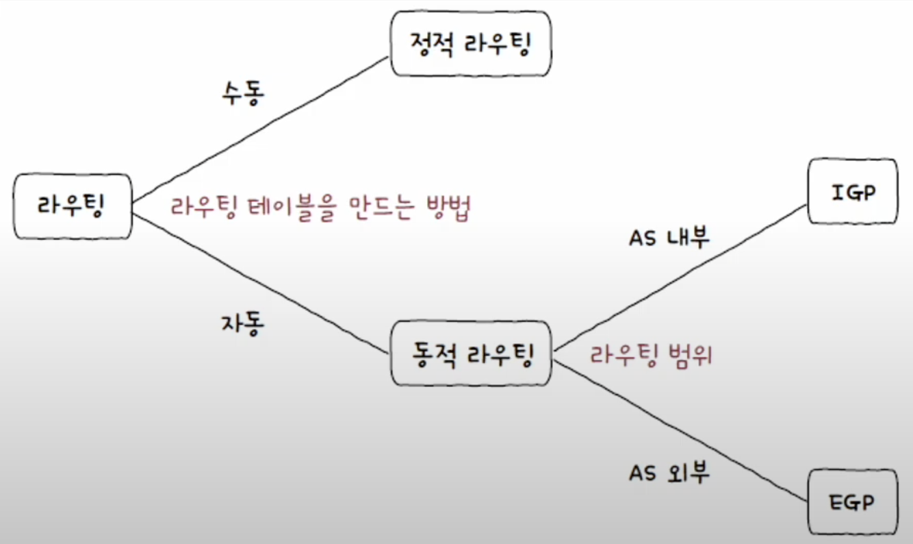

## 라우터
라우터는 네트워크 계층의 핵심 기능을 담당한다. 앞선 포스트에서의 NAT이나 DHCP 같은 여러 기능을 감소있는 네트워크 장비이다.

라우팅 도중 패킷이 호스트와 라우터 간에, 혹은 라우터와 라우터 간에 이동하는 하나의 과정을 **홉**이라고 부른다.

## 라우팅 테이블
라우팅 테이블은 라우터가 저장하고 관리하며, 특정 수신지까지 도달하기 위한 정보를 명시한 일종을 표와 같은 정보이다. 라우터는 라우팅 테이블을 참고하여 수신지까지의 도달 경로를 판단한다.

라우팅 테이블에 포함된 정보는 라우팅 방식이나, 호스트의 환경에 따라 다를 수 있지만 아래와 같은 정보들은 공통적으로 포함되어 있다.

- **수신지 IP주소와 서브넷 마스크**
	- 최종적으로 패킷을 전달할 대상을 의미한다.
- **다음 홉**
	- 최종 수신지까지 가지 위해 다음으로 거쳐야 할 라우터의 IP 주소이다.
	- **게이트웨이**라고 명시되기도 한다.
- **네트워크 인터페이스**
	- 패킷을 네트워크로 내보내는데 사용되는 네트워크 장치이다.
	- 인터페이스(NIC) 이름이 직접적으로 명시되거나 인터페이스에 대응하는 IP 주소가 명시되기도 한다.
- **메트릭**
	- 해당 경로로 이동하는 데에 드는 비용을 의미한다. 
	- 흔히 같은 종류의 물건중 저렴한 물건이 선호되듯, 라우터가 라우팅 테이블에 있는 경로 중 패킷을 내보낼 경로를 선택할 때도 메트릭이 낮은 경로(비용이 적은)를 선호한다.

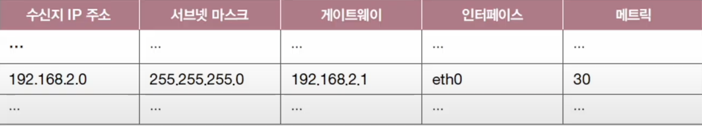

### 디폴트 라우트
패킷에 있는 수신지 IP 주소와 서브넷 마스크가 라우팅 테이블의 정보와 일치할 수도 있겠지만, 그러지 않을 경우 패깃을 보낼 곳이 필요하다. 이를 위해 기본 경로를 설정하여 해당 경로로 패킷을 보내는데, 이 **기본 경로**를 **디폴트 라우트**라고 한다.

디폴트 라우트는 모든 IP 주소를 의미하는 0.0.0.0/0으로 명시한다.
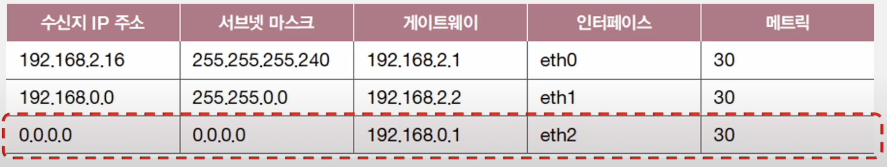

기본 게이트웨이는 호스트가 속한 네트워크 외부로 나가기 위한 첫번 째 경로이고, 일반적으로 라우터 주소를 의미한다.
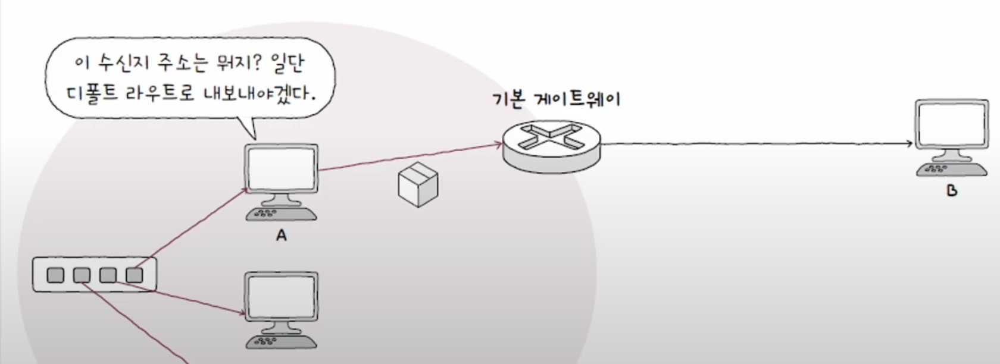

> #### 게이트웨이? 라우터?
> 위 글에서 **기본 게이트웨이**와 **라우터**를 비슷한 무언가 처럼 사용하였는데, 이 둘에는 큰 차이가 있다.
> 
>  
> 라우터는 IP 패킷을 네트워크 간에 전달하는 장비, 
> 게이트웨이는 한 네트워크에서 다른 네트워크로 나가는 출입구를 의미한다.
> 
> 라우터는 기술적 **장비**를 의미하고, 게이트웨이는 역할 또는 위치인 **개념**을 의미하는 것이다.
> 
>  
> 따라서, 모든 라우터는 게이트웨이일 수 있지만, 모든 게이트웨이가 반드시 라우터는 아니다.

## 라우팅 테이블을 만드는 방법
라우팅 테이블은 크게 정적 라우팅, 동적 라우팅 방법을 통해 만들어 진다.
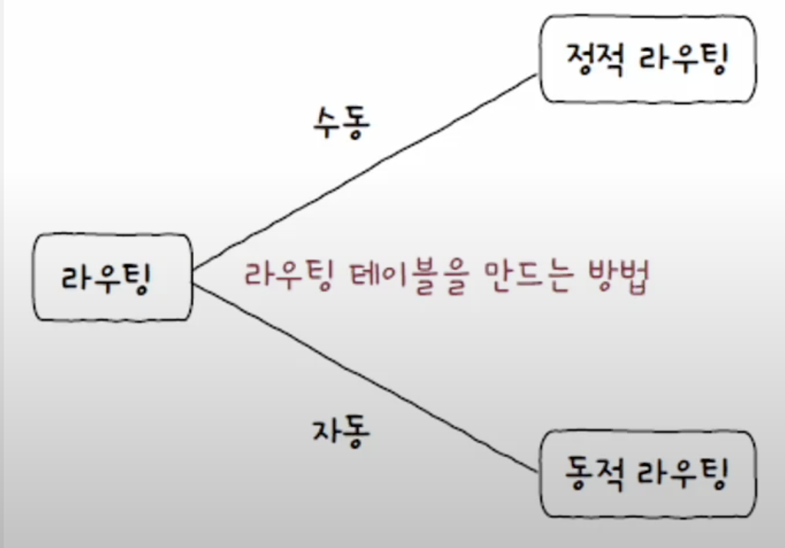

### 정적 라우팅
**정적 라우팅**은 사용자가 수동으로 직접 채워넣은 라우팅 테이블을 토대로 라우팅되는 방식이다. 아래는 라우팅 테이블을 수동으로 입력하는 명령어이다.
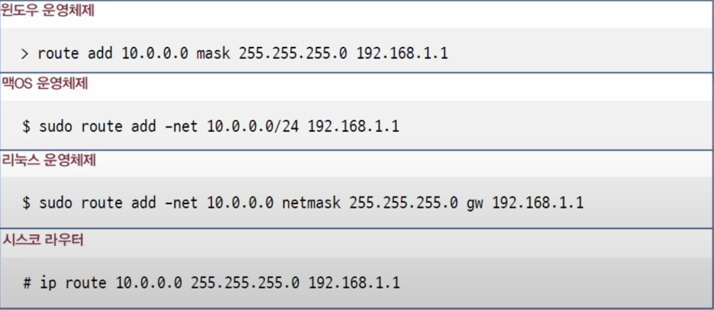

### 동적 라우팅
정적 라우팅은 수동으로 직접 라우팅 테이블을 채우는 구조상 수많은 라우팅 정보들을 수동으로 채우는데 한계가 있고, 입력 실수로 인한 문제가 있을 수도 있다. 이를 해결하기 위해 자동으로 라우팅 테이블 항목을 만들고 관리하는 **동적 라우팅** 방식이 있다.

동적 라우팅을 수행하기 위해서는 라우터끼리 서로 자신의 정보를 교환하게 되는데, 이때 사용되는 프로토콜이 **(동적) 라우팅 프로토콜**이다.

## 라우터들의 집단 네트워크, AS
AS(Autonomous System)는 동일한 라우팅 정책으로 운용되는 라우터들의 집단 네트워크를 의미한다. 한 회사나 단체에서 관리하는 라우터 집단을 AS라 생각해도 좋다.

AS마다 인터넷상에서 고유한 AS번호(ASN, Autonomous System Number)가 할당된다. AS번호는 사설 번호도 있지만, 일반적으로 AS번호를 칭할때는 고유한 번호는 일컫는 경우가 많다.

한 AS 내에는 다수의 라우터가 있으며 라우터들은 AS 내부에서만 통신할 수 있고, AS 외부와 통신할 수도 있다. AS 외부와 통신할 경우 AS 경계에서 통신을 주고 받을 수 있는 AS 경계 라우터(ASBR, Autonomous System Boundary Router)라는 특별한 라우터를 사용한다.
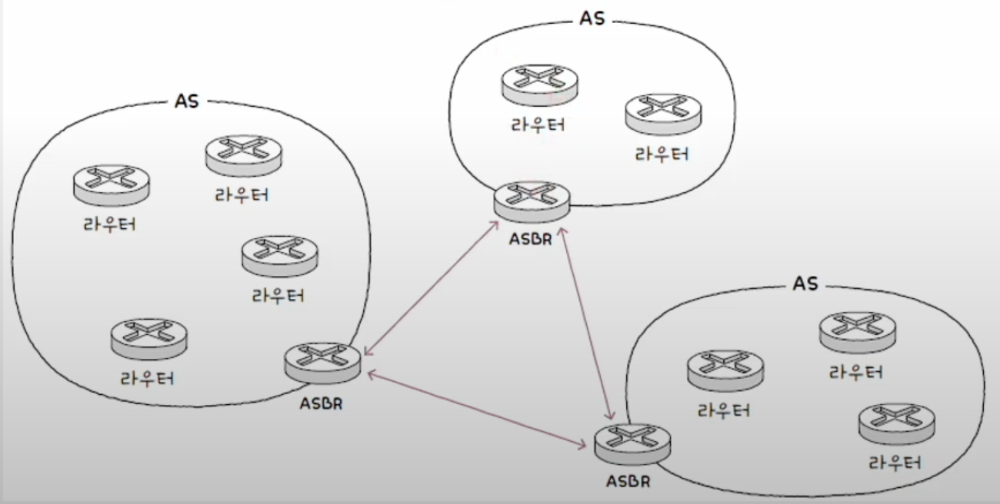

## 라우팅 프로토콜
**라우팅 프로토콜**은 라우터끼리 자신들의 정보를 교환하며 패킷이 이동할 최적의 경로를 찾기 위한 프로토콜이다.
라우팅 프로토콜은 AS 내부에서 수행되는지, 외부에서 수행되는지에 따라 종류가 나뉜다. 내부에서 수행된다면 **IGP(Inerior Gateway Protocol)** , 외부에서 수행된다면 **EGP(Exterior Gateway Protocol)** 라고 한다.
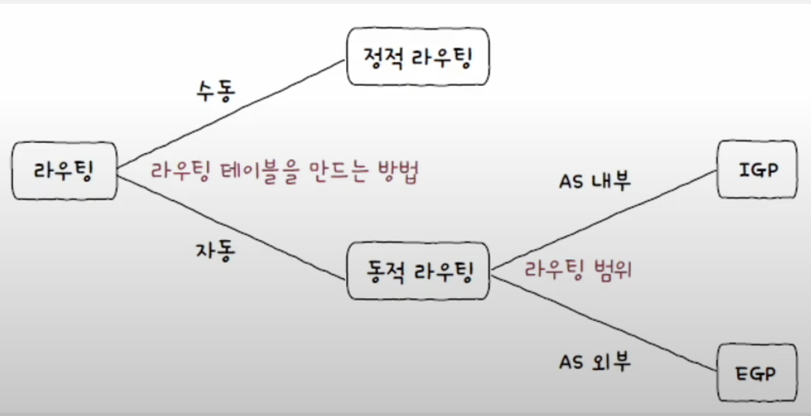

### IGP: RIP와 OSPF
대표적인 IGP에는 **RIP**와 **OSPF**가 있다. 이 프로토콜들은 최적의 경로를 선정하는 과정에서 **거리 백터**가 사용되느냐, **링크 상태**가 사용되느냐로 구분할 수 있다.
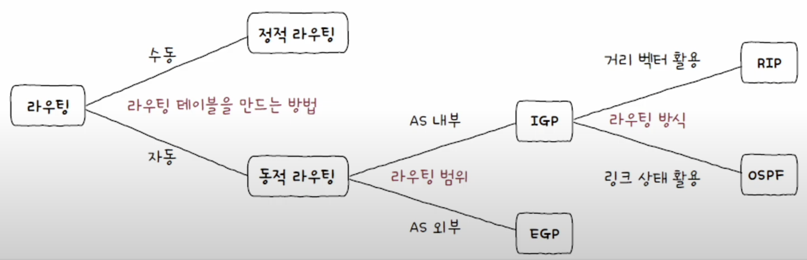

#### RIP
RIP는 거리 백터 기반의 라우팅 프로토콜이다. 거리 백터 라우팅 프로토콜이란 이름 그대로 **거리를 기반으로 최적의 경로를 찾는 라우팅 프로토콜**을 의미한다. 거리는 **홉**을 의미한다.

RIP는 인접한 라우터끼리 경로 정보를 주기적으로 교환하며 라우팅 테이블을 갱신한다. 이를 통해 특정 수신지까지에 도달하기 까지의 홉 수를 할 수 있고, 이 **홉 수가 가장 적은 경로**를 최적의 경로로 판단한다. 홉 수가 적을수록 라우팅 테이블상의 메트릭 값도 작아진다.
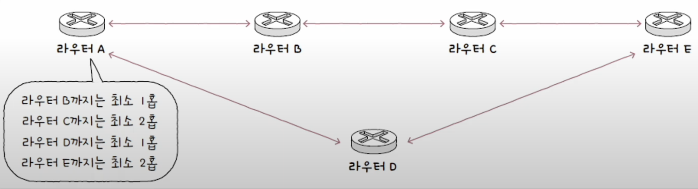

#### OSPF
OSPF는 링크 상태 라우팅 프로토콜이다. 네트워크의 현재 상태를 **링크 상태 데이터베이스**에 저장한다. 링크 상태 데이터베이스에는 라우터들의 연결 관계, 연결 비용 등의 현재 네트워크 상태를 그래프로 표현하기 위한 데이터가 저장되어있다. 라우터는 위 데이터를 기반으로 현재 네트워크 구성을 **마치 지도처럼 그린 후** 최적의 경로를 선택한다.
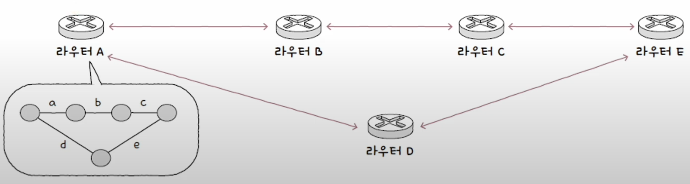

OSPF는 최적의 경로를 계산하기 위해 대역폭을 기반으로 메트릭을 계산한다. 대역폭이 높은 링크일수록 메트릭이 낮은 경로로 인식한다. 또 RIP와 달리 네트워크의 구성이 변경되었을 때 라우팅 테이블이 갱신된다.

하지만, 네트워크 구성이 변경될 때마다 테이블이 갱신된다면, 네트워크 규모가 커짐에 따라 부담이 커지게 되는 문제가 있다. 이를 해결하기 위해 OSPF에서는 AS를 **에어리어라**는 단위로 나눈 후 해당 에어리어 내에서만 링크 상태를 공유한다. 에어리어 간의 경계에서 연결을 담당하는 라우터는 **ABR(Area Border Router)** 이라고 한다.
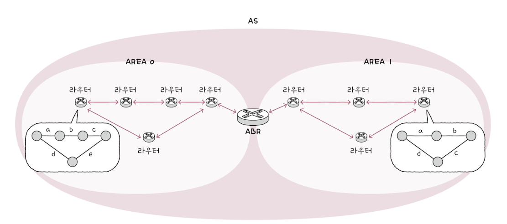

### EGP: BGP
대표적인 EGP로는 **BGP(Border Gatway Protocol)** 이 있다. BFP는 AS간 통신 뿐만 아니라 AS내의 통신도 가능한데, 각각 eEGP와 iEGP라고 불린다.

#### BGP
AS간의 정보를 주고 받기 위해서는 BGP를 사용하는 라우터가 AS안에 하나 이상 있어야 하며 또 다른 AS의 BGP를 사용하는 라우터와 연결되어야 한다. 이 연결은 BGP 메시지를 주고 받음으로써 이루어 지며, BGP 메시지를 주고 받을 수 있도록 연결된 라우터를 **피어(peer)** 라고 정의 한다. 그리고 피어 관계가 되도록 하는 과정을 **피어링(peering)** 이라고 한다.
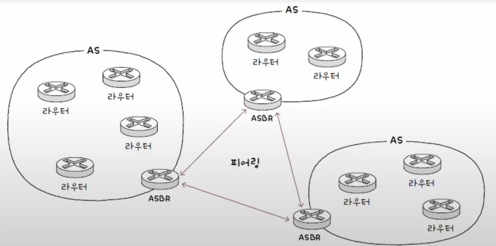

BGP는 RIP와 OSPF에 비해 최적의 경로를 경정하는 과정이 복잡하고, 일정하지 않다. 왜냐하면, 경로를 결정하는 과정에서 수진지 주소와 더불어 다양한 **"속성"과 "정책"**이 고려되기 때문이다.

속성이란 경로에 대한 일종의 부가 정보이다. 대표적인 속성으로는 아래와 같은 속성들이 있다.

- **AS-PATH 속성**: 메시지가 수신지에 이르는 과정에서 통과하는 AS들의 목록
- **NEXT-HOP 속성**: 다음 홉, 다음으로 거칠 라우터의 IP 주소
- **LOCAL-PREF 속성**: 지역 선호도, AS 외부 경로에 있어 AS 내부에서 어떤 경로를 선호할지에 대한 척도

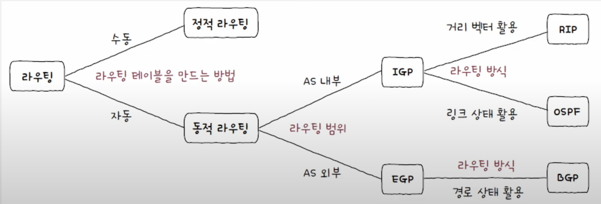