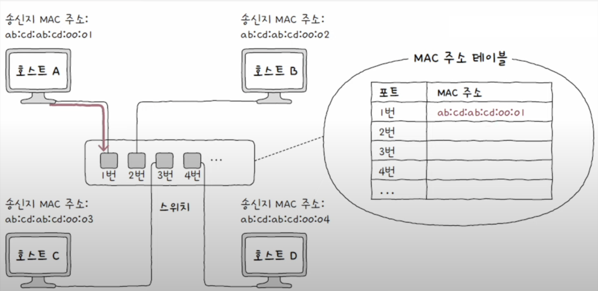
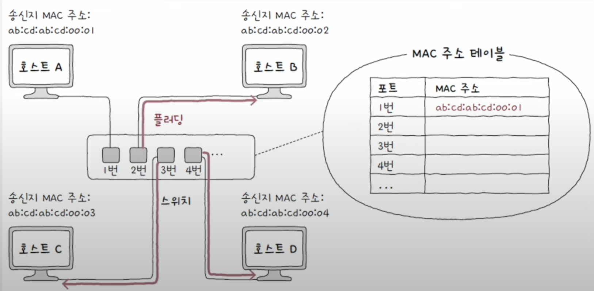
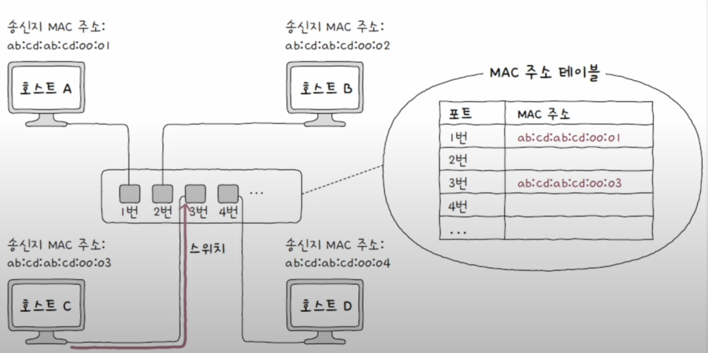
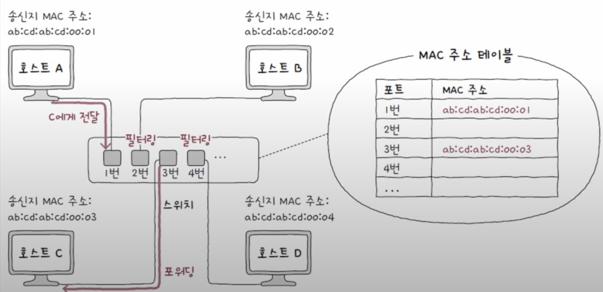
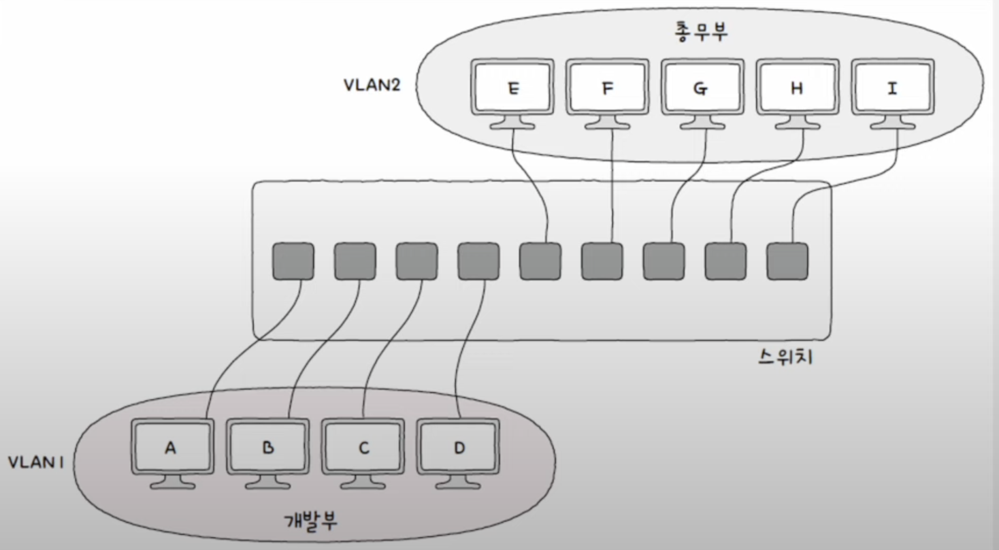
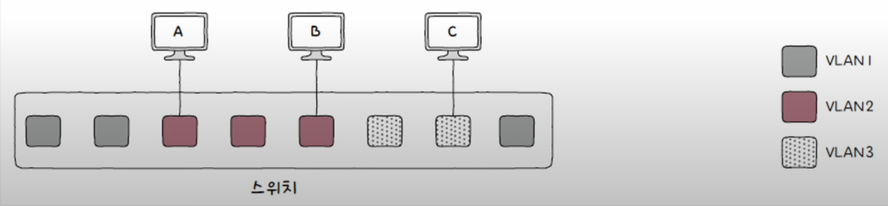
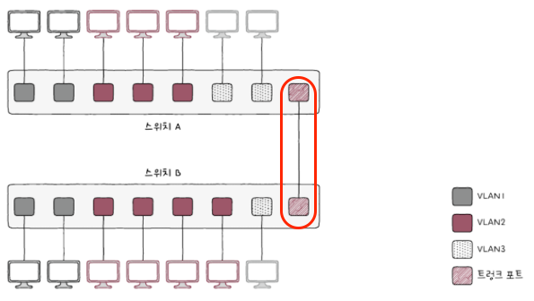
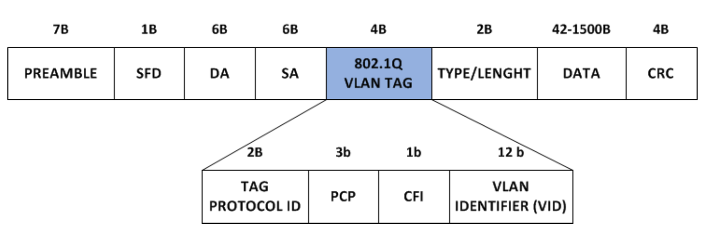
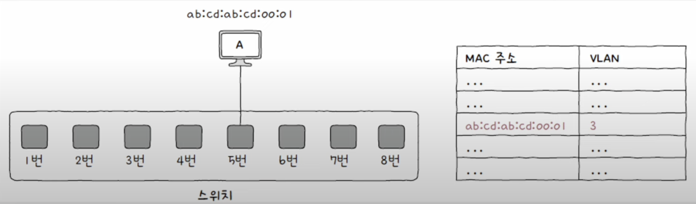

## 스위치
스위치는 데이터 링크 계층의 네트워크 장비이다. 2계층에서 사용한다 하여 **L2 스위치** 라고도 부른다.

스위치는 여러 포트에 여러 호스트를 연결할 수 있다는 점에서 허브와 유사한 점이 있지만, 허브와 달리 MAC 주소를 학습해 **특정 MAC 주소를 가진 호스트에만 프레임을 전달**할 수 있고 **전이중 모드의 통신을 지원**한다. 이로 인해 허브보다 성능에 이점이 있다.

### 스위치의 특징
#### 1. MAC 주소 학습
스위치의 가장 중요한 특징중 하나로 포트와 해당 포트에 연결되어 있는 호스트의 MAC 주소와의 관계를 기억한다는 특징이다. 이를 통해 원하는 호스트에만 프레임을 전달할 수 있다.

#### 2. MAC 주소 테이블
MAC 주소 학습을 위해 포트와 포트에 연결된 호스트의 MAC 주소 간의 관계를 메모리에 표 형태로 기억하는 특징이 있다. 이러한 테이블을 **MAC 주소 테이블**이라고 한다.

## 스위치가 MAC 주소를 학습하는 방법
스위티가 MAC 주소를 학습하기 위해 세 가지 기능을 가지고 있다.
1. 플러딩
2. 포워딩과 필터링
3. 에이징

#### 스위치의 MAC 주소 학습 순서
스위치의 MAC 주소 학습은 프레임 내 **"송신지 MAC 주소"** 를 통해 이루어 진다. 만일 스위치가 호스트 A의 프레임을 수신하면, 해당 프레임의 송신지 MAC 주소를 확인한 후 MAC 테이블에 기록한다. 

즉 호스트가 한번은 스위치를 거쳐서 프레임을 송신해야 MAC 주소 테이블에 정보가 기록되는 것이다.

#### 플러딩
아래 그림에서 호스트 A가 호스트 C에게 프레임을 전송한다 가정 하였을 때, 스위치의 MAC 주소 테이블에는 아무 MAC 주소도 없기 때문에 특정 포트에만 프레임을 전송하는 것이 불가능하다.

이런 상황에서 스위치가 마치 허브처럼 송신지 포트를 제외한 모든 포트로 프레임을 전송하는 동작을 **플러팅**이라고 한다.

플러딩을 진행하면 호스트 B와 D는 프레임을 폐기하게 되고, 호스트 C는 프레임을 송신받게 된다. 이후 호스트 C는 스위치로 응답 프레임을 전송하여 호스트 C의 MAC주소와 호스트 C에 연결되어 있는 포트와의 관계가 MAC 주소 테이블에 저장되게 된다.

#### 포워딩과 필터링
포워딩과 필터링이란 MAC 주소 테이블에 기록된 정보를 바탕으로 호스트에게 전달받은 프레임을 특정 포트에 보내도록 하는 동작이다.

전달받은 프레임을 어디로 내보내고 어디로 내보내지 않을지 결정하는 기능이 **필터링**, 
그리고 프레임이 전송될 포트에 실제로 프레임을 내보내는 것이 **포워딩**이다.

#### 에이징
에이징은 만약 MAC주소 테이블에 등록된 특정 포트에서 **일정 시간동안 프레임을 전송받지 못했다면 해당 항목을 삭제**하는 동작이다.

## VLAN
스위치의 또 다른 기능으로는 가상의 LAN 환경을 구축하는 **VLAN(Virtual LAN)** 기능이 있다. VLAN은 한 대의 스위치로 가상의 LAN을 만드는 방법이다. 

VLAN을 사용하는 이유는 스위치에 연결되어 있는 호스트 중에서도 서로 관계가 없어 메시지를 주고 받지 않아도 되는 상황(브로트캐스트 메시지 등)에서 매번 새로운 스위치 장비를 구비하지 않고 서로를 분리하여 **성능 저하를 방지**하기 위함이다.

### 포트 기반 VLAN
VLAN을 구성하는 방법중 하나로 가장 단순하지만 대중적으로 사용하는 방식이다. 이름 그대로 **"스위치의 포트가 VLAN을 결정하는 방식"** 이다. 

아래 그림처럼 사전에 특정 포트에 VLAN을 할당하고, 해당 포트에 호스트를 연결함으로써 VLAN에 포함시키는 것이다.

하지만 한 대의 스위치 만으로 포트 기반 VLAN을 사용하면, 포트 수가 부족해 질 수 있다는 문제가 있다. 이럴 때 사용하는 방법이 **VLAN 트렁킹** 이다.

#### VLAN 트렁킹
**VLAN 트렁킹**은 스위치 간의 통신을 위한 특별한 포트인 **트렁크 포트**를 사용하여 VLAN 스위치를 서로 연결하는 방식이다. 
> 트렁크 포트는 **태그 포트**라고도 부르며, 태그 포트 이외의 VLAN에 할당된 일반적인 포트는 **액세스 포트**라고 한다.

> #### 트렁크 포트로 전달받은 프레임이 어떤 VLAN에 속하는지 파악하는 방법
> 트렁크 포트로 연결되어 있는 스위치끼리 전달 받는 프레임이 어떤 VLAN에 속하는지 확인하는 방법은 확장된 이더넷 프레임을 사용하는 것이다.
> 
> 확장 이더넷 프레임인 **802.1Q 프레임**을 사용하면 VLAN의 식별 정보를 담은 **VLAN 태그**를 통해 해당 프레임이 어떤 VLAN에 대한 프레임인지 식별할 수 있다.
> 

### MAC 기반 VLAN
MAC 기반 LAN은 사전에 설정된 MAC 주소에 따라 VLAN이 결정되는 방식이다. 포트 기반 VLAN과 달리 송수신하는 프레임 속 MAC 주소가 호스트가 속할 VLAN을 결정하는 방식 인것이다.
