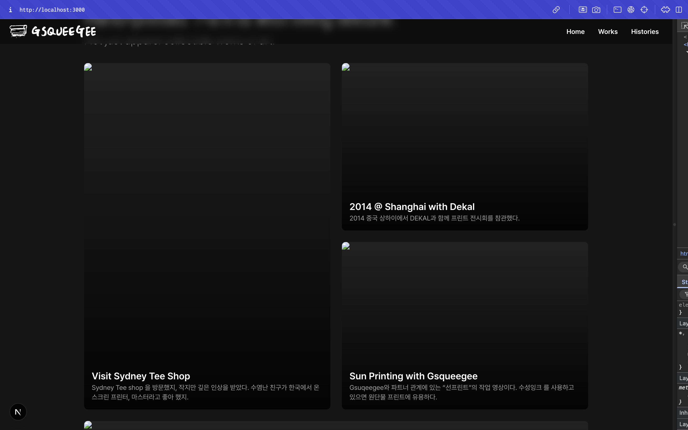
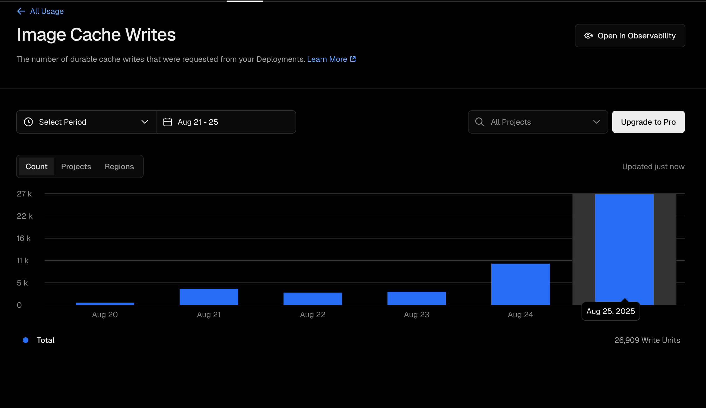
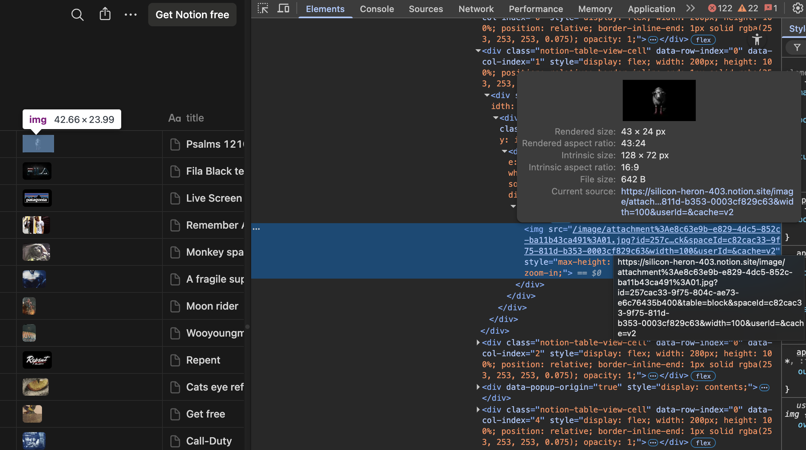
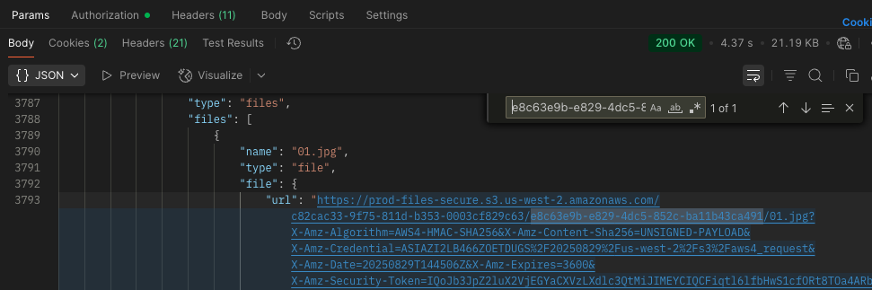
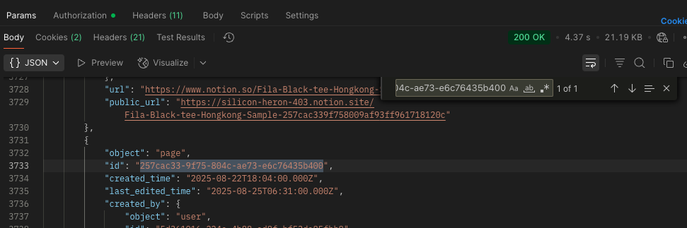
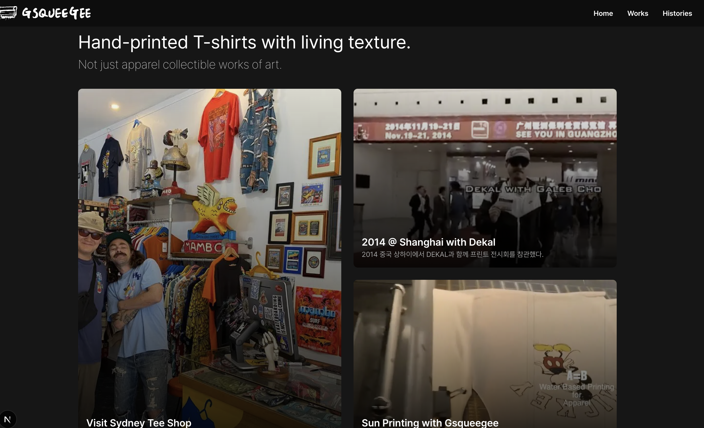
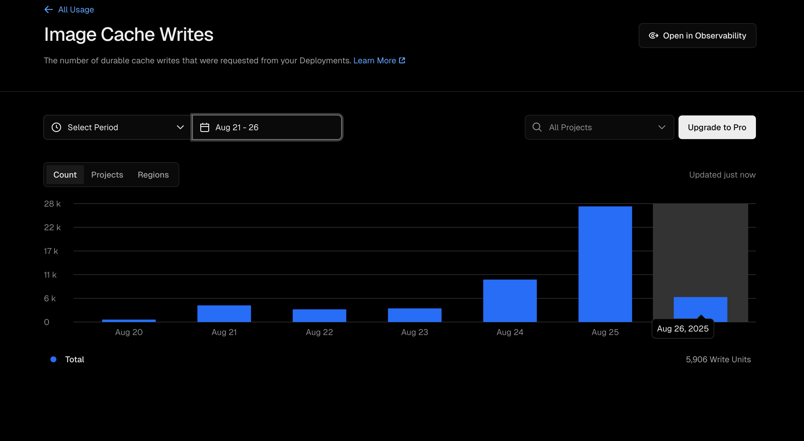

> ### 개발 환경
> - Next.js  `v15.4.6`
> - react `v19.1.0`
> - vercel 배포

## 문제 상황
Notion API를 사용하여 웹 프로젝트를 만들던 중, 아래와 같이 사진 파일이 보이지 않는 문제가 발생하였다. 


또, Vercel의 이미지 캐싱 쓰기 횟수가 이미지 양에 비해 상당히 높은 문제도 발생하였다.

## 원인
노션 API를 사용하여 특정 데이터베이스의 파일 정보를 가져오게 된다면 아래와 같은 URL형식으로 받을 수 있게 된다.
``` json
// 노션 API의 응답 중 이미지 url에 관련된 일부분

//...
{
	"name": "IMG_0750.JPG",
	"type": "file",
	"file": {
		"url": "https://prod-files-secure.s3.us-west-2.amazonaws.com/c82cac33-9f75-811d-b353-0003cf829c63/b916f417-f8b3-4fc7-bf3f-76c04abd7716/IMG_0750.jpg?...",
		"expiry_time": "2025-08-28T09:29:09.038Z"
	}
},
//...
```

json을 살펴보면 알 수 있듯이 파일 url에 만료 기간이 정해저 있기 때문에 만료기간 이후 url을 갱신할 필요가 있다. 또, 매번 url이 달라지기 때문에 같은 이미지라 해도 vercel에서는 다른 이미지로 인식하기 때문에 매번 캐시에 이미지를 저장하는 문제가 발생한다.

> url을 보면 `X-Amz-Expires`이라는 값을 확인할 수 있는데 이는 AWS에서 재공하는 pre-signed URL에 유효 기간을 초단위로 나타내는 파라미터이다. [자세한 내용](https://aws.amazon.com/ko/blogs/korea/aws-api-call-2-s3-pre-signed-url/)


## 시도1. fetch에 revalidate 설정 (실패)
next.js의 fetch에는 revalidate라는 옵션을 설정해서 특정 시간마다 저장해둔 캐시 데이터를 갱신 시키도록 할 수 있다. revalidate를 1시간(3600초) 보다 빠르게 설정한다면 파일 url이 만료되기 전 새로운 url을 갱신하게 되어 이미지가 보이지 않는 문제를 해결할 수 있을 것이다. [공식 문서](https://nextjs.org/docs/app/getting-started/caching-and-revalidating#unstable_cache)

### 실패) 갱신된 이미지 만료 후 사이트 진입시 여전히 이미지가 보이지 않음
만료되지 않은 이미지가 캐싱되고 1시간 이상 지난 뒤에 다시 사이트에 진입하기 되면, 여전히 캐싱된 이미지(이미 만료된 이미지)를 보여줌.

수동으로 재로딩(`Cmd + R`)을 하면 갱신이 되지만, 해당 방법으로는 Vercel에서 이미지 캐시 낭비 문제를 해결할 수 없기 때문에 다른 방법이 필요함.

## 시도2. Notion 페이지 게시를 활용한 정적 이미지 URL 사용 (성공)
노션 API로 불러오는 페이지를 게시하기 되면 해당 페이지의 게시 URL이 생기게 되는데, 이 URL을 통해 정적인 사진 URL을 얻을 수 있어 이미지가 보이지 않는 문제와 캐싱 문제를 해결할 수 있을 것이다.

### 게시된 사이트의 이미지 URL 분석

먼저 노션으로 게시한 사이트에 들어가 개발자 모드로 사진의 URL 원문을 가져와 분석해 보았다. 

#### a. 메인 URL과 /image/attachment
```text
https://{노션 페이지 메인 URL}/image/attachment...
```
앞쪽의 메인 URL은 노션에서 페이지를 게시할 때 주어지는 메인 URL과 같았다. 그 뒤에 path로 `/image/attachment`라 붙는 것까지 알 수 있었다.

#### b. attachment와 연결되어 있는 부분
```text
attachment%3Ae8c63e9b-e829-4dc5-852c-ba11b43ca491%3A01.jpg
```
%으로 시작되는 부분부터 jpg로 끝나는 부분 중 유추 가능한 점은 jpg로 끝나는 끝부분에 사진의 이름과 확장자가 붙어 있다는 것이다. 해당 사진의 원본 이름은 `01.jpg`이기 때문에 나머지 부분이 해당 사진의 특정 식별자 라는 것을 유추할 수 있다. 

`%3Ae8c63e9b-e829-4dc5-852c-ba11b43ca491%3A`이라는 문자열을 URL Decoder로 디코딩 하게 되면 `:e8c63e9b-e829-4dc5-852c-ba11b43ca491:`이라는 결과를 얻게 되며 `%3A`라는 값이 `:`을 URL로 인코딩한 값이라는 것을 알게 된다. 

위 값에서 나온 `e8c63e9b-e829-4dc5-852c-ba11b43ca491`이라는 값을 노션 API의 응답 json에서 찾아본결과 file URL에 포함되어 있는 값이라는 것을 알 수 있었다.

#### c. queryString의 id 부분
해당 부분은 따로 인코딩된 부분이 없기 때문에 바로 노션 API의 응답에서 찾아 보았다. 확인 결과 해당 부분도 노션 API에서 가져올 수 있는 id 값이였다.

#### d. 필요하지 않는 값 (spaceid, userid)
spaceid와 useid값의 경우 값을 추가하지 않아도 사진 데이터를 불러오는데 문제가 없었기 때문에 추가하지 않기로 하였다.

#### e. 나머지 고정값 (table, cache, width)
table과 cache값의 경우 모든 사진 URL에서 고정으로 동일한 값이 들어가기 때문에 해당 값을 그대로 추가하였다. width값은 1000정도로 사용하기로 하였다.
- table: block
- cache: v2
- width: 1000

최종적으로 분석한 값들을 조합하면 다음과 같다.
```
https://{노션 페이지 메인 URL}/image/attachment%3A{노션 API의 url에 포함된 고유 id}%3A{파일 원본 이름}?id={노션 api의 특정 페이지 id}&width=1000&table=block&cache=v2
```

### 노션 api URL을 게시 페이지 이미지 URL로 변환
분석한 규칙을 바탕으로 게시 페이지 이미지 URL 반환 함수를 작성해 준다.
```js
function notionFileUrlGenerator(originUrl: string, resultID: string): string {
	// 원본 URL에서 필요한 부분만 추출
	const [, , imageId, imageName] = originUrl.split("//")[1].split("?")[0].split("/");
	
	// 게시 페이지의 정적 URL로 가공
	const resultUrl = `${process.env.NOTION_PAGE_URL}/image/attachment${encodeURIComponent(`:${imageId}:`)}${imageName}?id=${resultID}&width=1000&table=block&cache=v2`;
	
	return resultUrl;
}
```
해당 함수를 DTO to Entity mapper 함수에서 사용하여 노션 API의 만료 기간이 있는 이미지 URL을 게시 페이지의 정적 URL로 변환 후 사용하도록 한다.

## 결과

이미지의 만료 기간이 없기 때문에 언제든 사진이 잘 나온다.


또한, 이미지 캐시 쓰기의 횟수가 26,909번에서 5,906번으로 약 **78.1%** 개선된 것을 확인할 수 있다.

### 참고자료
- https://velog.io/@soooee/%EB%85%B8%EC%85%98-API-%EC%9D%B4%EB%AF%B8%EC%A7%80-%EC%82%AC%EC%9A%A9-%EC%8B%9C-URL-%EB%A7%8C%EB%A3%8C-%EB%AC%B8%EC%A0%9C-%ED%95%B4%EA%B2%B0%ED%95%98%EA%B8%B0
- https://weezip.treefeely.com/post/weezip-use-notion-image