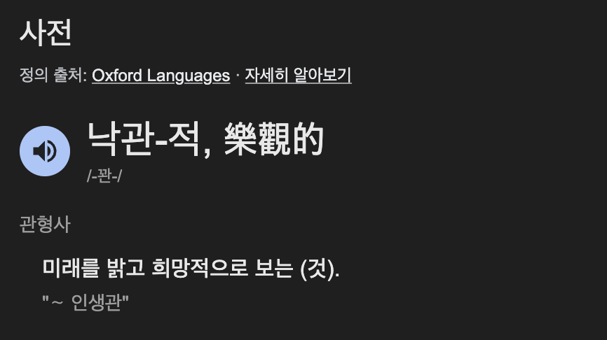
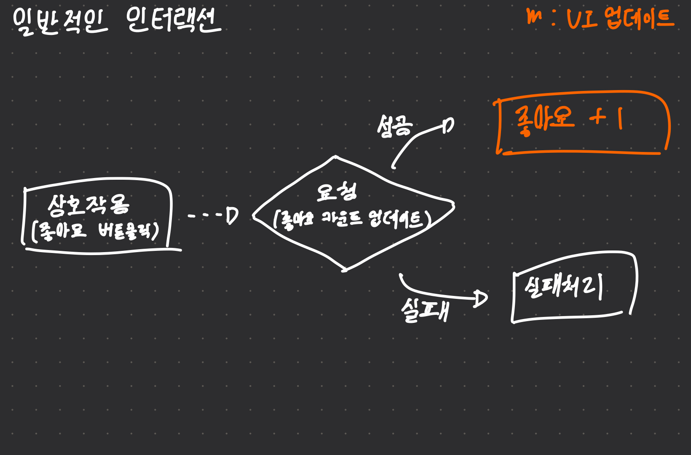
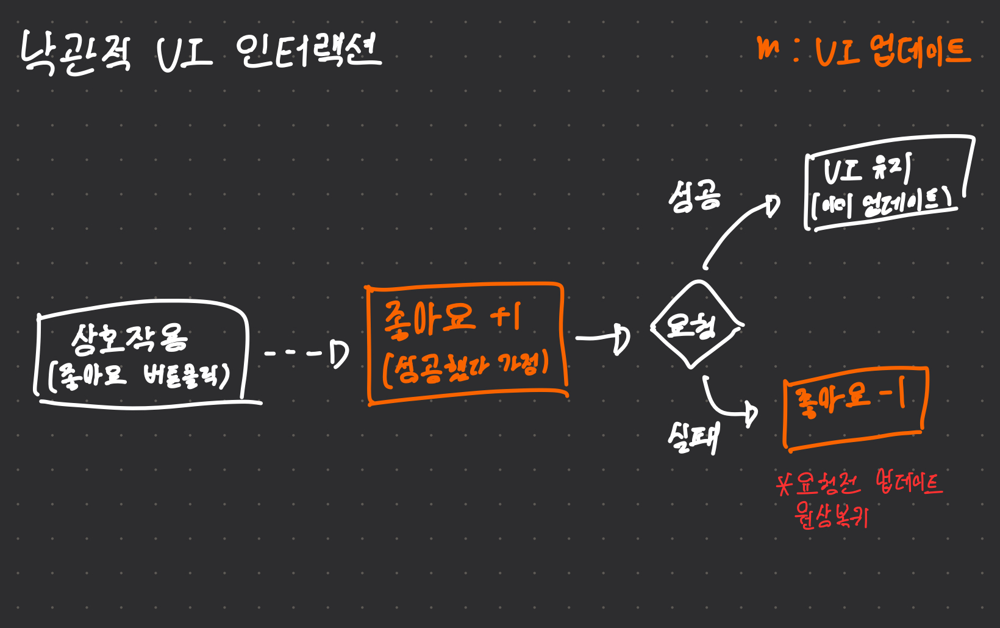

## 낙관적인 개발이란?

사전상 낙관은 "미래를 밝고 희망적으로 보는 것" 이라고 정의한다. 이런 의미를 개발에 접목하여 해석하면 **"어떤 공정(task)이 성공적으로 실행될 것이라 보는 것"** 이라 할 수 있을 것 같다. 

그렇다면 **낙관적 개발**은 **"어떤 공정이 성공적으로 실행될 것이라 가정하고, 개발하는 것"** 이라 해석할 수 있다. 성공과 실패의 여부를 확인한 후 다음 작업을 진행하는 순서가 아닌 일단 성공했다 가정한 후 결과에 따라 후처리(롤백, 재시도)를 진행하는 것이다.

## 낙관적 UI
낙관적 UI는 위에서 설명한 낙관적 개발 방식을 UI에 적용한 방식이라 할 수 있다. 

사용자가 어떤 요청(업데이트)을 진행하여 UI를 변경해야 하는 상황에서, **요청이 성공했다 가정**하고 **UI를 먼저 업데이트** 하는 것이다. 여기서 만약 요청이 실패한다면, 그때 실패에 대한 후처리를 진행한다.

## 낙관적 UI를 사용하는 이유
예를 들어, 정말 인터넷이 느린 환경에서 사용자가 어떤 게시물에 좋아요를 누른다고 가정하자. 만일 낙관적 UI를 사용하지 않는다면 좋아요를 누른 후 카운트가 변화하기까지 서버의 응답을 기다려야 하기 때문에 상당히 오랜 시간 좋아요의 카운트가 변하지 않을 것이다. 이로 인해 좋아요가 눌리지 않았거나, 요청이 실패하였다 착각하여 좋아요를 여러번 누르는 불편함이 발생할 것이다.

하지만, 낙관적 UI를 사용한다면 좋아요 버튼을 누른 즉시 좋아요 카운트가 변하기 때문에 위와 같은 불편함을 해결할 수 있게 된다.

이처럼, 낙관적 UI는 사용자 경험(UX) 향상을 위해 사용할 수 있으며, 예시를 든 좋아요 말고도 `실시간 메시지를 전송할 때`, `데이터 수정 후 수정 내용을 보여줄 때` 등에 적용할 수 있다.
