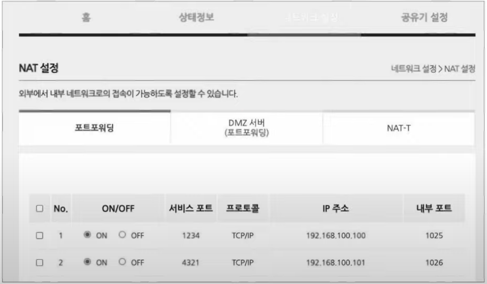

## 포트포워딩이란?
네트워크 네 특정 호스트에 **IP 주소와 포트 번호를 미리 할당**하고, 해당 `IP 주소:포트 번호`로써  해당 호스트에게 패킷을 전달하는 기능이다. 주로 **네트워크 외부**에서 **네트워크 내부로 통신을 시작**할 때, 네트워크 내부의 서버를 외부에서 접속할 수 있도록 접속 정보를 공개할 때 사용된다.

네트워크 내부의 여러 호스트가 공인 IP 주소를 공유하는 상황에서 네트워크 외부의 호스트가 특정 호스트에 패킷을 전달해야 할 때, 공인 IP를 사용하는 외부 호스트에서 보낸 패킷을 어떤 `사설 IP 주소:포트 번호`로 전송해야 할지 알 수 없는 상황에서 포트포워딩을 사용할 수 있다.

특정 IP 주소와 포트 번호 쌍을 특정 호스트에게 할당한 뒤, 외부에서 통신을 시작할 호스트에게 해당 접속 정보를 알려주면 통신이 가능하게 된다. 

아래 사진은 실제 포트포워딩 설정 화면이다. 어떤 공인 `IP 주소:외부 접속 포트(서비스 포트)`에 접근했을 때 어떤 `사설 IP 주소:내부 전달 포트`로 전달할지를 설정할 수 있다. 

## 정리
- 포트포워딩은 네트워크 외부에서 내부로 통신할 때, IP주소와 포트 번호를 할당하여 외부에서 접근이 가능하도록 하는 기술이다.
- `공인 IP 주소: 포트번호`로 오는 패킷의 **포트 번호**와 네트워크 내부의 **`사설 IP 주소: 포트번호`**를 사용하여 패킷을 네트워크 내부 호스트로 보낸다.
- 주로 웹 서버, FTP 서버, 게임 서버 등에 사용된다.