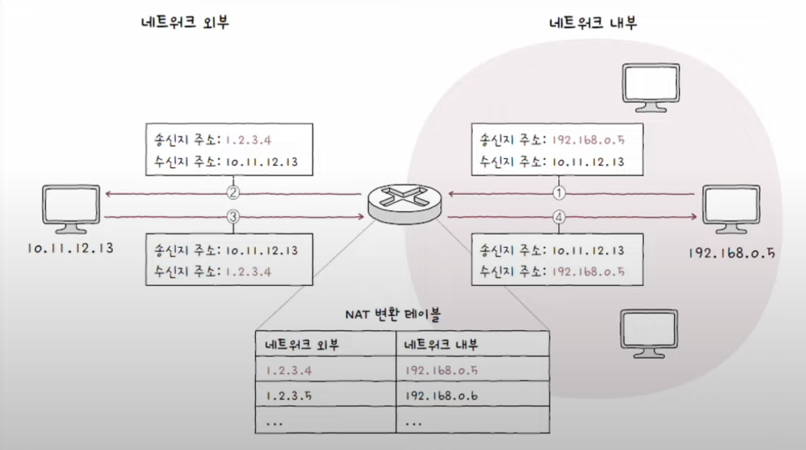
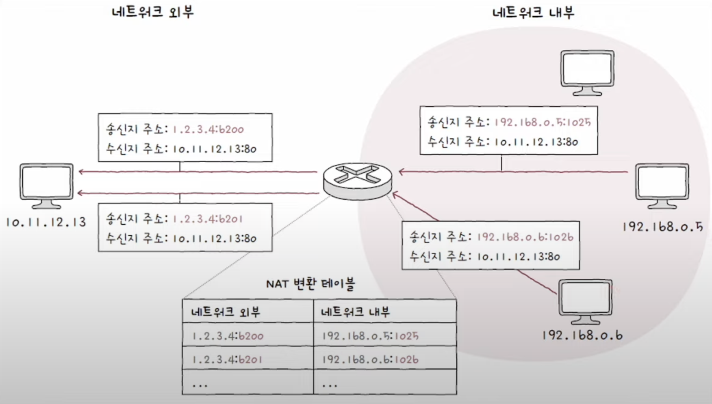

NAT이란 사설 IP 주소를 공인 IP 주소로 변환하는 기술이다. IP 변환을 위해 NAT은 **NAT 변환 테이블**을 사용한다.

## NAT 변환 테이블
NAT 테이블은 네트워크 외부 IP와 내부 IP가 쌍으로 명시되어 있는 구조이다. 명시되어 있는 주소를 활용하며 네트워크 내부에서 네트워크 내부로 송신을 할 때 송신지 수소가 공인 IP로 변환되고 반대로 네트워크 외부에서 송신될 때는 송신지 주소가 사설 IP로 변환되는 과정을 거친다.

하지만 위와 같은 방식으로 NAT이 작동한다면, 사설 IP와 공인 IP가 `1:1`로 대응되어야 한다. 즉 사설 IP의 개수만큼 공인 IP가 필요해 진다는 것이다. 이러면 NAT을 사용할 때와 사용하지 않을 때의 공인 IP 수가 같으므로 사설 IP와 공인 IP가 `1:n`의 관계가 되도록 해야한다. 이를 위해 포토가 사용된다.

## NAPT
포트 기반 NAT를 **NAPT(Network Address Port Translation)** 혹은 **APT(Address Port Translation)** 이라고 한다. NAPT는 포트를 활용하여 하나의 공인 IP 주소를 여러 사설 IP 주소가 공유할 수 있도록 한다.

NAT 테이블에 변환할 IP 주소 쌍과 함께 포트 번호도 기록하고 변환하여 하나의 공인 IP로 많은 사설 IP을 변환시키는 것이 가능하다. NAPT의 송수신 과정이 담긴 사진이다.

## 정리
- NAT는 사설 IP를 공인 IP로 변환하는 기술이다. NAT 변환 테이블을 사용하여 변환을 진행한다.
- 일반 NAT은 사설 IP와 공인 IP를 `1:1`로 사용해야 하기 때문에 IP 부족 문제를 해결할 수 없다.
- 사설 IP와 공인 IP의 `1:n` 사용을 위한 기술로 포트 정보까지 포함하여 변환하는 NAPT(혹은 APT)기술이 있다.