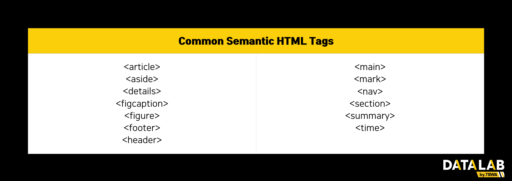

---

# 게시글 제목
title: "SEO 파먹기"

# 작성 날짜
date: 2025-03-13

# 업데이트 날짜
update: 2025-03-13

# 태그
tags:
  - "SEO 최적화"
  - "최적화"
  - "Frontend"

---

웹을 개발하다 보면, SEO라는 용어를 자주 접하게 된다. 과연 SEO란 무엇이고, 왜 이 SEO를 잘 해야하는지 알아보자.

## 노출을 위한 최적화, SEO
SEO는 검색 엔진 최적화(Search Engine Optimization)의 약자로, 우리가 주로 검색하는 Google이나 Naver의 검색 알고리즘에서 상위 사이트로 노출되기 위한 작업이다.

만약 내가 사과 농장을 운영하고 있고, 이런 사과를 팔기 위한 사이트를 배포했다 하였을 때, "사과" 또는 "사과 구입" 등과 같은 검색 키워드로 상위에 노출되고 싶다면 그에 맞는 SEO작업을 진행하여 구매자의 진입률을 높이고 최종적으로 수입까지 높일 수 있는 것이다.

SEO최적화만 잘 한다면 직접적으로 노출건수(클릭 건수)가 늘어 많은 이익을 얻을 수 있어, 다소 시간이 걸리지만 꼭 해줘야 하는 작업이다.

## SEO 최적화를 위한 방법
어떤 방법을 사용해야 SEO최적화를 할 수 있을까?


첫번째 방법은 "시맨틱 태그"를 사용하여 웹사이트를 구성하는 것이다. 
시맨틱 태그란 포함된 콘텐츠의 특정 의미를 정의하고 목적을 갖는 태그로 HTML5에서 처음 등장하였다. 흔히들 div나 span태그만 사용한 구성을 사용하여 웹사이트를 개발하는데, 이 시맨틱 태드를 사용하면 각 콘텐트의 역할 구분이 명확해 지면서 검색엔진이 페이지를 효율적으로 분석할 수 있게 된다. 결과적으로 SEO에 도움이 되는 것이다. 추가로 구글의 랭킹 알고리즘은 명확한 콘텐츠의 구조로 인해 신뢰도가 높다고 판단하여 더 높은 랭킹에 사이트를 올릴 수도 있다고 한다.


<center></center>
두번째 방법은 "메타 태그"를 명시해주는 방법이다.
메타 태그란 웹페이지의 메타데이터(페이지 설명, 키워드, 작성자 정보 등)을 제공하는 HTML 태그이다. 메타 태그 직접적으로 웹사이트에 영향을 주는 부분은 없지만, 검색 엔진이나 해당 페이지를 들어가지 않은 상태에서 뜨는 회부 시스템에 정보를 전달해 주는 역할을 한다. 카카오톡이나 페이스북에 링크를 공유했을 때 뜨는 미리보기 배너를 본적이 있을텐데, 그런 부분들도 모두 meta태그로 구성된 정보를 가져와 띄우는 것이다. (해당 기능은 메타 태그의 오픈 그래프(og)라고 불린다.)

메타 태그의 대표적인 사용 방법은 웹페이지의 head 섹션에 아래 코드들을 원하는 사이트(페이지)의 컨셉에 맞춰 작성하는 것이다.
```html
<meta name="description" content="이 웹사이트는 SEO 최적화에 대한 다양한 정보를 제공합니다.">

<meta name="keywords" content="SEO, 최적화, 검색 엔진, 키워드 연구">

<meta name="author" content="홍길동">

<meta property="og:title" content="SEO 최적화 방법">
<meta property="og:description" content="SEO 최적화의 중요성과 팁을 알아보세요.">
<meta property="og:image" content="https://example.com/image.jpg">
```
이외 더 다양한 메타 태그는 [여기](https://www.w3schools.com/tags/tag_meta.asp)를 참고하자

세번째 방법은 "사이트맵(Sitemap)"을 만들어 웹페이지에 적용하는 것이다.
사이트맵이란, 웹사이트의 구조를 나타내는 파일로, 웹사이트의 페이지들이 어떻게 연결되어 있는지에 대한 정보를 제공하는 XML형식의 파일이다. 해당 파일을 만드는 방법은 [사이트맵을 만들어주는 사이트](https://www.xml-sitemaps.com/)에 들어가 자동으로 만들거나, 자체적인 라이브러리를 사용하거나, 직접 작성하는 방법 등이 있다. 사이트맵을 적용하게 되면 검색 엔진 크롤러가 해당 사이트맵을 참고하여 효율적으로 모든 페이지를 크롤링 하게 된다.

또 구글이나 네이버의 경우, 사이트맵을 제출하여 색인 작업을 진행할 수도 있다.


### 참고자료
- https://library.gabia.com/contents/domain/4359/
- https://www.w3schools.com/tags/tag_meta.asp
- https://seo.tbwakorea.com/blog/seo-guide-2022/
