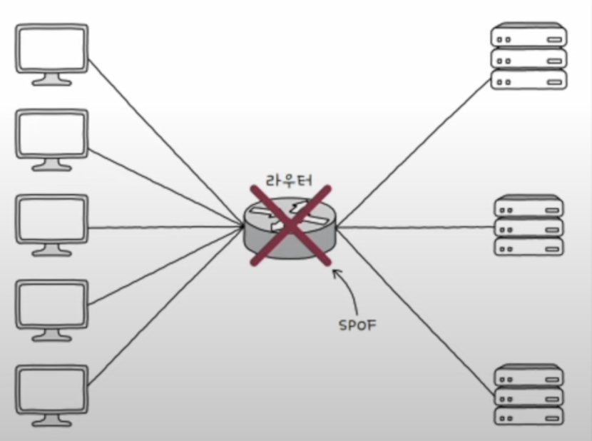
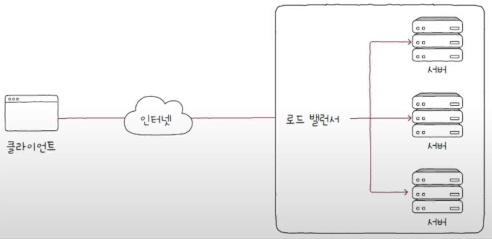

우리가 흔히 안정성 있는 시스템을 말하면, 언제든 원활하게 접근 가능한 시스템을 말하는 것 처럼 안정성은 "특정 기능을 언제든 균일한 성능으로 수행할 수 있는 특성"이라 정의할 수 있다.
## 가용성
이런 안정성의 정도를 나타내는 용어로 **가용성**과 **고가용성**이 있다. 

가용성이란, "컴퓨터 시스템이 특정 기능을 실제로 수행할 수 있는 시간의 **비율**"을 의미한다. 정상적으로 사용할 수 있는 시간을 **업타임**, 사용할 수 없는 시간을 **다운타임**이라 정의하며, 가용성을 수식으로 나타내면 다음과 같다.
$$
가용성 = \frac{업타임}{업타임 + 다운타임}
$$
`업타임 + 다운타임`은 **전체 사용중인 시간**이며 전체 사용중인 시간중 사용 가능한 시간의 비율을 가용성이라 할 수 있다. 가용성이 높다는 것은 사용 가능한 시간이 많다는 것이고 가용성이 높은 성질을 **고가용성(High Availability; HA)** 이라 부른다.

보통 가용성을 표기할 때는 백분율을 사용하며, 일반적으로 안정적이라 평가받는 시스템은 **99.999%** 이상을 목표로 한다. 이를 **파이브 나인즈**라고도 한다.

가용성을 높이기 위해서는 다운타임을 줄여야 하지만, 정말 예기치 못한 상황에서 발생하는 다운타임을 막는것은 현실적을 불가능 하다. 때문에 문제를 발생하지 않도록 하는것이 아니라 **문제가 발생하더라도 계속 기능할 수 있도록 설계**하는 것을 목표로 두어야 하며, 이러한 능력을 **결함 감내**라 부른다.

## 이중화
이중화는 말 그대로 **무언가를 이중으로 두는 기술**이다. 문제가 발생한다면 시스템 전체를 운영할 수 없는 부분을 찾아 이중화를 진행해야 하며, 이러한 부분을 **단일 장애점(Single Point Of Failure; SPOF)** 라고 한다.

### 이중화의 구성
이중화의 방식에는 크게 두 가지가 있다.

- **액티브/스탠바이**
- **액티브/액티브**

**액티브/스탠바이** 방식의 경우 이중화된 시스템에서 평소에는 하나의 장비만 작동시키다가, 작동하는 장비에 문제가 발생하였을때, 대기하고 있는 장비가 작동하여 시스템의 운영을 이어가는 방식이다. 이는 안전한 구성 방식이지만, 하나의 장비를 사용할 때에 비해 성능항의 큰 변화를 기대하기 어렵다는 단점이 있다.

**액티브/엑티브** 방식의 경우 두 장비 모두 가동시키는 방식이다. 이론상 두 장비 모두 문제가 생기지 않는 이상 시스템의 안정성을 보장할 수 있으며, 성능상의 이점도 있다.

## 다중화
다중화는 **이중화보다 더많은 장비 혹은 무언가를 여러개 두는 기술**이다. 당연히 이중화된 구성에 비해 더욱 안정적인 운영이 가능하며, 다중화의 사례로는 **티밍**과 **본딩**이 있다.
- **티밍**: 주로 윈도우에서 사용되는 용어
- **본딩**: 주로 리눅스에서 사용되는 용어

## 로드 밸런싱
로드 벨런싱은 서버에서의 고가용성을 위해 트래픽을 고르게 분산하기 위한 기술이다. 로드 벨런싱은 **로드 밸런서**에 의해 수행되며 로드 밸런서는 'L4 스위치', 'L7 스위치'와 같은 네트워크 장비 혹은 로드 밸런싱 기능을 제공하는 소프트웨어를 의미한다.

일반적으로 로드 밸런서는 이중화나 다중화된 서버와 클라이언트 사이에 위치하여 **로드 밸런싱 알고리즘**을 통해 요청을 각 서버에 균등하게 분배한다. 로드 밸런싱 알고리즘은 대표적으로 다음과 같은 것들이 있다.

- `라운드 로빈 알고리즘`: 서버를 돌아가며 부하를 전달하는 알고리즘
- `최소 연결 알고리즘`: 연결이 적은 서버부터 우선적으로 부하를 전달하는 알고리즘
- 단순히 무작위로 고르는 알고리즘
- 해시(hash) 자료구조를 이용하는 알고리즘
- 응답 시간이 가장 짧은 서버를 선택하는 알고리즘 등..

서버의 성능에 따라 가중치를 부여하여 적용할 수도 있는데, **가중치 라운드 로빈 알고리즘**과 **가중치 최소 연결 알고리즘**이 대표적이다.

> **서버의 상태를 검사하는 헬스 체크**
> 
> 다중화된 서버 환경에서 문제가 없는 서버를 찾아 요청을 보내기 위해 로드 밸런서는 서버의 상태를 주기적으로 검사한다. 이러한 검사를 **헬스 체크**라고 하며 HTTP, ICMP등 다양한 프로토콜을 활용할 수 있다.
>  
>  
> 로드 밸런서가 주도하는 헬스 체크 이외에도 서버 간에 **하트비트**라는 메시지를 주기적으로 주고 받는 방법도 있다.