이 글은 [혼자 공부하는 네트워크](https://product.kyobobook.co.kr/detail/S000212911507)를 보고 이해한 내용을 작성하였다.

## 컴퓨터 네트워크 시작하기
먼저 네트워크란 무엇이고, 네트워크와 인터넷의 차이점에 대해 알아보겠다.

`컴퓨터 네트워크(네트워크)`: 여러개의 장치(데스크톱, 노트북, 스마트폰 등)가 마치 그물처럼 서로 연결되어 정보를 주고 받을 수 있는 통신망.

`인터넷`: 네트워크를 통해 서로 연결된 장치 뿐만 아니라 지구 반대편에 있는 장치와 정보를 주고 받을 수 있도록 하는 네트워크. **"네트워크의 네트워크"**

네트워크를 `장치`를 연결하는 통신망, 인터넷은 `네트워크`를 연결하여 네트워크 끼리 정보를 주고 받게 한다는 점에서 차이가 있다.

## 네크워크 거시적으로 살펴보기
네트워크는 여러 장치가 서로 연결하여 정보를 주고 받을 수 있는 통신망이기 때문에, 이 모양을 그래프로 표현 가능하다.
그래프의 노드는 장치, 간선은 각 장치의 연결 관계를 나타낸다고 생각하면 된다.
### 네트워크의 기본 구조
모든 네트워크는 `노드`, 노드를 연결하는 `간선`, 노드간 주고 받는 `메시지`로 구성된다.
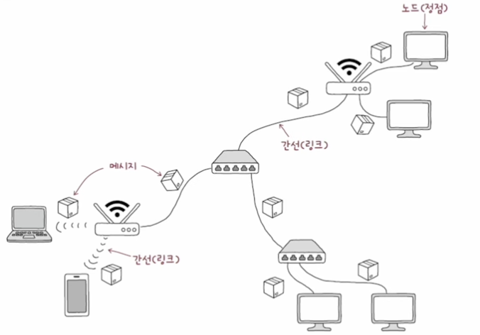

#### 호스트
네크워크의 가장자리에 위치한 노드를 호스트라고 한다. 호스트는 서버, 데스크톱, 노트북 등이 될 수 있으며 최초로 정보를 생성 및 송신하고 최종적으로 수신한다. 호스트는 특정 역할에 따라 `서버`와 `클라이언트`로 구분할 수 있다.

`서버`: 어떤 서비스를 제공하는 호스트 (파일 서버, 웹 서버, 메일 서버)

`클라이언트`: 서버에세 어떠한 서비스를 요청하고 서버의 응답을 제공받는 호스트

#### 네트워크 장비
네트워크의 가장자리에 위치하지 않는 중간 노드, 즉 호스트 간 주고받을 정보가 중간에 거치는 노드 호스트 간 주고 받는 정보가 원하는 수신지까지 안정적이고 안전하게 전송될 수 있도록 한다. 이더넷, 허브, 스위치, 라우터, 공유기 등이 있다.

>#### 호스트, 네트워크 장비, 서버, 클라이언트는 완전히 베타적인 개념이 아니다!
>위와 같은 개념들은 노드의 역할에 따라 구분한 기준에 불과하다는 것에 유의해야 한다. 호스트가 네트워크 장비의 역할을 할 수도 있고, 클라이언트가 서버의 역할을 수행할 수 도 있다는 것이다.
>이러한 역할의 노드가 있다~ 정도로 이해하는 것이 좋다.

#### 통신 메체
호스트와 네트워크 장비를 유무선 메체를 통해 연결하는 간선을 통신 매체라고 한다. 통신 메체에는 `유선 매체`와 `무선 매체`가 있다. 말 그대로 무선와 유선의 차이이다.

#### 메시지 
통신 메체로 연결된 노드가 **주고받는 정보**를 `메시지`라고 한다. 메시지는 파일, 메일 혹은 웹 페이지 등 여러 종류가 될 수 있다.

### 범위에 따른 네트워크 분류
네크워크는 형성된 범위에 따라 분류하는 기준이 존재한다. 크게 `LAN`과 `WAN`으로 구분하며, 그외 `CNA`과 `MAN`이라는 기준도 존재한다.

#### LAN(Local Area Network)
가까운 지역을 연결한 **근거리 통신망**을 의미한다. 가정, 학교, 기업처럼 한정된 공간의 네트워크를 `LAN`이라 할 수 있다.

#### WAN(Wide Area Network)
먼 지역을 연결하는 `광역 통신망`을 의미한다. 멀리 떨어진 LAN, 다시 말해 다른 소속의 LAN들이 통신할 수 있도록 하는 역할이다. 앞서 설명한 인터넷이 바로 이 `WAN`이다.

`WAN`은 ISP(인터넷 서비스 업체)가 구축하고 관리하며, 우리는 ISP에 통신비를 지불하여 인터넷을 사용한다.
한국의 대표적인 ISP는 KT, LG유플러스, SK브로드밴드 등이 있다.

>  #### CNA과 MAN
> CNA(Campus Area Network)과 MAN(Metropolitan Area Network)은 LAN과 WAN의 사이에 있는 기준이다.
> 
> `WAN` > `MAN` > `CAN` > `LAN`

### 메시지 교환 방식에 따른 네트워크 분류
호스트들이 네트워크를 통해 효율적으로 메시지를 주고 받기 위해, 대표적으로 회선 교환 방식과 패킷 교환 방식을 사용한다.

#### 회선 교환 방식
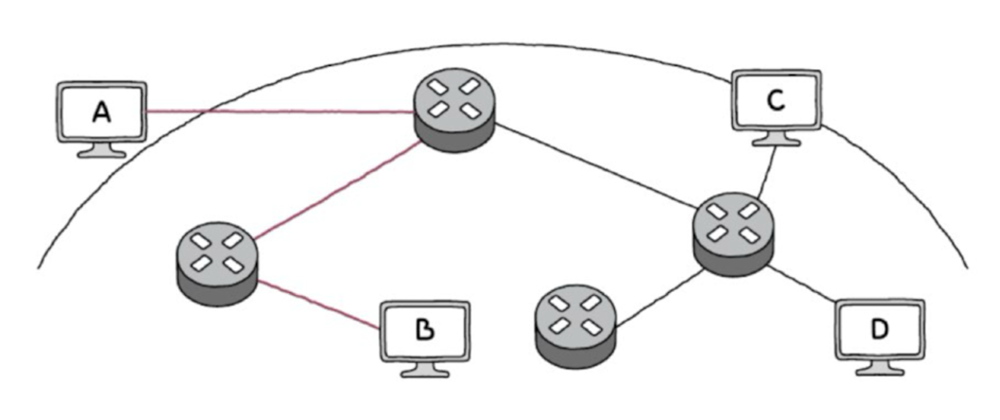
메시지 전송로인 `회선`을 설정하고, 이를 통해 메시지를 주고받는 방식이다. "회선을 설정한다"라는 의미는 메시지를 주고 받기 전, 두 호스트 사이를 연결할 회선을 먼저 확보한다는 의미이다.

호스트간 회선을 적절하게 설정하기 위해 **회선 스위치**라는 회선 교환 네트워크 장비를 사용한다.

**장점**
- 두 호스트 사이에 연결을 확보한 후 메시지를 주고 받기 때문에 주어진 시간동안 전송되는 정보의 양이 비교적 일정하다.

**단점**
- 회선의 이용 효율이 낮아질 가능성이 있다.

#### 패킷 교환 방식
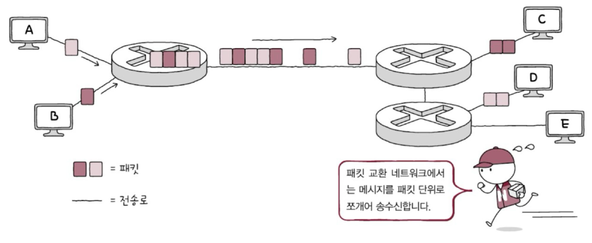
메시지를 `패깃`이라는 작은 단위로 쪼개어 전송한다. `패킷`은 교환 네크워크 상에서 송수신되는 메시지의 단위이다.

패킷 교환 방식은 정해진 경로만으로 메시지를 송수신 하지 않기 때문에 최적의 경로를 결정하고 패킷 송수신지를 식별해야 한다. 이를 위해 `라우터`와 `스위치` 같은 **패킷 스위치 네크워크 장비**를 사용한다.

> #### 패킷의 구성
> 네트워크의 패킷은 `페이로드`, `헤더`, `트레일러`로 구성되어 있다.
> 
> 페이로드는 전송하고자 하는 데이터, 헤더와 트레일러는 부가 정보 또는 제어 정보가 들어있다.

### 주소와 송수신지 유형에 따른 전송방식
패킷에 담기는 대표적인 정보로는 `주소`가 있다. `주소`는 송수신지를 특정하는 정보를 의미한다. IP 주소 혹은 MAC 주소가 여기에 포함된다.

그리고 이런 송수신지를 특정할 수 있는 주소가 있다면, 송수신지 유혀엥 따라 다양한 방식으로 메시지를 보낼 수 있다. 

`유니캐스트`: 하나의 수신지에 메시지를 전송하는 방식 (1 : 1)

`브로드개스트`: 자신을 제외한 네트워크상의 모든 호스트에게 전송하는 방식. 브로드캐스트가 전송되는 범위를 **브로드캐스트 도메인** 이라고 한다.

`멀티캐스트`: 네트워크 내의 동일 그룹에 속한 호스트에게만 전송하는 방식

`애니캐스트`: 네크위크 내의 동일 그룹에 속한 호스트 중 가장 가까운 호스트에게 전송하는 방식

## 네크워크 미시적으로 살펴보기

### 프로토콜
노드 간에 정보를 올바르게 주고받기 위해 합의된 규칙이나 방법을 의미한다.

네트워크 상의 노드는 수많은 종류의 통신 장비들로 이루어져 있는데, 각 장비가 요구하는 정보의 형식이 다르다면 원활한 통신이 불가능 할 것이다. 그래서 네트워크에서는 `프로토콜` 이라는 약속을 통해 원활한 통신을 가능하게 한다.
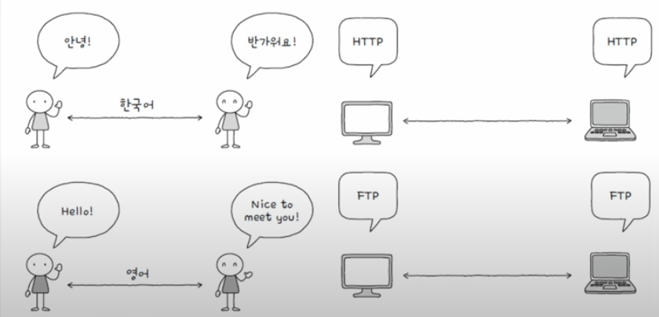

### 네트워크 참조 모델
네크워크로 메시지를 송수신 하는 과정에서 정형화된 여러 단계를 거치게 된다. 이 과정을 계층으로 나눈 구조들을 `네크워크 참조 모델` 또는 `네트워크 계층 모델`이라고 한다.
네크워크 참조 모델을 사용하면 구성과 설계와 네크워크 문제 진단 및 해결에 용이한 장점이 있다.

#### OSI 모델
국제 표준화 기구에서 만든 네트워크 참조 모델이다. 통신 단계를 7계층으로 나눠 표현한다.
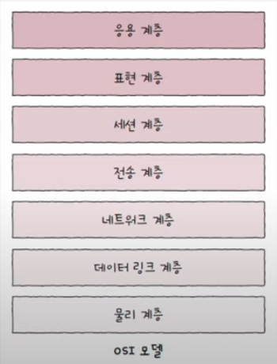

1. **물리 계층**
	- 최하단 계층으로, 1과 0으로 표현되는 비트 신호를 주고 받는 계층
2. **데이터 링크 계층**
	- 네크워크 내 주변 창치 간의 정보를 주고 받기위한 계층
3. **네크워크 계층**
	- 메시지를 다른 네트워크에 속한 수신지까지 전달하는 계층
4. **전송 계층**
	- 신뢰성 있고 안전성 있는 전송을 해야 할 때 필요한 계층
5. **세션 계층**
	- 통신을 주고 받는 호스트의 응용 프로그램 간 연결 상태를 관리하기 위한 계층
6. **표현 계층**
	- 사람이 이해할 수 있는 언어인 문자를 컴퓨터가 이해할 수 있는 코드로 변환, 압축, 암호화 작업하는 계층
7. **응용 계층**
	- 최상단 계층으로, 사용자가 이용할 응용 프로그램에 다양한 네트워크 서비스를 제공하는 계층

#### TCP/IP 모델
앞서 본 OSI 모델은 주로 네크워크를 이론적으로 기술할 때 사용하는 반면, `TCP/IP 모델`은 구현에 중점을 둔 모델이다. 
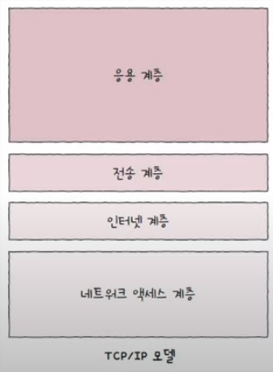
1. **네트워크 엑세스 계층**
	- 링크 계층 또는 네트워크 인터페이스 계층이라고도 불리며, OSI 모델의 데이터 링크 계층과 유사
2. **인터넷 계층**
	- OSI 모델의 전송 계층과 유사
3. **전송 계층**
	- OSI 모델의 전송 계층과 유사 
4. **응용 계층**
	- OSI 모델의 세션 계층, 표현 계층, 응용 계층을 합친 것과 유사

### 캡슐화와 역캡슐화
패킷의 송신 과정에서 캡슐화가 이루어 지고, 수신 과정에서 역캡슐화가 이루어 진다. 이는 네크워크 참조 모델의 계층 관점에서 봤을 때 송신의 경우 가장 높은 계층에서 낮은 계층으로, 수신은 가장 낮은 계층에서 높은 계층으로 이동하는 것을 알 수 있다. 
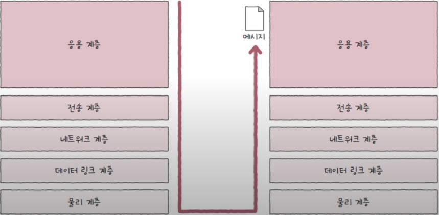
#### 캡슐화
송신 과정에서 헤더 및 트레일러를 추가해 나가는 과정을 말한다.
한 단계 아래 계층은 바로 위의 계층으로 부터 받은 패킷에 헤더 및 트레일러를 추가한다.
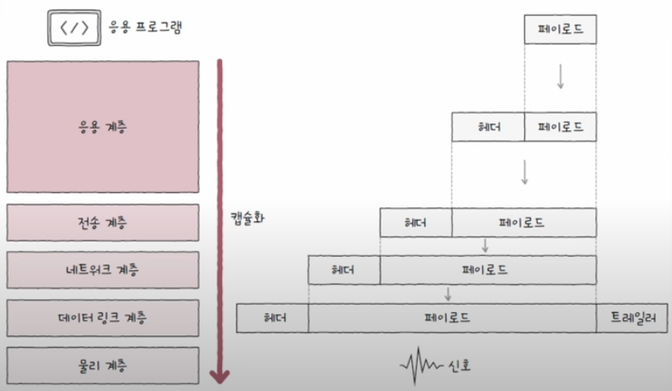
#### 역캡슐화
캡슐화의 반대 작업이다. 수신할 때 캡슐화 과정에서 붙였던 헤더 및 트레일러를 각 계층에서 확인 뒤 제거하는 과정이다. 
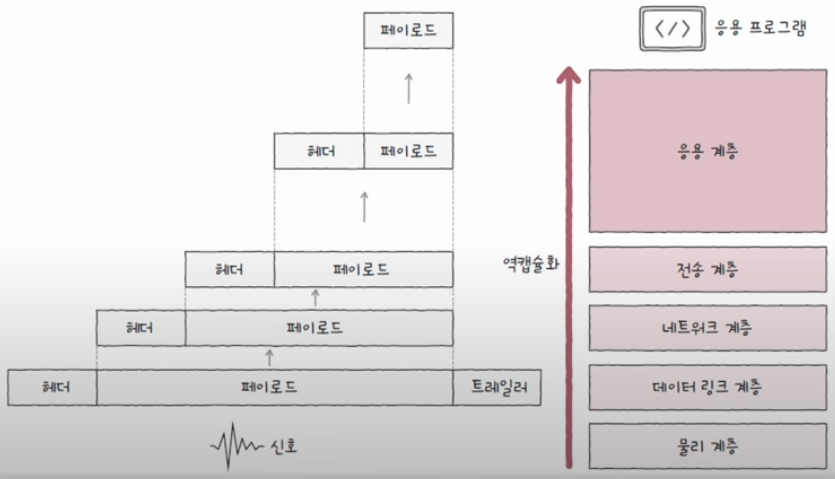
#### PDU
각 계층에서 송수신되는 메시지의 단위를 **PDU(Protocol Data Unit)** 라고 한다. 아래는 각 계층에 대한 PDU이다.
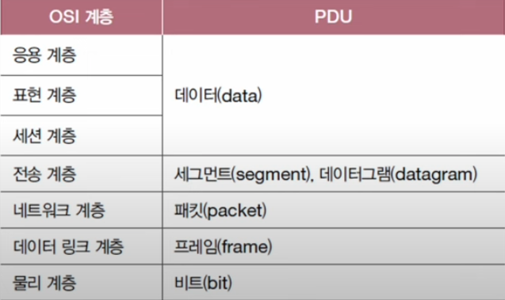

> 전송 계층의 PDU는 TCP 프로토콜이 사용되었을 경우 세크먼트, UDP 프로토콜이 사용되었을 경우 데이터그램이 된다.

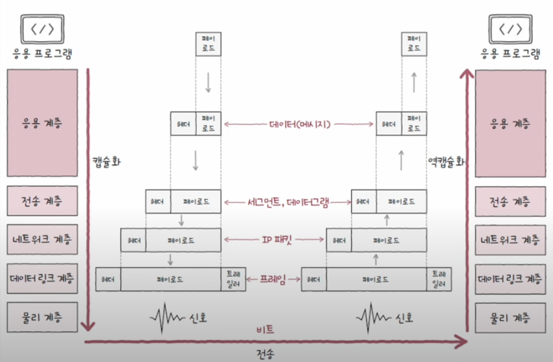
> ### ‼️ OSI 7계층, TCP/IP 계층은 사실 아무것도 해주지 않는다!
> 네트워크 참조 모델에 근거하여 반드시 특정 계층에 완벽하게 대응될 것이라 오해할 수 있는데, 말 그대로 **"참조 모델"** 이기 때문에 네트워크 구조에 대한 개념 참조를 위해 사용하는 것이 바람직 하다.
> 
> 지금도 새로운 프로토콜 혹은 네트워크 장비들이 나오고 있는데, 모든 프로토콜이나 장비들이 특정 계층에 완벽하게 대응하지는 않는다. 
> 
> 그러니 네크워크 참조 모델이나 특정 계층은 **네트워크를 작동시키는 주체나 반드시 지켜야 하는 "규칙"이 아닌** 그저 **"모델"** 이라는 걸 잘 기억해 두어야 한다.