TCP와 UDP는 전송 계층에서 가장 중요한 프로토콜 이다. TCP는 신뢰할 수 있는 통신을 위한 연결형 프로토콜이고, UDP는 TCP 보다는 신뢰성이 떨어지지만 비교적 빠른 통신이 가능한 비연결형 프로토콜이다.

## TCP 통신 단계와 세그먼트 구조
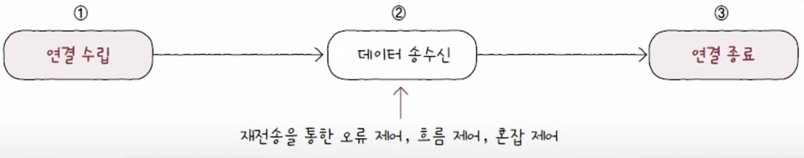
TCP 통신은 크게 세 단계로 나눌 수 있다.
1. 통신하기 전에 연결을 수립하고
2. 데이터 송수신 과정에서 재전송을 통한 오류 제어, 흐름 제어, 혼잡 제어 등의 기능을 제공하며
3. 통신이 끝나면 연결을 종료한다.

이번 포스트에는 1, 3번의 연결 수립과 종료를 먼저 살펴볼 것이다.

### MSS와 TCP의 세그먼트 구조
TCP의 연결 수립과 종료를 이해하려면 MSS라는 단위와 TCP의 세그먼트 구조를 이해해야 한다.

**MSS**는 **Maximum Segment Size**의 약자로 TCP로 전송할 수 있는 최대 페이로드 크기를 의미한다. MSS의 크기는 MTU와는 다르게 TCP 헤더 크기는 제외한다.
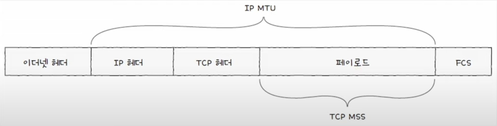

TCP의 세그먼트는 아래와 같은 구조로 이루어져 있다.
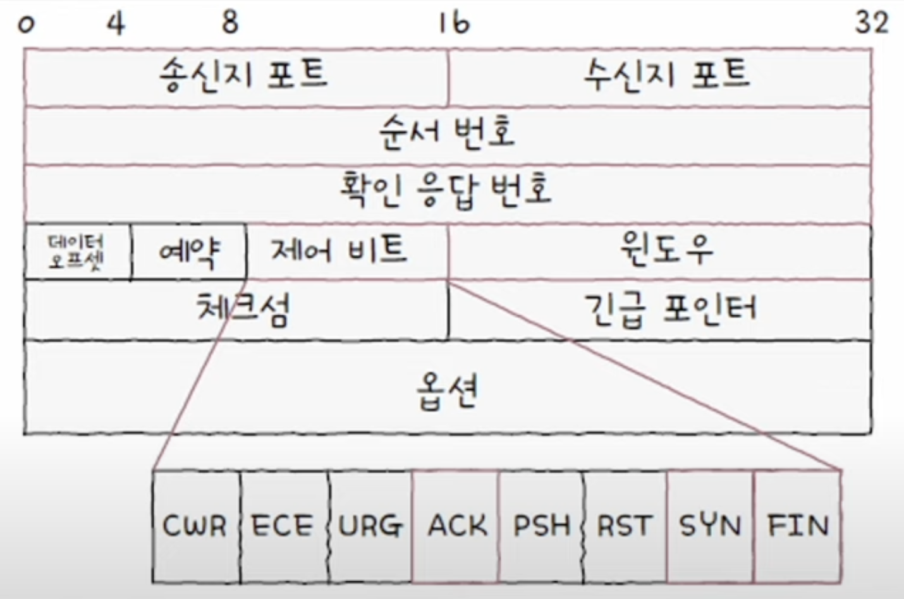

이중 중요한 부분만 살펴보자.
- **송신지 포트와 수신지 포트**: 송신지 또는 수신지 애플리케이션을 식별하는 포트 번호가 명시된다.
- **순서번호**: 송수신되는 세그먼트의 올바른 순서를 보장하기 위해 세그먼트 데이터의 첫 바이트에 부여되는 번호이다.
- **확인 응답 번호**: 상대 호스트가 보낸 세그먼트에 대한 응답으로, 다음으로 수신하기를 기대하는 순서 번호가 명시된다.
- **제어 비트**: 현재 세그먼트에 대한 부가 정보를 나타낸다. 플래그 비트(flag bits)라고도 불린다.
- **윈도우**: 수신 윈도우의 크기가 명시된다. 수신 윈도우란 한 번에 수신하고자 하는 데이터의 양을 나타낸다.

이중 제어 비트, 순서번호와 확인 응답 번호를 자세히 알아보자.

### 제어 비트
제어 비트 필드는 기본적으로 8비트로 구성된다. 각각 자리의 비트는 다른 의미를 가지는데, 이중 TCP의 기본 동작에 대해 논할때 자주 언급되는 비트는 다음과 같다.
- **ACK**: 세그먼트의 승인을 나타내기 위한 비트
- **SYN**: 연결을 수립하기 위한 비트
- **FIN**: 연결을 종료하기 위한 비트

각각의 비트들이 1이 되었을 때를 **'ACK 세그먼트'**, **'SYN 세그먼트'**, **'FIN 세그먼트'** 라 줄여 칭하는 경우가 많다.

### 순서 번호와 확인 응답 번호
순서 번호 필드와 확인 응답 번호 필드는 TCP의 신뢰성을 보장하기 위한 중요한 필드로, 이 둘을 묶어 생각하는 것이 좋다.

#### 순서 번호
순서 번호는 세그먼트의 올바른 송수신 순서를 보장하기 위한 번호로, 세그먼트 데이터의 첫 바이트에 부여되는 번호이다. 

예를들어 응용 계층에서 전달받은 전송할 데이터가 1900바이트이고 MSS(전송할 데이터의 최대 크기)가 500바이트라 가정한다면, 아래와 같이 4개의 세크먼트 조각이 나올 것이다. 
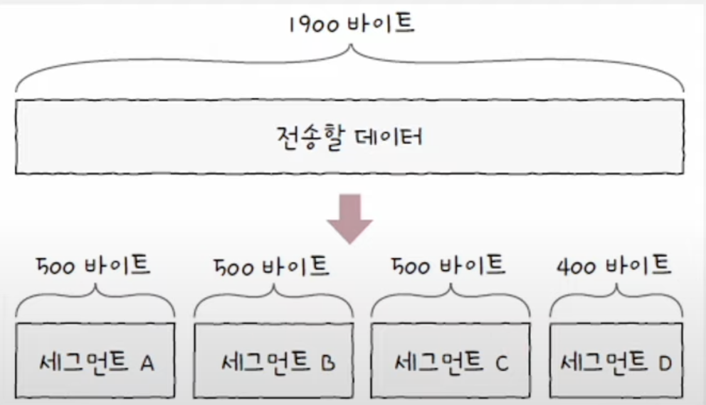

이중 처음 세그먼트 A의 값이 100이라 가정한 후 전송을 진행한다면, 각각의 세그먼트의 순서 번호는 **`세그먼트 A의 순서번호 + 지금까지 송신한 바이트 수`**가 된다.

여기서 처음 세그먼트인 세그먼트 A의 순서 번호를 **초기 순서 번호**라 하며, 각 세그먼트의 순서 번호는 아래의 식과 같다. 

$$
초기\;세그먼트\;번호 + 송신한\;바이트\;수
$$
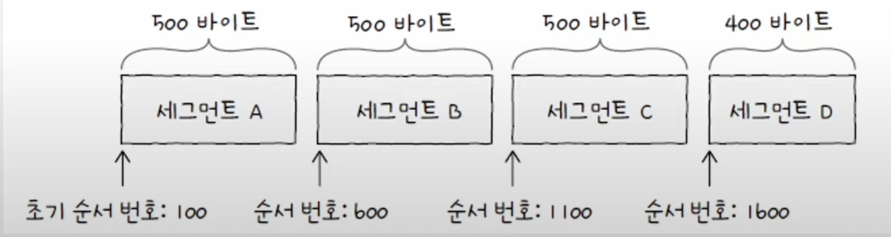

#### 확인 응답 번호
확인 응답 번호는 순서 번호에 대한 응답 번호이다. 수신지가 다음으로 받기를 기대하는 순서 번호가 들어 있으며, 일반적으로 **`수신한 순서 번호 + 1`** 로 설정된다. 확인 응답 번호 값을 보내기 위해서는 제어 비트의 **ACK 세그먼트는 1로 설정**해야 한다. 

만약 들어온 호스트의 순서 번호가 8000인 세그먼트를 성공적으로 수신했다면, 수신한 호스트는 ACK 플래그를 1로 설정하고 확인 응답 번호로 8001을 명시한 세그먼드를 전송하게 된다.

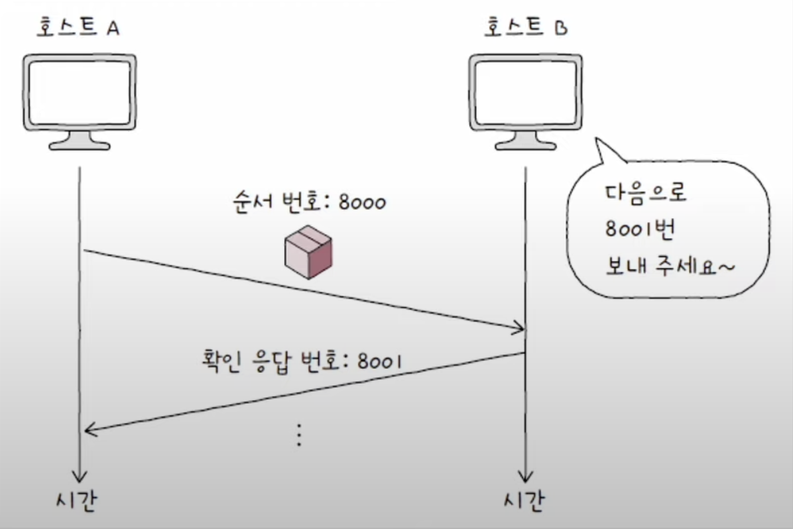

## TCP 연결 수립과 종료
### 연결 수립: 쓰리 웨이 핸드셰이크
TCP의 연결 수립은 쓰리 웨이 핸드셰이크를 통해 이루어진다. 이름 그대로 세 개의 단계로 이루어진 TCP의 연결 수립 과정을 의미한다. 
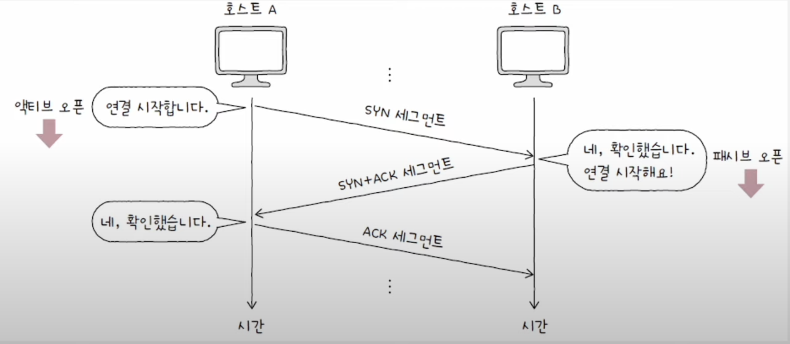
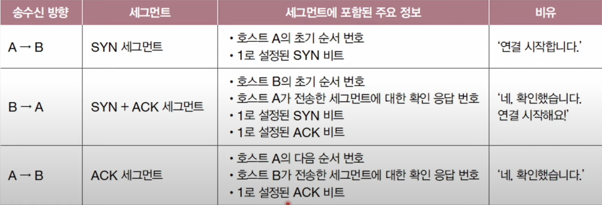
처음 연결을 시작하는 호스트의 동작을 **액티브 오픈**이라 하며, 액티브 오픈은 주로 클라이언트에 의해 수행된다. 반대로 연결 요청을 받고 요청에 따라 연결을 수립하는 호스트의 동작을 **패시브 오픈**이라고 하며, 주로 서버에 의해 수행된다.

### 연결 종료
TCP에서 연결을 수립하고 데이터 송수신이 끝났다면, 이제 연결을 종료해야 한다. 

연결을 종료할 때에는 송수신 호스트가 각각 한번씩 FIN과 ACK를 주고 받으며 이루어 진다. 
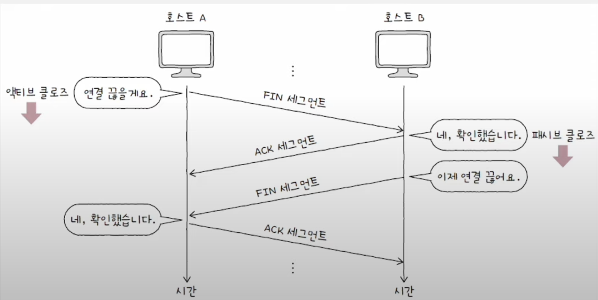
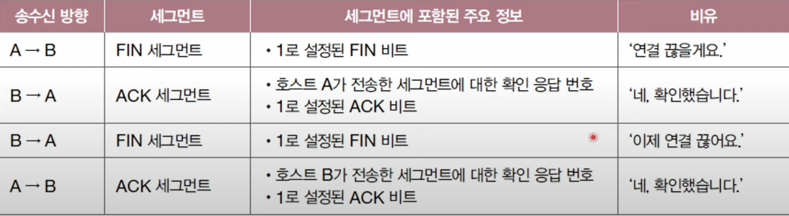
액티브 오픈과 패시브 오픈과 같이 연결을 종료할 때에도 액티브 클로즈와 패시브 클로즈가 있다. 연결을 종료하려는 호스트에서 수행되는 동작을 **액티브 클로즈**, 연결 종료 요청을 받아들이는 호스트의 동작을 **패시브 클로즈**라 한다.

## TCP 상태
연결형 통신과 신뢰할 수 있는 통신을 유지하기 위해 TCP는 현재 어떤 통신 과정에 있는지를 **상태(state)** 정보로 나타낸다. 이러한 점에서 TCP를 **스테이트풀(stateful) 프로토콜**이라고 부른다.

TCP는 많은 종류의 상태를 나타낼 수 있는데, 각각의 상태를 세 종류로 분류하면 다음과 같다.
1. 연결이 수립되지 않는 상태
2. 연결 수립 과정에서 주로 볼 수 있는 상태
3. 연결 종료 과정에서 주로 볼 수 있는 상태

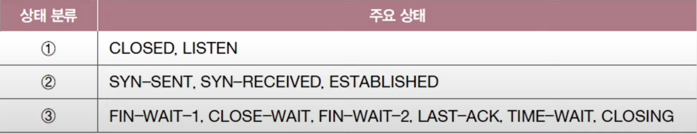

### 연결이 수립되지 않은 상태
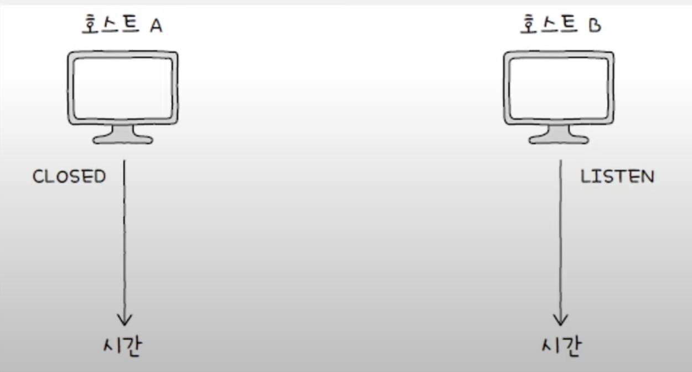
주로 `CLOSED`나 `LISTEN` 상태를 유지하고 있다.
- `CLOSE` - 아무런 연결이 없는 상태
- `LISTEN` - 일종의 연결 대기 상태. 일반적으로 서버로서 동작하는 **패시브 오픈 호스트**가 이 상태를 유지한다.

### 연결 수립 상태
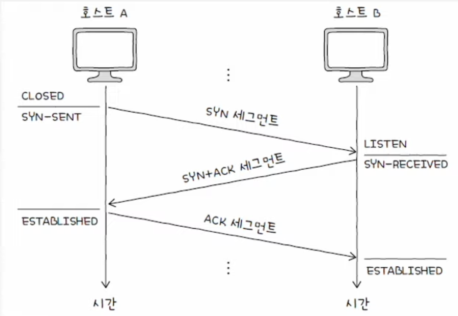
주로 `SYN-SENT`, `SYN-RECEIVED`, `ESTABLISHED` 상태를 볼 수 있다.
- `SYN-SENT` - 액티브 오픈 호스트가 SYN 세그먼트를 보낸 뒤 그에 대한 응답인 SYN + ACK 세그먼트를 기다리는 상태. 연결 요청을 보낸 뒤 대기하는 상태라고 생각하면 된다.
- `SYN-RECEIVED` - 패시브 오픈 호스트가 SYN + ACK 세그먼트를 보낸 뒤 그에 대한 ACK 세그먼트를 기다리는 상태
- `ESTABLISHED` - 연결이 확립되고 데이터를 송수신할 수 있는 상태. 두 호스트가 마지막 ACK 세그먼트를 주고 받으면 이 상태로 접어든다.

### 연결 종료 상태 
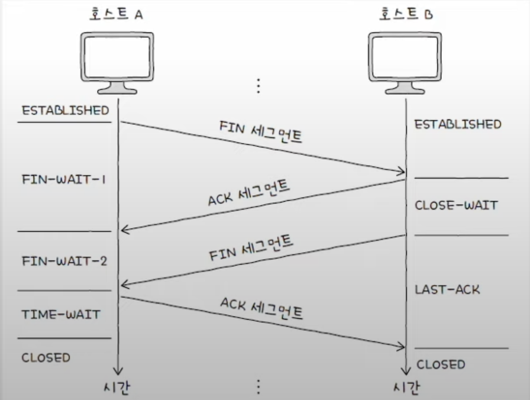
주로 `FIN-WAIT-1`, `CLOSE-WAIT`, `FIN-WAIT-2`, `LAST-ACK`, `TIME-WAIT`, `CLOSE` 상태를 볼 수 있다.
- `FIN-WAIT-1` - 일반적으로 TCP 연결 종료에 있어 첫 단계이다. FIN 세그먼트로서 연결 종료 요청을 보낸 액티브 클로즈 호스트는 `FIN-WAIT-1` 상태에 접어든다.
- `CLOSE-WAIT` - 종료 요청인 FIN 세그먼트를 받은 패시브 클로즈 호스트가 그에 대한 응답으로 ACK 세그먼트를 보낸 후 대기하는 상태
- `FIN-WAIT-2` - 상태 호스트의 FIN 세그먼트를 기다리는 상태. `FIN-WAIT-1` 상태에서 ACK 세그먼트를 받게 되면 `FIN-WAIT-2` 상태가 된다. 
- `LAST-ACK` - `CLOSE-WAIT` 상태에서 FIN 세그먼트를 전송한 뒤 이에 대한 ACK 세그먼트를 기다리는 상태
- `TIME-WAIT` - 액티브 클로즈 호스트가 FIN 세그먼트를 수신한 뒤, 이에 대한 ACK 세그먼트를 전송한 뒤 접어드는 상태. 패시브 클로즈 호스트가 마지막 ACK 세그먼트를 수신하면 바로 `CLOSED` 상태로 전이하는 반면, `TIME-WAIT` 상태에 접어든 액티브 클로즈 호스트는 일정 시간을 기다린 뒤 `CLOSED` 상태로 전이한다.

> #### TIME-WAIT 상태가 필요한 이유
> 액티브 클로즈 호스트만 `TIME-WAIT` 상태에서 일정 시간 기다리고 `CLSOE` 상태가 되는 이유는 생대 호스트가 받았어야 할 마지막 ACK 세그먼트의 올바른 전송 유무를 알기 위함이다. 
> 
> 만약 일정 상태를 대기하기 않고 바로 종료한다면, ACK 세그먼트가 올바르게 전송되지 않았을 때 재전송을 할 수 없어짐으로 문제가 발생할 수 있다.

#### CLOSING 상태
`CLOSING` 상태는 보통 동시에 연결을 종료하려 할 때 전이되는 상태이다. 서로가 FIN 세그먼트를 보내고 받은 뒤 각자 그에 대한 ACK 세그먼트를 보냈지만, 아직 자신의 FIN 세그먼트에 대한 ACK 세그먼트를 받지 못했을 때 접어드는 상태이다. 

양쪽 모두 연결 종료를 요정하고, 서로 종료 응답을 기다리는 경우 `CLOSING` 상태에 접어드는 것이다. 이 경우 ACK 세그먼트를 수신한다면 각자 `TIME-WAIT` 상태로 접어든 뒤 종료한다.
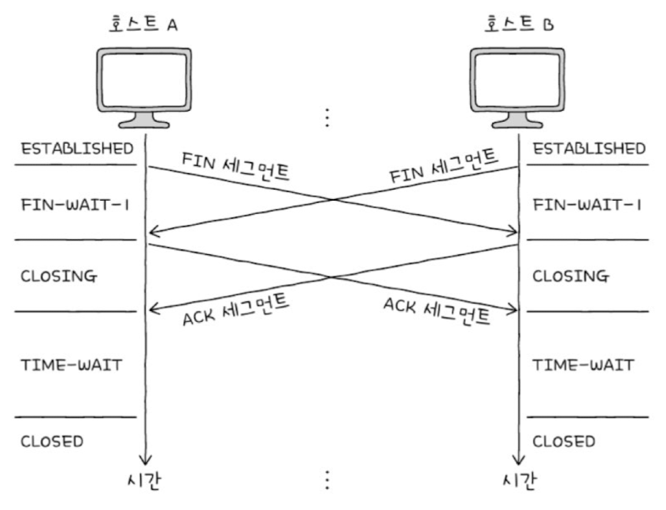

지금까지의 상태를 종합하면 다음과 같다.
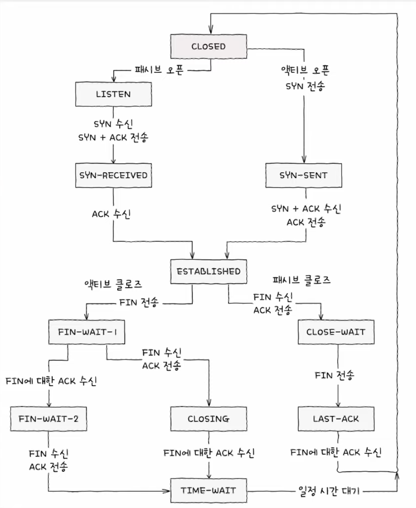

## UDP 데이터그램 구조
UDP는 TCP와 달리 비연결형 통신을 수행하는 신뢰할 수 없는 프로토콜이다. 때문에 연결 수립 및 해제, 재전송을 통한 오류 제어, 혼잡 제어, 흐름 제어 등을 수행하지 않는다. 또 TCP 처럼 상태를 유지하지 않기 때문에 **스테이트리스** 프로토콜의 일종이라고도 한다.
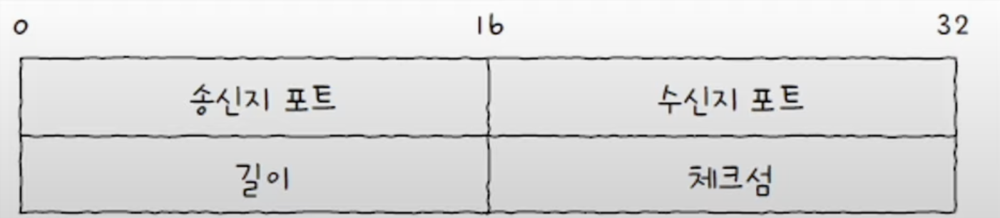
UDP의 데이터그램 구조는 TCP에 비해 상당히 간단한 구조로 구성되어 있다. 
- **송신지 포트**와 **수신지 포트**: 송수진지의 포트 번호가 담긴다.
- **길이**: 헤더를 포함한 UDP 데이터그램의 바이트가 담긴다.
- **체크섬**: 데이터그램 전송 과정에서 오류가 발생했는지 검사하기 위한 필드이다. 체크섬은 데이터그램의 훼손 여부를 확인하기 위한 정보일 뿐 신뢰성에는 관련이 없다.

이러한 간단한 구조 덕분에 UDP는 TCP에 비해 빠른 전송이 가능하다. TCP와 UDP의 작동 과정을 그림으로 비교하면 다음과 같다.
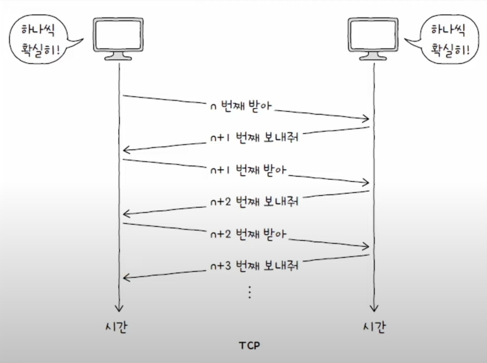
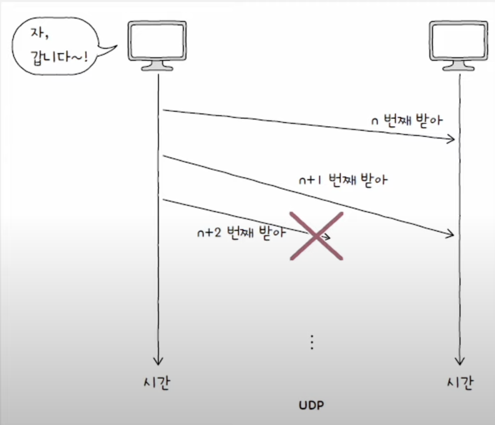
UDP의 전송 과정은 **"빠르게 마구 던지기"** 와 같기 때문에 패킷이 손실되거나 순서가 바뀔 수도 있다.