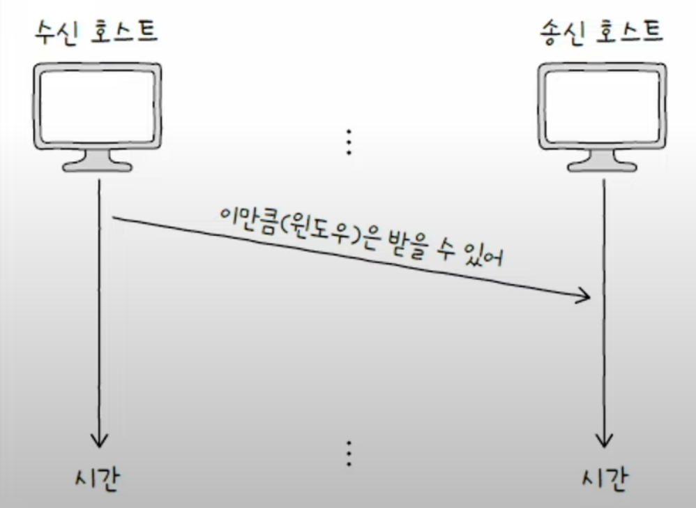

TCP는 데이터 송수신 과정에서 신뢰성을 보장하기 위해 오류 제어, 흐름 제어, 혼잡 제어의 기능을 제공한다. 
## 오류 제어: 재선송 기법
TCP는 신뢰성 있는 통신을 위해 오류를 감지하고, 오류를 감지한 세그먼트를 재전송하는 방법을 사용한다. 

먼저, TCP가 오류를 감지하는 방법을 알아보자.
### TCP의 오류 감지
#### 1. 중복된 ACK 세그먼트를 수신했을 때
중복된 ACK라는 의미가 애매할 수 있는데, 다음 그림과 함께 이해해보자.

위 그림처럼 만약 `n+1 세그먼트`가 손실된 상황이라면, ACK를 보내는 호스트는 `n+1 세그먼트`를 받지 못해 `n+1 세그먼트`에 대한 ACK를 2번 보내게 된다. 이럴때 호스트 A의 입장에서는 `n+1 세그먼트`에 대한 ACK를 **중복하여 두번** 받았으므로 `n+1 세그먼트`에 오류가 있음을 감지할 수 있는 것이다.

#### 2. 타임아웃이 발생했을 때

**타임아웃이**란 이름 그대로 정해진 시간 내에 응답을 받지 못하는 상황을 의미한다. TCP 세그먼트를 송신하는 호스트는 모두 **재전송 타이머**라는 값을 유지하는데, 이 타이머의 카운터가 끝나는 상황까지 ACK를 받지 못했다면 오류라 판단한다.

### ARQ: 재전송 기법
오류를 감지 했다면, 오류를 해결하기 위한 기능을 동작해야 하는데 TCP에서는 재전송 기법을 사용한다. 여기서 수신 호스트의 답변(ACK)과 타임아웃 발생을 토대로 문제를 진단하고, 문제가 생긴 메시지를 재전송함으로써 신뢰성을 확보하는 방식을 **ARQ(Automatic Repeat Request, 자동 재전송 요구)** 라고 한다.

이 ARQ에는 크게 3가지 종류가 있다.
- Stop-and-Wait ARQ
- Go-Back-N ARQ
- Selective Repeat ARQ

### Stop-and-Wait ARQ
가장 단순하면서 직관적인 재전송 기법이다. 이름 그대로 세그먼트를 송신한 후 제대로 전달 받았음을 확인하기 까지 기다리는 방식이다. 단순하지만, 높은 신뢰성을 보장하는 방식이라 할 수 있다.

하지만, 이러한 방식은 네트워크의 이용 효율이 낮아질 수 있으며 성능 저하로 이어질 수 있기 때문에 오늘날의 인터넷 환경의 TCP에서는 잘 사용하지 않는 방식이다.

### Go-Back-N ARQ
Stop-and-Wait ARQ의 문제를 해결하기 위해서는 각 세그먼트의 응답이 돌아오기 전에 일정한 개수의 세그먼트를 더 보낼 수 있어야 한다. 그래서 **Go-Back-N ARQ**방식은 연속해서 메시지를 전송할 수 있는 기술을 사용하고 있다. 이러한 연속해서 메시지를 전송하는 기술을 **파이프라이닝**이라고 한다.

Go-Back-N ARQ방식은 파이프라이닝 방식을 사용하려 여러 세그먼트를 전송하고, 도중 잘못 전송된 세그먼트가 발생하면 **해당 세그먼트부터 전부 다시 전송**하는 방식이다. 

수신받는 호스트(호스트 B)는 수신받지 못한 세그먼트(n + 2 세그먼트)가 있을 경우, 다른 세그먼트(n + 3 세그먼트)들을 정상적으로 수신 받더라도 수신받지 못한 세그먼트 이외의 모든 세그먼트를 폐기한다. 송신 호스트(호스트 A)에서는 ACK를 받지 못해 타임아웃이 발생하며 잘못된 세그먼트부터 다시 전송하게 되는 것이다.

Go-Back-N ARQ의 확인응답(ACK)은 n번까지의 확인 응답을 누적해가며 보내기 때문에 **누적 확인 응답(CACK)** 이라고 한다.

### Selective Repeat ARQ
Selective Repeat ARQ의 이름대로 **"선택적으로 재전송"** 을 하는 방법이다.

앞서 설명한 Go-Back-N ARQ 방식에서는 한 세그먼트에만 문제가 발생하여도 그 후의 모든 세그먼트를 다시 재전송 하는 단점이 있는 반면, Selective Repeat ARQ 방식에서는 수신 호스트 측에서 제대로 전송받은 **각각의 패킷들에 대해 ACK** 세그먼트를 보내어 문제가 있는 세그먼트만 재전송 하는 방식이다.

각각 패킷의 ACK를 보낸다는 점에서 Selective Repeat ARQ의 ACK는 **개별 응답 확인**이라고 한다.

오늘날 대부분의 호스트는 TCP 통신에서 **Selective Repeat ARQ**를 지원하며, **Selective Repeat ARQ**가 지원되지 않는 호스트의 경우 **Go-Back-N ARQ** 방식으로 동작한다.

## 흐름 제어: 슬라이딩 윈도우
오류 제어 기법중 바이프라이닝 기반의 재전송 방식이 정상적으로 동작하려면, 호스트가 한 번에 받아 처리할 수 있는 세그먼트의 양이 정해져 있기 때문에 흐름 제어를 반드시 고려해야 한다. 

- `수신 버퍼`: 수신된 세그먼트가 애플리케이션 프로세스에 의해 읽히기 전에 임시로 저장되는 공간
- `버퍼 오버플로`: 수신 버퍼 크기보다 많은 데이터가 전송되어 세그먼트가 처리되지 못하는 상황

**흐름 제어**는 위와 같은 수신 버퍼의 오버플로를 방지하기 위해 송신 호스트가 수신 호스트의 처리 속도를 고려하며 송수신 속도를 균일하게 유지하는 것을 의미한다. 대표적인 방법으로 **슬라이딩 윈도우**를 사용한다.

슬라이딩 윈도우란, **윈도우**라는 송신 호스트가 파이프라이닝 할 수 있는 최대량을 정해두고 이를 이동시키며 흐름을 제어하는 방식이다.

위 사진은 윈도우 크기가 4인 상태의 슬라이딩 윈도우 초기 상태이다. 해당 상태에서는 첫 번째 ~ 네 번째 세그먼트만 동시에 보낼 수 있다.

이 후, 만약 첫 번째 세그먼트의 ACK를 받았다면, 윈도우는 다음 세그먼트의 방향(그림에서는 오른쪽)으로 이동하여 다른 세그먼트를 범위에 포함시킨다.

위 과정을 반복하며 윈도우가 마지막 세그먼트까지 이동하여 송수신의 흐름을 제어한다.

송신 호스트 뿐만 아니라 수신 호스트도 윈도우를 고려하며, 두 호스트의 윈도우 크기는 수신 호스트에서 TCP 세그먼트의 **윈도우 필드**를 통해 공유한다.

결과적으로 송신 호스트는 송신하는 세그먼트를 기준으로 윈도우를 이동시키며 혼잡 제어를 진행하고, 수신 호스트는 수신 받은 세그먼트를 기준으로 윈도우를 이동시키며 혼잡 제어를 진행한다.

## 혼잡 제어
TCP에서는 혼잡 제어를 위해 **혼잡 윈도우**의 크기를 계산하는 알고리즘을 가지고 있다. 이러한 알고리즘을 **AIMD**라고 한다.

`혼잡 윈도우` - 혼잡 없이 전송할 수 있을 법한 데이터의 양

AIMD는 Additive Increase/Multiplicative Decrease의 약자로, "합으로 증가, 곱으로 감소"라는 의미이다. 혼잡이 감지되지 않는다면 혼잡 윈도우를 *RTT* 마다 1씩 선형적으로 증가시키고, 혼잡이 감지되면 혼잡 윈도우를 절반으로 떨어뜨리는 동작을 반복하는 알고리즘이다.

> #### RTT
>RTT(Round Trip Time)란 메시지를 전송한 뒤 그에 대한 답변을 받는 데까지 걸리는 시간을 의미한다.
>

AIMD로는 완벽한 혼잡 제어가 불가능 하기 때문에, 이를 보조할 혼잡 제어 알고리즘들이 있다.
1. 느린 시작
2. 혼잡 회피
3. 빠른 회복

### 느린 시작 알고리즘
느린 시작 알고리즘은 혼잡 윈도우를 1부터 시작하여 문제없이 수신된 ACK 세그먼트 하나당 1씩 증가시키는 방식이다.

아래 그림과 같이 RTT마다 2배씩 증가하며, 이는 AIDM에서의 혼잡 윈도우 증가 속도보다 빠르다는 것을 알 수 있다.

하지만, 매번 2배씩 혼잡 윈도우를 증가시킨다면 언젠가는 혼잡 상황을 마주할 확률이 높아지므로 **느린 시작 임계치** 값을 설정하여 이를 방지한다. 

아래는 상황별 혼잡을 피하는 방법에 대한 표이다.

### 혼잡 회피 알고리즘
혼잡 회피 알고리즘은 RTT마다 혼잡 윈도우를 1MSS씩 증가시키는 알고리즘이다. 

이름 그대로 혼잡을 회피하기 위해 **느린 시작 임계치를 넘어선 후**, 선형적으로 혼잡 윈도우를 증가시키는 방법이다. 

혼잡 회피 도중 타임아웃이 발생하면 혼잡 윈도우 값은 1로, 느린 시작 임계치는 혼잡이 감지된 시점의 혼잡 윈도우 값의 절반으로 초기환 한 뒤 다시 느린 시작을 수행한다. 그리고 혼잡 회피 도중 세 번의 중복 ACK 세그먼트가 발생되었을 때는 혼잡 윈도우 값과 느린 시작 임계치를 대략 절반으로 떨어뜨린 뒤 빠른 알고리즘을 수행한다. 
### 빠른 회복 알고리즘
빠른 회복 알고리즘은 세 번의 중복 ACK 세그먼트를 수신했을 때 느린 시작은 건너뛰고 혼잡 회피를 수행하는 알고리즘으로, 빠르게 전송률을 회복하기 위한 알고리즘이다.

세 번의 중복된 ACK 세그먼트를 수신하면 빠른 재전송 후 빠른 회복 알고리즘이 수행된다. 단, 빠른 회복 도중이라도 타임아웃이 발생하면 혼잡 윈도우 크기는 1로, 느린 시작 임계치는 혼잡이 감지된 시점의 절반으로 떨어뜨린 후 다시 느린 시작을 수행한다.

아래 그림은 지금까지의 혼잡 알고리즘을 정리한 그림이다.
